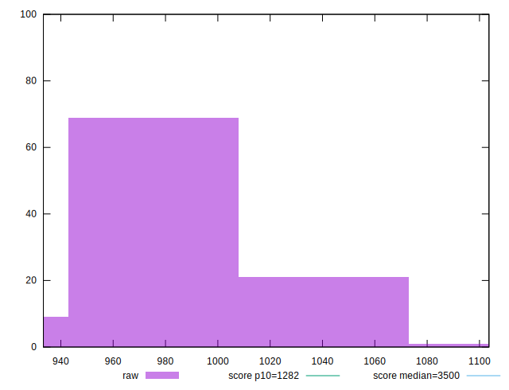
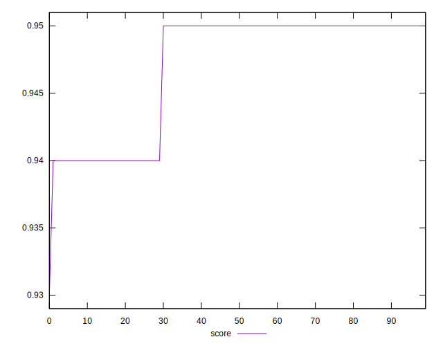

# //bootup-time/samples/astro

[→ Parent](../..)


## Raw


```yaml
p90min: 940.0080000000006
p90max: 1041.1000000000008
p90range: 101.09200000000021
p90mean: 983.6445531914898
median: 986.8980000000003
p90stdev: 26.42634169126216
mad: 25.054000000000144
stdevBySn: 32.138184799999706
lfitCenter: 984.7254252205922
lfitStdev: 23.250479089168227
mfitCenter: 984.7254252205922
mfitStdev: 29.140154171135016
mfitConfidence: 2.9140154171135015
p90skewness: -0.03064764200034012
p90eccentricity: 1.0000000000000002
p90discretization: 1
outlandishness: 1.0020830690846152

```


## Score


```yaml
p90min: 0.94
p90max: 0.95
p90range: 0.010000000000000009
p90mean: 0.9471276595744689
median: 0.95
p90stdev: 0.0045247170889652685
mad: 0
stdevBySn: 0
lfitCenter: 0.9478025485864741
lfitStdev: 0.004323427952824702
mfitCenter: 0.9478025485864741
mfitStdev: 0.00541861338039265
mfitConfidence: 0.000541861338039265
p90skewness: -0.940460821145349
p90eccentricity: 1.0000000000000002
p90discretization: 47
outlandishness: 0.999519320946693

```


## Raw Estimate


## Score Estimate


## P Score


```yaml
p90min: 0.9390858545140741
p90max: 0.9532759858465958
p90range: 0.014190131332521672
p90mean: 0.9472861910500565
median: 0.9468845700874013
p90stdev: 0.003681866576082398
mad: 0.0035520628038484547
stdevBySn: 0.004412035960634132
lfitCenter: 0.9471428116230002
lfitStdev: 0.003237250927027038
mfitCenter: 0.9471428116230002
mfitStdev: 0.004057292356963315
mfitConfidence: 0.00040572923569633156
p90skewness: -0.011953247170255504
p90eccentricity: 1.0000000000000002
p90discretization: 1
outlandishness: 0.9996602856615652

```


## Score Difference


```yaml
p90min: 1.1102230246251565e-16
p90max: 1.1102230246251565e-16
p90range: 0
p90mean: 1.1102230246251565e-16
median: 1.1102230246251565e-16
p90stdev: 0
mad: 0
stdevBySn: 0
lfitCenter: 1.1050564892561304e-16
lfitStdev: 1.2890316797319411e-18
mfitCenter: 1.1050564892561304e-16
mfitStdev: 1.6155616292812348e-18
mfitConfidence: 1.6155616292812347e-19
p90skewness: .nan
p90eccentricity: .nan
p90discretization: 94
outlandishness: 0.9801

```


## P Score Difference


```yaml
p90min: -0.004739146874547018
p90max: 0.00432227591519041
p90range: 0.009061422789737428
p90mean: 0.000247891247746183
median: 0.001014150261610336
p90stdev: 0.002875263289281361
mad: 0.0023955079661339695
stdevBySn: 0.0034060293047368994
lfitCenter: 0.00038183283089305203
lfitStdev: 0.002688812853675945
mfitCenter: 0.00038183283089305203
mfitStdev: 0.0033699271654986595
mfitConfidence: 0.0003369927165498659
p90skewness: -0.296982516288524
p90eccentricity: 0.9999999999999999
p90discretization: 1
outlandishness: 0.8258475331802865

```

