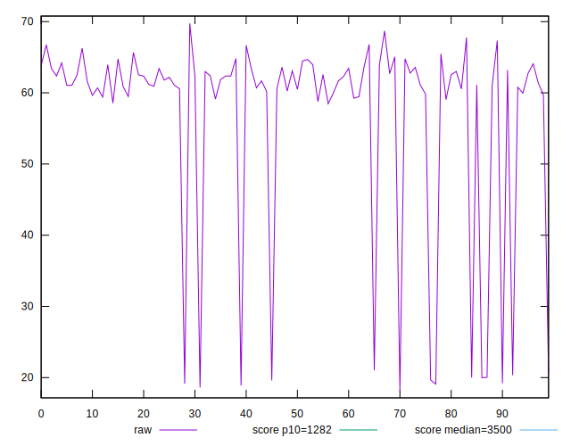
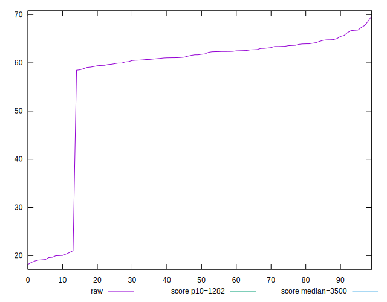
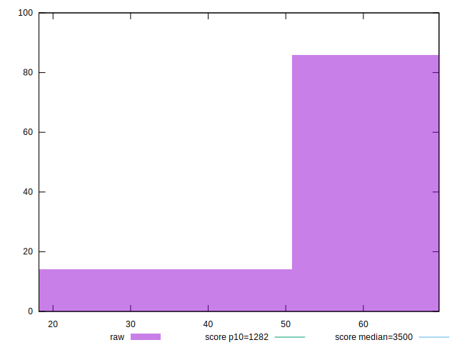
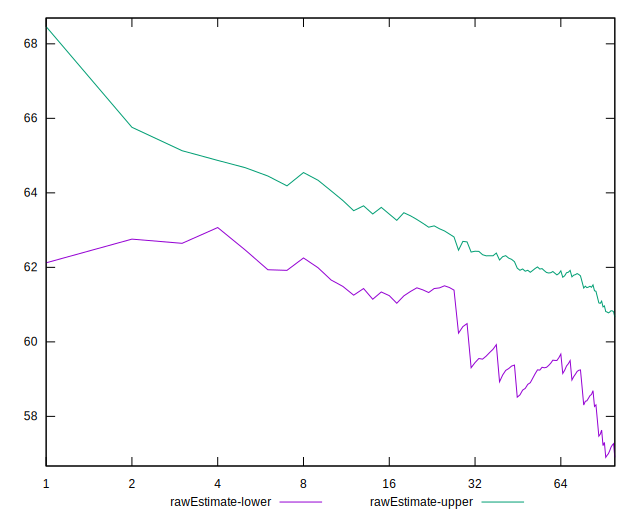
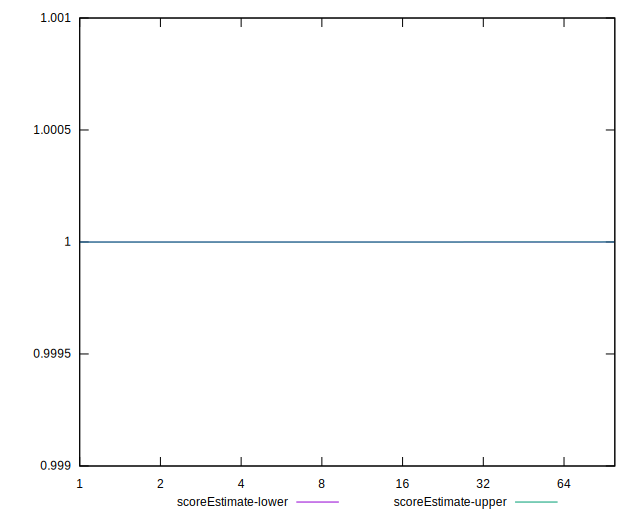
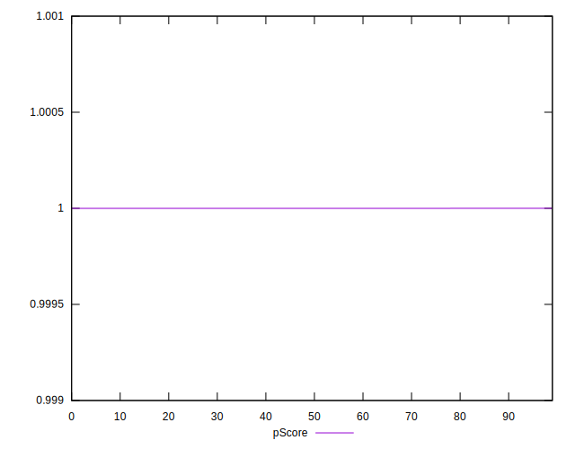
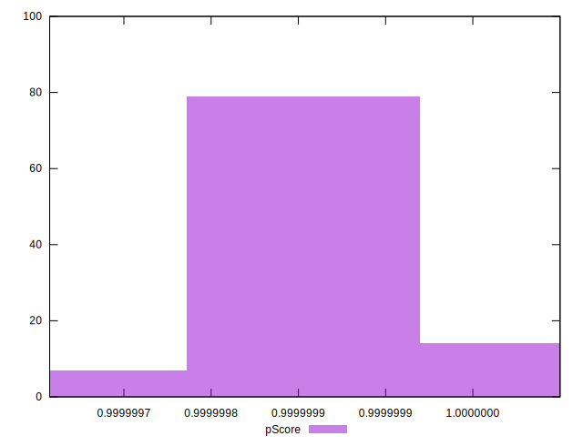
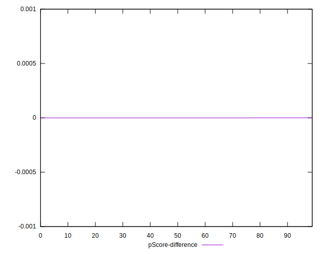
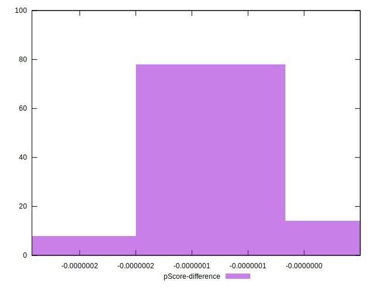

# //bootup-time/samples/card

[→ Parent](../..)


## Raw


```yaml
p90min: 19.087999999999994
p90max: 67.34399999999997
p90range: 48.25599999999997
p90mean: 57.2815319148936
median: 61.72799999999998
p90stdev: 13.756146257800646
mad: 1.8560000000000052
stdevBySn: 3.1353454000000105
lfitCenter: 58.78237840027989
lfitStdev: 7.665608613149068
mfitCenter: 58.78237840027989
mfitStdev: 9.607415655654583
mfitConfidence: 0.9607415655654583
p90skewness: -2.288884363955098
p90eccentricity: 0.9999999999999992
p90discretization: 1.010752688172043
outlandishness: 0.9716469594892777

```


## Score


```yaml
p90min: 1
p90max: 1
p90range: 0
p90mean: 1
median: 1
p90stdev: 0
mad: 0
stdevBySn: 0
lfitCenter: 1
lfitStdev: 0
mfitCenter: 1
mfitStdev: 0
mfitConfidence: 0
p90skewness: .nan
p90eccentricity: .nan
p90discretization: 94
outlandishness: 1

```


## Raw Estimate


## Score Estimate


## P Score


```yaml
p90min: 0.9999997682415387
p90max: 0.9999999999852547
p90range: 2.3174371599488097e-7
p90mean: 0.9999998770201917
median: 0.9999998710764959
p90stdev: 5.4214314886773694e-8
mad: 2.6269179775884055e-8
stdevBySn: 4.526950469342928e-8
lfitCenter: 0.9999998739774086
lfitStdev: 3.817073577293898e-8
mfitCenter: 0.9999998739774086
mfitStdev: 4.783992282409749e-8
mfitConfidence: 4.783992282409749e-9
p90skewness: 0.9093417576684643
p90eccentricity: 1.0000000000000002
p90discretization: 1.032967032967033
outlandishness: 0.9999999987809791

```


## Score Difference


```yaml
p90min: 0
p90max: 0
p90range: 0
p90mean: 0
median: 0
p90stdev: 0
mad: 0
stdevBySn: 0
lfitCenter: 0
lfitStdev: 0
mfitCenter: 0
mfitStdev: 0
mfitConfidence: 0
p90skewness: .nan
p90eccentricity: .nan
p90discretization: 94
outlandishness: .nan

```


## P Score Difference


```yaml
p90min: -2.3175846131096023e-7
p90max: -1.4745316079256554e-11
p90range: 2.3174371599488097e-7
p90mean: -1.2297980841009243e-7
median: -1.2892350409465791e-7
p90stdev: 5.42143148867737e-8
mad: 2.6269179775884055e-8
stdevBySn: 4.526950469342928e-8
lfitCenter: -1.2602259127773232e-7
lfitStdev: 3.817073578409374e-8
mfitCenter: -1.2602259127773232e-7
mfitStdev: 4.78399228380779e-8
mfitConfidence: 4.78399228380779e-9
p90skewness: 0.9093417801511451
p90eccentricity: 0.9999999999999999
p90discretization: 1.032967032967033
outlandishness: 1.0099369294187184

```

