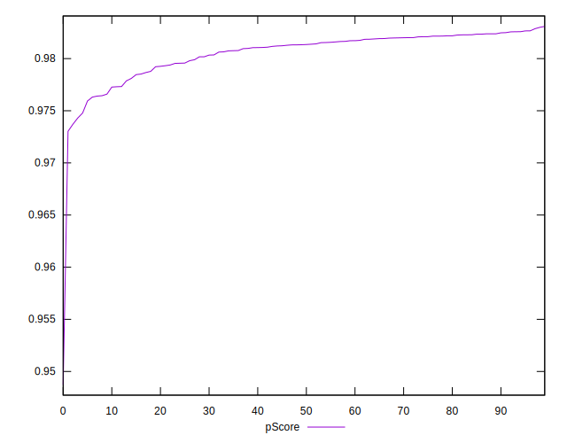

# //bootup-time/samples/music

[→ Parent](../..)


## Raw


```yaml
p90min: 668.6720000000007
p90max: 760.3160000000003
p90range: 91.64399999999955
p90mean: 691.5662127659581
median: 684.4980000000004
p90stdev: 21.464447125952617
mad: 11.036000000000172
stdevBySn: 15.606363599999746
lfitCenter: 690.6548868454001
lfitStdev: 18.905862631031145
mfitCenter: 690.6548868454001
mfitStdev: 23.694984937459054
mfitConfidence: 2.3694984937459056
p90skewness: 1.3286901083323857
p90eccentricity: 0.9999999999999997
p90discretization: 1
outlandishness: 1.0103634438130262

```


## Score


```yaml
p90min: 0.97
p90max: 0.98
p90range: 0.010000000000000009
p90mean: 0.9797872340425534
median: 0.98
p90stdev: 0.0014430489325798453
mad: 0
stdevBySn: 0
lfitCenter: 0.9796614293658377
lfitStdev: 0.0008278359773066912
mfitCenter: 0.9796614293658377
mfitStdev: 0.0010375385347808851
mfitConfidence: 0.00010375385347808852
p90skewness: -6.63488802697087
p90eccentricity: 1.000000000000003
p90discretization: 47
outlandishness: 0.9990056761745781

```


## Raw Estimate


## Score Estimate


## P Score


```yaml
p90min: 0.9743042075168968
p90max: 0.9826605163145092
p90range: 0.0083563087976124
p90mean: 0.9806860260982877
median: 0.9813396613129552
p90stdev: 0.0019204846658203607
mad: 0.0009265417826848088
stdevBySn: 0.0013177779492725798
lfitCenter: 0.9807397520482011
lfitStdev: 0.0017343663188705432
mfitCenter: 0.9807397520482011
mfitStdev: 0.0021737058289115698
mfitConfidence: 0.000217370582891157
p90skewness: -1.4200203003955452
p90eccentricity: 1.0000000000000002
p90discretization: 1.010752688172043
outlandishness: 0.9991905206978872

```


## Score Difference


```yaml
p90min: 0
p90max: 0
p90range: 0
p90mean: 0
median: 0
p90stdev: 0
mad: 0
stdevBySn: 0
lfitCenter: 5.166535369026208e-19
lfitStdev: 1.2890316797319448e-18
mfitCenter: 5.166535369026208e-19
mfitStdev: 1.6155616292812394e-18
mfitConfidence: 1.6155616292812395e-19
p90skewness: .nan
p90eccentricity: .nan
p90discretization: 94
outlandishness: .inf

```


## P Score Difference


```yaml
p90min: -0.0035573277625065014
p90max: 0.0030886811626175126
p90range: 0.006646008925124014
p90mean: 0.0010367651984911513
median: 0.001534496998981505
p90stdev: 0.0015462194304408344
mad: 0.0007837740271328109
stdevBySn: 0.0013175122467250278
lfitCenter: 0.0011788047470786646
lfitStdev: 0.0012316338436023234
mfitCenter: 0.0011788047470786646
mfitStdev: 0.00154362410973628
mfitConfidence: 0.000154362410973628
p90skewness: -1.177766942327156
p90eccentricity: 1.0000000000000004
p90discretization: 1.010752688172043
outlandishness: 0.9100225522757645

```

