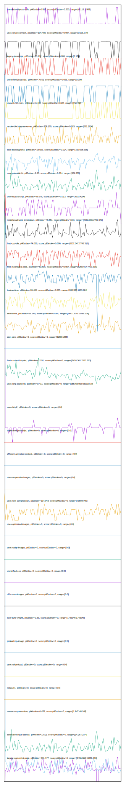

# //correlation/astro

[→ Parent](../..)

[0. score, p90stdev=NaN, score:p90stdev=NaN, range=[NaN:NaN]](../../meta/score/samples/astro)  
[1. cumulative-layout-shift, p90stdev=0.517, score:p90stdev=0.303, range=[0.113:1.585]](../../cumulative-layout-shift/samples/astro/)  
[2. uses-rel-preconnect, p90stdev=104.492, score:p90stdev=0.087, range=[0:301.078]](../../uses-rel-preconnect/samples/astro/)  
[3. legacy-javascript, p90stdev=73.612, score:p90stdev=0.059, range=[0:150]](../../legacy-javascript/samples/astro/)  
[4. unminified-javascript, p90stdev=70.52, score:p90stdev=0.056, range=[0:300]](../../unminified-javascript/samples/astro/)  
[5. unused-css-rules, p90stdev=61.39, score:p90stdev=0.033, range=[150:450]](../../unused-css-rules/samples/astro/)  
[6. render-blocking-resources, p90stdev=209.178, score:p90stdev=0.025, range=[861:1634]](../../render-blocking-resources/samples/astro/)  
[7. total-blocking-time, p90stdev=18.026, score:p90stdev=0.024, range=[319:668.535]](../../total-blocking-time/samples/astro/)  
[8. max-potential-fid, p90stdev=6.63, score:p90stdev=0.014, range=[324:370]](../../max-potential-fid/samples/astro/)  
[9. unused-javascript, p90stdev=98.676, score:p90stdev=0.013, range=[3600:4200]](../../unused-javascript/samples/astro/)  
[10. mainthread-work-breakdown, p90stdev=48.851, score:p90stdev=0.01, range=[2263.396:2761.972]](../../mainthread-work-breakdown/samples/astro/)  
[11. first-cpu-idle, p90stdev=74.088, score:p90stdev=0.009, range=[6637.047:7793.316]](../../first-cpu-idle/samples/astro/)  
[12. first-meaningful-paint, p90stdev=83.501, score:p90stdev=0.007, range=[5260.917:7793.316]](../../first-meaningful-paint/samples/astro/)  
[13. bootup-time, p90stdev=26.426, score:p90stdev=0.005, range=[933.328:1103.624]](../../bootup-time/samples/astro/)  
[14. interactive, p90stdev=65.149, score:p90stdev=0.001, range=[14471.876:15785.136]](../../interactive/samples/astro/)  
[15. dom-size, p90stdev=0, score:p90stdev=0, range=[1288:1288]](../../dom-size/samples/astro/)  
[16. first-contentful-paint, p90stdev=2.291, score:p90stdev=0, range=[2416.561:2583.783]](../../first-contentful-paint/samples/astro/)  
[17. uses-long-cache-ttl, p90stdev=0.411, score:p90stdev=0, range=[958768.062:959310.19]](../../uses-long-cache-ttl/samples/astro/)  
[18. uses-passive-event-listeners, p90stdev=NaN, score:p90stdev=0, range=[NaN:NaN]](../../uses-passive-event-listeners/samples/astro/)  
[19. uses-http2, p90stdev=0, score:p90stdev=0, range=[0:0]](../../uses-http2/samples/astro/)  
[20. no-document-write, p90stdev=NaN, score:p90stdev=0, range=[NaN:NaN]](../../no-document-write/samples/astro/)  
[21. duplicated-javascript, p90stdev=0, score:p90stdev=0, range=[0:0]](../../duplicated-javascript/samples/astro/)  
[22. efficient-animated-content, p90stdev=0, score:p90stdev=0, range=[0:0]](../../efficient-animated-content/samples/astro/)  
[23. uses-responsive-images, p90stdev=0, score:p90stdev=0, range=[0:0]](../../uses-responsive-images/samples/astro/)  
[24. uses-text-compression, p90stdev=114.943, score:p90stdev=0, range=[7950:8700]](../../uses-text-compression/samples/astro/)  
[25. uses-optimized-images, p90stdev=0, score:p90stdev=0, range=[0:0]](../../uses-optimized-images/samples/astro/)  
[26. uses-webp-images, p90stdev=0, score:p90stdev=0, range=[0:0]](../../uses-webp-images/samples/astro/)  
[27. unminified-css, p90stdev=0, score:p90stdev=0, range=[0:0]](../../unminified-css/samples/astro/)  
[28. offscreen-images, p90stdev=0, score:p90stdev=0, range=[0:0]](../../offscreen-images/samples/astro/)  
[29. total-byte-weight, p90stdev=0.89, score:p90stdev=0, range=[1733546:1742546]](../../total-byte-weight/samples/astro/)  
[30. preload-lcp-image, p90stdev=0, score:p90stdev=0, range=[0:0]](../../preload-lcp-image/samples/astro/)  
[31. unsized-images, p90stdev=NaN, score:p90stdev=0, range=[NaN:NaN]](../../unsized-images/samples/astro/)  
[32. third-party-summary, p90stdev=NaN, score:p90stdev=0, range=[NaN:NaN]](../../third-party-summary/samples/astro/)  
[33. font-display, p90stdev=NaN, score:p90stdev=0, range=[NaN:NaN]](../../font-display/samples/astro/)  
[34. uses-rel-preload, p90stdev=0, score:p90stdev=0, range=[0:0]](../../uses-rel-preload/samples/astro/)  
[35. redirects, p90stdev=0, score:p90stdev=0, range=[0:0]](../../redirects/samples/astro/)  
[36. server-response-time, p90stdev=0.476, score:p90stdev=0, range=[1.647:482.65]](../../server-response-time/samples/astro/)  
[37. estimated-input-latency, p90stdev=1.512, score:p90stdev=0, range=[14.267:23.4]](../../estimated-input-latency/samples/astro/)  
[38. largest-contentful-paint, p90stdev=131.177, score:p90stdev=0, range=[9496.303:15686.113]](../../largest-contentful-paint/samples/astro/)  
[39. timing-budget, p90stdev=NaN, score:p90stdev=NaN, range=[NaN:NaN]](../../timing-budget/samples/astro/)  
[40. metrics, p90stdev=NaN, score:p90stdev=NaN, range=[NaN:NaN]](../../metrics/samples/astro/)  
[41. screenshot-thumbnails, p90stdev=NaN, score:p90stdev=NaN, range=[NaN:NaN]](../../screenshot-thumbnails/samples/astro/)  
[42. speed-index, p90stdev=NaN, score:p90stdev=NaN, range=[NaN:NaN]](../../speed-index/samples/astro/)  
