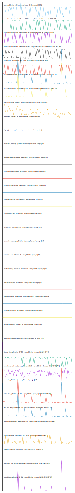

# //correlation/card

[→ Parent](../..)

[0. score, p90stdev=0.009, score:p90stdev=0.009, range=[0.85:1]](../../meta/score/samples/card)  
[1. cumulative-layout-shift, p90stdev=0.058, score:p90stdev=0.084, range=[0.005:0.127]](../../cumulative-layout-shift/samples/card/)  
[2. uses-text-compression, p90stdev=69.282, score:p90stdev=0.06, range=[150:300]](../../uses-text-compression/samples/card/)  
[3. largest-contentful-paint, p90stdev=233.433, score:p90stdev=0.024, range=[1523.48:2431.369]](../../largest-contentful-paint/samples/card/)  
[4. uses-http2, p90stdev=67.506, score:p90stdev=0.009, range=[760:1470]](../../uses-http2/samples/card/)  
[5. first-meaningful-paint, p90stdev=20.481, score:p90stdev=0, range=[1359.357:1681.198]](../../first-meaningful-paint/samples/card/)  
[6. first-contentful-paint, p90stdev=20.481, score:p90stdev=0, range=[1359.357:1681.198]](../../first-contentful-paint/samples/card/)  
[7. uses-rel-preload, p90stdev=0.815, score:p90stdev=0, range=[1053:1154]](../../uses-rel-preload/samples/card/)  
[8. dom-size, p90stdev=0, score:p90stdev=0, range=[582:582]](../../dom-size/samples/card/)  
[9. uses-passive-event-listeners, p90stdev=NaN, score:p90stdev=0, range=[NaN:NaN]](../../uses-passive-event-listeners/samples/card/)  
[10. no-document-write, p90stdev=NaN, score:p90stdev=0, range=[NaN:NaN]](../../no-document-write/samples/card/)  
[11. legacy-javascript, p90stdev=0, score:p90stdev=0, range=[0:0]](../../legacy-javascript/samples/card/)  
[12. duplicated-javascript, p90stdev=0, score:p90stdev=0, range=[0:0]](../../duplicated-javascript/samples/card/)  
[13. efficient-animated-content, p90stdev=0, score:p90stdev=0, range=[0:0]](../../efficient-animated-content/samples/card/)  
[14. uses-responsive-images, p90stdev=0, score:p90stdev=0, range=[0:0]](../../uses-responsive-images/samples/card/)  
[15. uses-optimized-images, p90stdev=0, score:p90stdev=0, range=[0:0]](../../uses-optimized-images/samples/card/)  
[16. uses-webp-images, p90stdev=0, score:p90stdev=0, range=[0:0]](../../uses-webp-images/samples/card/)  
[17. unused-javascript, p90stdev=0, score:p90stdev=0, range=[0:0]](../../unused-javascript/samples/card/)  
[18. unused-css-rules, p90stdev=0, score:p90stdev=0, range=[0:0]](../../unused-css-rules/samples/card/)  
[19. unminified-javascript, p90stdev=0, score:p90stdev=0, range=[0:0]](../../unminified-javascript/samples/card/)  
[20. unminified-css, p90stdev=0, score:p90stdev=0, range=[0:0]](../../unminified-css/samples/card/)  
[21. render-blocking-resources, p90stdev=0, score:p90stdev=0, range=[0:0]](../../render-blocking-resources/samples/card/)  
[22. offscreen-images, p90stdev=0, score:p90stdev=0, range=[0:0]](../../offscreen-images/samples/card/)  
[23. total-byte-weight, p90stdev=0, score:p90stdev=0, range=[546450:546933]](../../total-byte-weight/samples/card/)  
[24. uses-long-cache-ttl, p90stdev=0, score:p90stdev=0, range=[0:0]](../../uses-long-cache-ttl/samples/card/)  
[25. preload-lcp-image, p90stdev=0, score:p90stdev=0, range=[0:0]](../../preload-lcp-image/samples/card/)  
[26. unsized-images, p90stdev=NaN, score:p90stdev=0, range=[NaN:NaN]](../../unsized-images/samples/card/)  
[27. font-display, p90stdev=NaN, score:p90stdev=0, range=[NaN:NaN]](../../font-display/samples/card/)  
[28. uses-rel-preconnect, p90stdev=0, score:p90stdev=0, range=[0:0]](../../uses-rel-preconnect/samples/card/)  
[29. bootup-time, p90stdev=13.756, score:p90stdev=0, range=[18.188:69.748]](../../bootup-time/samples/card/)  
[30. mainthread-work-breakdown, p90stdev=16.26, score:p90stdev=0, range=[620.088:884.708]](../../mainthread-work-breakdown/samples/card/)  
[31. redirects, p90stdev=0, score:p90stdev=0, range=[0:0]](../../redirects/samples/card/)  
[32. interactive, p90stdev=20.481, score:p90stdev=0, range=[1359.357:1681.198]](../../interactive/samples/card/)  
[33. first-cpu-idle, p90stdev=20.481, score:p90stdev=0, range=[1359.357:1681.198]](../../first-cpu-idle/samples/card/)  
[34. server-response-time, p90stdev=0.437, score:p90stdev=0, range=[1.624:6010.534]](../../server-response-time/samples/card/)  
[35. max-potential-fid, p90stdev=7.623, score:p90stdev=0, range=[16:44]](../../max-potential-fid/samples/card/)  
[36. total-blocking-time, p90stdev=0, score:p90stdev=0, range=[0:0]](../../total-blocking-time/samples/card/)  
[37. estimated-input-latency, p90stdev=0, score:p90stdev=0, range=[12.8:12.8]](../../estimated-input-latency/samples/card/)  
[38. speed-index, p90stdev=20.481, score:p90stdev=0, range=[1359.357:9655.785]](../../speed-index/samples/card/)  
