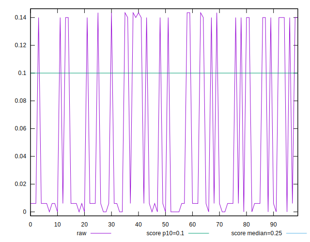

# //cumulative-layout-shift/samples/agenda

[→ Parent](../..)


## Raw


```yaml
p90min: 0
p90max: 0.1434961832894219
p90range: 0.1434961832894219
p90mean: 0.05059549972407922
median: 0.006063152419196235
p90stdev: 0.06475741068732176
mad: 0.006063152419196235
stdevBySn: 0.00723091557513343
lfitCenter: 0.04185156943580925
lfitStdev: 0.06749254785421178
mfitCenter: 0.04185156943580925
mfitStdev: 0.08458936447424398
mfitConfidence: 0.008458936447424398
p90skewness: 0.669962767402422
p90eccentricity: 1.000000000000001
p90discretization: 18.8
outlandishness: 1.0507979364362177

```


## Score


```yaml
p90min: 0.78
p90max: 1
p90range: 0.21999999999999997
p90mean: 0.9278723404255328
median: 1
p90stdev: 0.10042327801293302
mad: 0
stdevBySn: 0
lfitCenter: 0.9422805850926583
lfitStdev: 0.10523674046248957
mfitCenter: 0.9422805850926583
mfitStdev: 0.13189469471935836
mfitConfidence: 0.013189469471935836
p90skewness: -0.6751792970992566
p90eccentricity: 0.9999999999999996
p90discretization: 31.333333333333332
outlandishness: 0.9951080383173675

```


## Raw Estimate


## Score Estimate


## P Score


```yaml
p90min: 0.7812592330863557
p90max: 1
p90range: 0.2187407669136443
p90mean: 0.9282986899836133
median: 0.9999999011422622
p90stdev: 0.09982984237938455
mad: 9.885773777362772e-8
stdevBySn: 1.1789773806882843e-7
lfitCenter: 0.9426219688238743
lfitStdev: 0.1046141702594915
mfitCenter: 0.9426219688238743
mfitStdev: 0.13111441868168436
mfitConfidence: 0.013111441868168436
p90skewness: -0.6751964756993182
p90eccentricity: 1.0000000000000009
p90discretization: 18.8
outlandishness: 0.9951364942663032

```


## Score Difference


```yaml
p90min: 0
p90max: 0
p90range: 0
p90mean: 0
median: 0
p90stdev: 0
mad: 0
stdevBySn: 0
lfitCenter: 0
lfitStdev: 0
mfitCenter: 0
mfitStdev: 0
mfitConfidence: 0
p90skewness: .nan
p90eccentricity: .nan
p90discretization: 94
outlandishness: .nan

```


## P Score Difference


```yaml
p90min: -9.885773777362772e-8
p90max: 0.001259233086355671
p90range: 0.0012593319440934447
p90mean: 0.0004263527131160979
median: 0
p90stdev: 0.0005935470507434458
mad: 9.885773777362772e-8
stdevBySn: 1.1789773806882843e-7
lfitCenter: 0.00034140478676735164
lfitStdev: 0.0006225558140247973
mfitCenter: 0.00034140478676735164
mfitStdev: 0.0007802580037703667
mfitConfidence: 0.00007802580037703666
p90skewness: 0.6735516622330937
p90eccentricity: 0.9999999999999994
p90discretization: 18.8
outlandishness: 1.058013986409583

```

