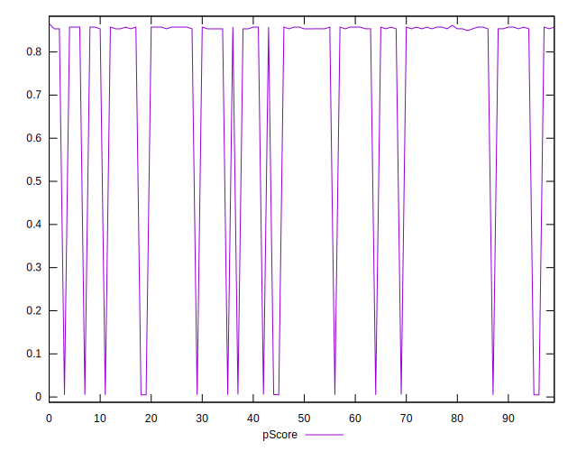

# //cumulative-layout-shift/samples/astro

[→ Parent](../..)


## Raw


```yaml
p90min: 0.11630859375
p90max: 1.585097885131836
p90range: 1.4687892913818361
p90mean: 0.33317058319741105
median: 0.1177978515625
p90stdev: 0.5166558703698502
mad: 0.0014599609375000044
stdevBySn: 0.0017411494140625054
lfitCenter: 0.26114189590468545
lfitStdev: 0.3251314350515105
mfitCenter: 0.26114189590468545
mfitStdev: 0.40749182444577003
mfitConfidence: 0.040749182444577
p90skewness: 1.9735678444189477
p90eccentricity: 1.0000000000000002
p90discretization: 7.833333333333333
outlandishness: 1.194807783969369

```


## Score


```yaml
p90min: 0
p90max: 0.86
p90range: 0.86
p90mean: 0.7281914893617022
median: 0.85
p90stdev: 0.3034691710864705
mad: 0.010000000000000009
stdevBySn: 0.011926000000000011
lfitCenter: 0.7699783400183492
lfitStdev: 0.1907901747910459
mfitCenter: 0.7699783400183492
mfitStdev: 0.23912002356712592
mfitConfidence: 0.02391200235671259
p90skewness: -1.971293269377244
p90eccentricity: 0.9999999999999992
p90discretization: 23.5
outlandishness: 0.9517320788897006

```


## Raw Estimate


## Score Estimate


## P Score


```yaml
p90min: 0.004894655520471081
p90max: 0.8577468142243491
p90range: 0.852852158703878
p90mean: 0.7289886363755581
median: 0.8537048253165158
p90stdev: 0.302819538504478
mad: 0.003962716815983702
stdevBySn: 0.004725936074742164
lfitCenter: 0.7711047452042504
lfitStdev: 0.19049225659180852
mfitCenter: 0.7711047452042504
mfitStdev: 0.23874663847588243
mfitConfidence: 0.023874663847588243
p90skewness: -1.971954303217823
p90eccentricity: 1.000000000000001
p90discretization: 7.833333333333333
outlandishness: 0.9519190635462058

```


## Score Difference


```yaml
p90min: 0
p90max: 0
p90range: 0
p90mean: 0
median: 0
p90stdev: 0
mad: 0
stdevBySn: 0
lfitCenter: 0
lfitStdev: 0
mfitCenter: 0
mfitStdev: 0
mfitConfidence: 0
p90skewness: .nan
p90eccentricity: .nan
p90discretization: 94
outlandishness: .nan

```


## P Score Difference


```yaml
p90min: -0.004340322892845352
p90max: 0.004912971260002841
p90range: 0.009253294152848193
p90mean: 0.0008840386267270505
median: 0.0035851789800422917
p90stdev: 0.00317047524890378
mad: 0.001327792279960549
stdevBySn: 0.001583525073080951
lfitCenter: 0.0009125101009564637
lfitStdev: 0.003813312735553898
mfitCenter: 0.0009125101009564637
mfitStdev: 0.0047792787662840576
mfitConfidence: 0.0004779278766284058
p90skewness: -0.07034969366608558
p90eccentricity: 0.9999999999999994
p90discretization: 7.833333333333333
outlandishness: 0.9191083964890125

```

