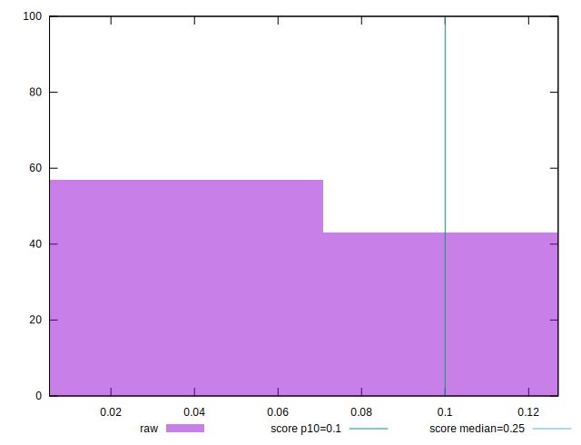

# //cumulative-layout-shift/samples/card

[→ Parent](../..)


## Raw


```yaml
p90min: 0.005289688110351562
p90max: 0.12706176386939155
p90range: 0.12177207575903999
p90mean: 0.060139168898264525
median: 0.011352840529547797
p90stdev: 0.05761847939603084
mad: 0.0060631524191962355
stdevBySn: 0.007230915575133431
lfitCenter: 0.05535154853079092
lfitStdev: 0.0688467807756858
mfitCenter: 0.05535154853079092
mfitStdev: 0.0862866437416533
mfitConfidence: 0.00862866437416533
p90skewness: 0.2989994092542468
p90eccentricity: 0.9999999999999994
p90discretization: 31.333333333333332
outlandishness: 1.0120814471834672

```


## Score


```yaml
p90min: 0.83
p90max: 1
p90range: 0.17000000000000004
p90mean: 0.9276595744680846
median: 1
p90stdev: 0.08405197900279929
mad: 0
stdevBySn: 0
lfitCenter: 0.9348879156781766
lfitStdev: 0.10069967441342996
mfitCenter: 0.9348879156781766
mfitStdev: 0.1262083256924159
mfitConfidence: 0.012620832569241592
p90skewness: -0.30123203803833587
p90eccentricity: 0.9999999999999992
p90discretization: 47
outlandishness: 0.9983630557665599

```


## Raw Estimate


## Score Estimate


## P Score


```yaml
p90min: 0.8280724101476665
p90max: 0.9999999652181568
p90range: 0.1719275550704903
p90mean: 0.926835497024972
median: 0.9999923522960321
p90stdev: 0.08500173128783768
mad: 0.0000076129221247001055
stdevBySn: 0.000009079170925917347
lfitCenter: 0.9341453074160587
lfitStdev: 0.1018373389341618
mfitCenter: 0.9341453074160587
mfitStdev: 0.12763417672120614
mfitConfidence: 0.012763417672120613
p90skewness: -0.3012320364610607
p90eccentricity: 0.9999999999999996
p90discretization: 31.333333333333332
outlandishness: 0.9983435239480217

```


## Score Difference


```yaml
p90min: 0
p90max: 1.1102230246251565e-16
p90range: 1.1102230246251565e-16
p90mean: 4.724353296277262e-17
median: 0
p90stdev: 5.4892024914245867e-17
mad: 0
stdevBySn: 0
lfitCenter: 4.252290305613123e-17
lfitStdev: 6.576417476826276e-17
mfitCenter: 4.252290305613123e-17
mfitStdev: 8.242317004888873e-17
mfitConfidence: 8.242317004888874e-18
p90skewness: 0.30123203803835497
p90eccentricity: 0.9999999999999982
p90discretization: 47
outlandishness: 1.02111025

```


## P Score Difference


```yaml
p90min: -0.0019275898523334334
p90max: -3.478184318339572e-8
p90range: 0.00192755507049025
p90mean: -0.0008240774431141505
median: -0.000007647703967883501
p90stdev: 0.0009497542405321902
mad: 0.0000076129221247001055
stdevBySn: 0.000009079170925917347
lfitCenter: -0.0007426082621181994
lfitStdev: 0.0011376645207319183
mfitCenter: -0.0007426082621181994
mfitStdev: 0.001425851028790328
mfitConfidence: 0.0001425851028790328
p90skewness: -0.301219379163469
p90eccentricity: 0.9999999999999984
p90discretization: 31.333333333333332
outlandishness: 1.0204513350621174

```

