# //cumulative-layout-shift/samples/music

[→ Parent](../..)


## Raw


```yaml
p90min: 0.01815185546875
p90max: 0.09242338699764675
p90range: 0.07427153152889676
p90mean: 0.042628022626782155
median: 0.024215007887946234
p90stdev: 0.027853131874616726
mad: 0.0060631524191962355
stdevBySn: 0.007230915575133431
lfitCenter: 0.03946011284920827
lfitStdev: 0.029545432288430692
mfitCenter: 0.03946011284920827
mfitStdev: 0.037029708017448905
mfitConfidence: 0.0037029708017448904
p90skewness: 0.6096896949192933
p90eccentricity: 0.9999999999999997
p90discretization: 10.444444444444445
outlandishness: 1.035972392547067

```

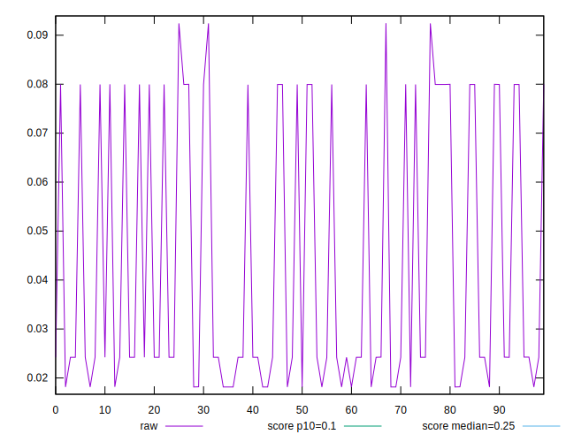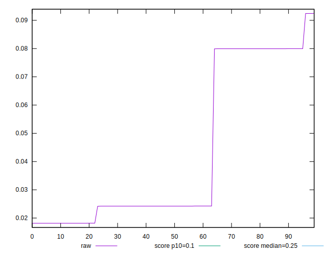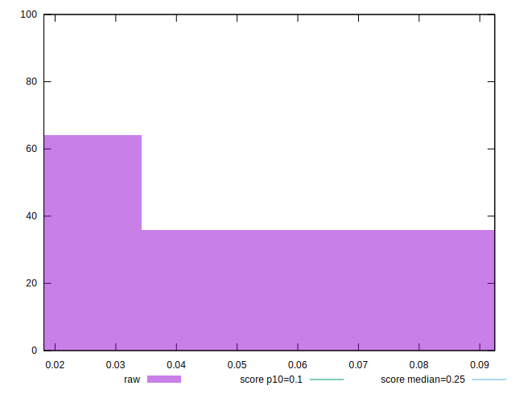
## Score


```yaml
p90min: 0.92
p90max: 1
p90range: 0.07999999999999996
p90mean: 0.9787234042553187
median: 1
p90stdev: 0.028998680914724826
mad: 0
stdevBySn: 0
lfitCenter: 0.9825036665633822
lfitStdev: 0.03135115468398258
mfitCenter: 0.9825036665633822
mfitStdev: 0.03929284542613856
mfitConfidence: 0.0039292845426138565
p90skewness: -0.6426305753835312
p90eccentricity: 1.0000000000000007
p90discretization: 31.333333333333332
outlandishness: 0.9977056653308128

```

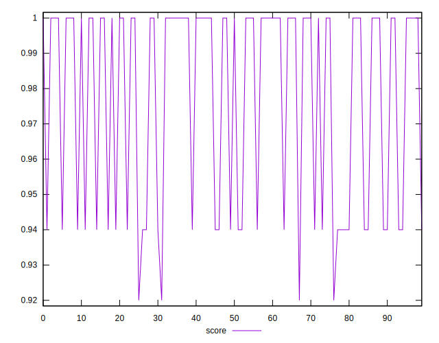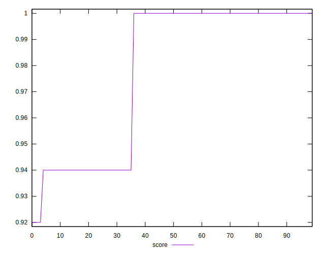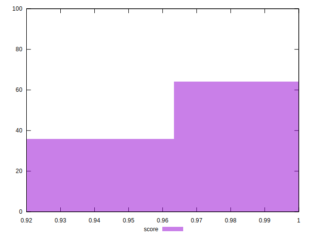
## Raw Estimate

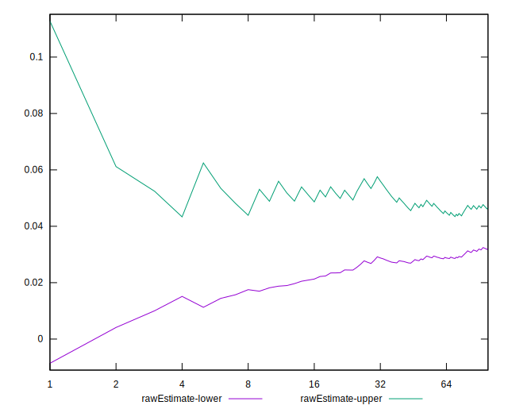
## Score Estimate

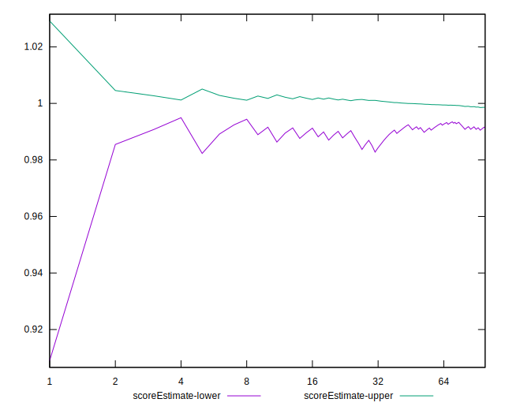
## P Score


```yaml
p90min: 0.9180008553554518
p90max: 0.9998778210952632
p90range: 0.0818769657398114
p90mean: 0.9799991126940995
median: 0.9994527833197606
p90stdev: 0.026774874866397035
mad: 0.00042503777550262356
stdevBySn: 0.0005069000510644289
lfitCenter: 0.9833565337629125
lfitStdev: 0.028998325753545075
mfitCenter: 0.9833565337629125
mfitStdev: 0.036344011661969086
mfitConfidence: 0.0036344011661969084
p90skewness: -0.665229971404558
p90eccentricity: 1.0000000000000002
p90discretization: 10.444444444444445
outlandishness: 0.9974212011375383

```

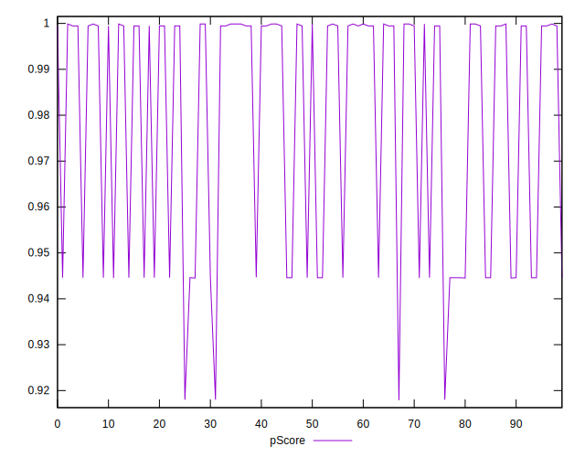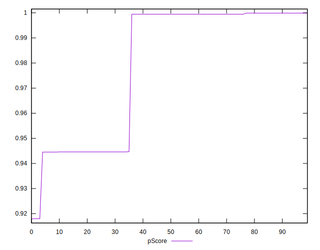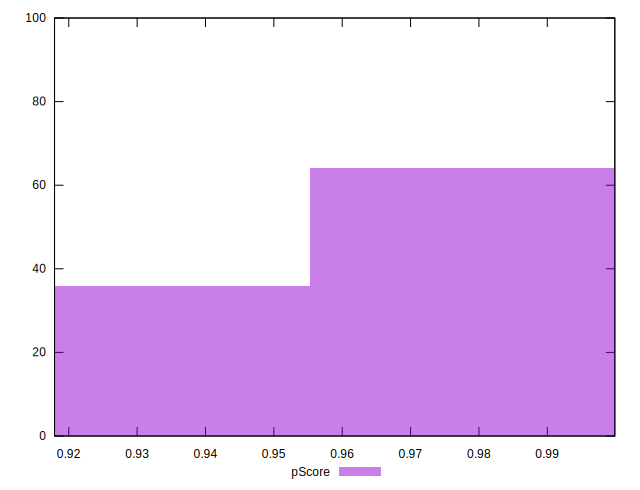
## Score Difference


```yaml
p90min: 0
p90max: 1.1102230246251565e-16
p90range: 1.1102230246251565e-16
p90mean: 3.425156139801015e-17
median: 0
p90stdev: 5.12788236130827e-17
mad: 0
stdevBySn: 0
lfitCenter: 2.6326324622728603e-17
lfitStdev: 5.0342261751066015e-17
mfitCenter: 2.6326324622728603e-17
mfitStdev: 6.309466842053694e-17
mfitConfidence: 6.309466842053694e-18
p90skewness: 0.8291761914687816
p90eccentricity: 1.0000000000000007
p90discretization: 47
outlandishness: 1.0758696789536266

```

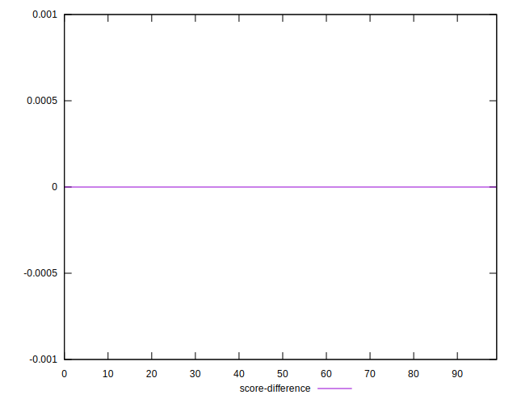
## P Score Difference


```yaml
p90min: -0.001999144644548201
p90max: 0.004599091596629856
p90range: 0.006598236241178057
p90mean: 0.0011241516966399904
median: -0.0001221789047367583
p90stdev: 0.002323164138077066
mad: 0.00042503777550262356
stdevBySn: 0.0005069000510644289
lfitCenter: 0.000788440361688407
lfitStdev: 0.002254741749513605
mfitCenter: 0.000788440361688407
mfitStdev: 0.002825899713504426
mfitConfidence: 0.0002825899713504426
p90skewness: 0.79327081345876
p90eccentricity: 1.0000000000000002
p90discretization: 11.75
outlandishness: 1.0188308429989557

```

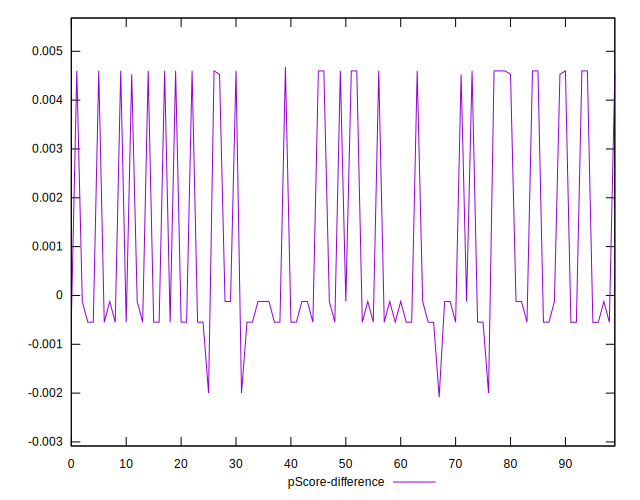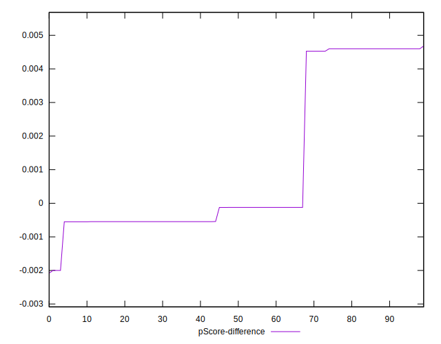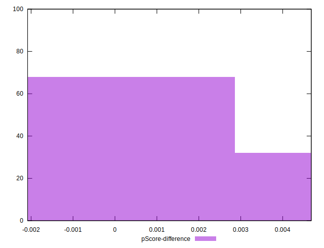