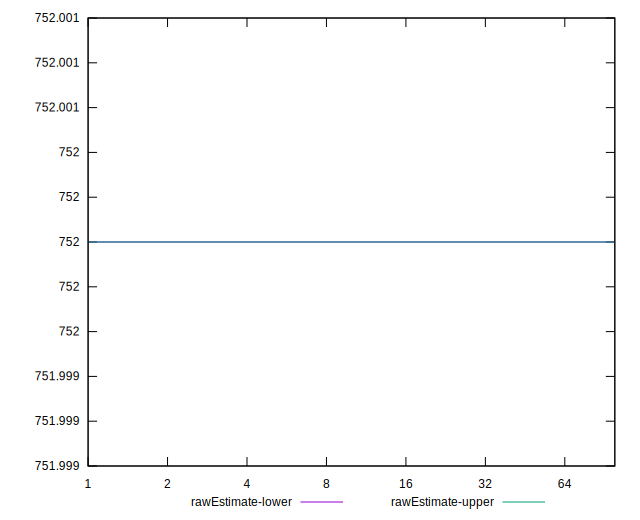

# //dom-size/samples/music

[→ Parent](../..)


## Raw


```yaml
p90min: 752
p90max: 752
p90range: 0
p90mean: 752
median: 752
p90stdev: 0
mad: 0
stdevBySn: 0
lfitCenter: 752
lfitStdev: 0
mfitCenter: 752
mfitStdev: 0
mfitConfidence: 0
p90skewness: .nan
p90eccentricity: .nan
p90discretization: 94
outlandishness: 1

```


## Score


```yaml
p90min: 0.93
p90max: 0.93
p90range: 0
p90mean: 0.9300000000000017
median: 0.93
p90stdev: 1.6653345369377348e-15
mad: 0
stdevBySn: 0
lfitCenter: 0.9300000000000019
lfitStdev: 0
mfitCenter: 0.9300000000000019
mfitStdev: 0
mfitConfidence: 0
p90skewness: -1
p90eccentricity: 1
p90discretization: 94
outlandishness: 1.0000000000000004

```


## Raw Estimate


## Score Estimate


## P Score


```yaml
p90min: 0.9308540313791123
p90max: 0.9308540313791123
p90range: 0
p90mean: 0.9308540313791126
median: 0.9308540313791123
p90stdev: 3.3306690738754696e-16
mad: 0
stdevBySn: 0
lfitCenter: 0.9308540313791126
lfitStdev: 0
mfitCenter: 0.9308540313791126
mfitStdev: 0
mfitConfidence: 0
p90skewness: -1
p90eccentricity: 1
p90discretization: 94
outlandishness: 1

```


## Score Difference


```yaml
p90min: 0
p90max: 0
p90range: 0
p90mean: 0
median: 0
p90stdev: 0
mad: 0
stdevBySn: 0
lfitCenter: 0
lfitStdev: 0
mfitCenter: 0
mfitStdev: 0
mfitConfidence: 0
p90skewness: .nan
p90eccentricity: .nan
p90discretization: 94
outlandishness: .nan

```


## P Score Difference


```yaml
p90min: 0.0008540313791122189
p90max: 0.0008540313791122189
p90range: 0
p90mean: 0.0008540313791122189
median: 0.0008540313791122189
p90stdev: 0
mad: 0
stdevBySn: 0
lfitCenter: 0.0008540313791122189
lfitStdev: 0
mfitCenter: 0.0008540313791122189
mfitStdev: 0
mfitConfidence: 0
p90skewness: .nan
p90eccentricity: .nan
p90discretization: 94
outlandishness: 1

```

