# //estimated-input-latency/samples/astro

[→ Parent](../..)


## Raw


```yaml
p90min: 14.4
p90max: 20.8
p90range: 6.4
p90mean: 16.570425531914893
median: 16.5
p90stdev: 1.5119093992989614
mad: 1.2999999999999998
stdevBySn: 1.7889000000000002
lfitCenter: 16.561682104790425
lfitStdev: 1.3344476537007925
mfitCenter: 16.561682104790425
mfitStdev: 1.6724821115736248
mfitConfidence: 0.1672482111573625
p90skewness: 0.649538312668091
p90eccentricity: 1.0000000000000002
p90discretization: 3.1333333333333333
outlandishness: 1.0152382086615575

```

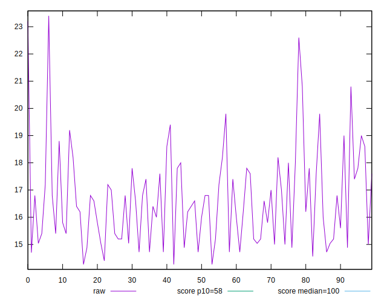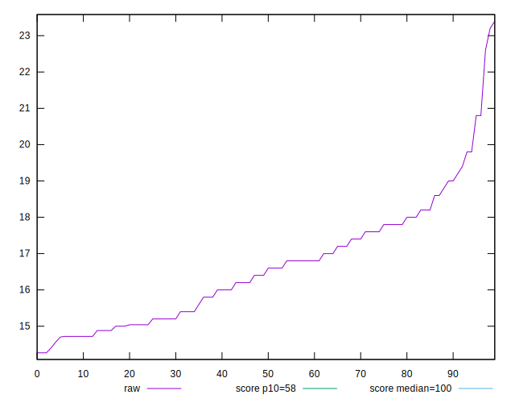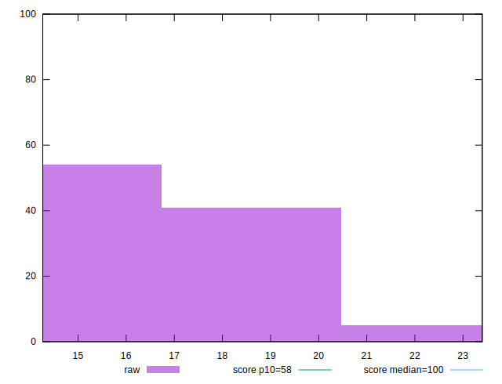
## Score


```yaml
p90min: 1
p90max: 1
p90range: 0
p90mean: 1
median: 1
p90stdev: 0
mad: 0
stdevBySn: 0
lfitCenter: 1
lfitStdev: 0
mfitCenter: 1
mfitStdev: 0
mfitConfidence: 0
p90skewness: .nan
p90eccentricity: .nan
p90discretization: 94
outlandishness: 1

```


## Raw Estimate

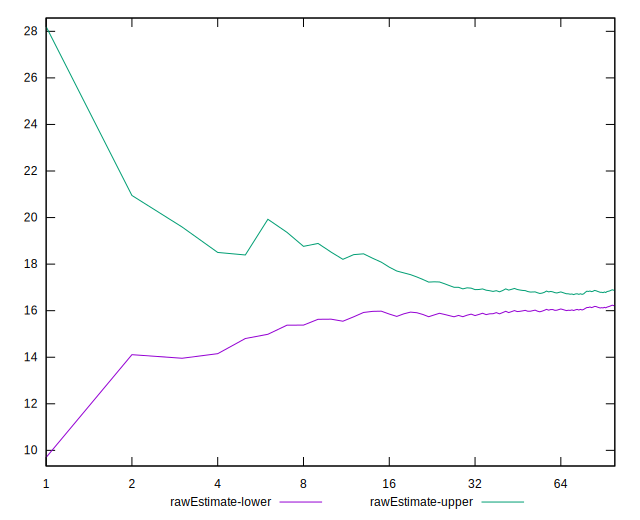
## Score Estimate

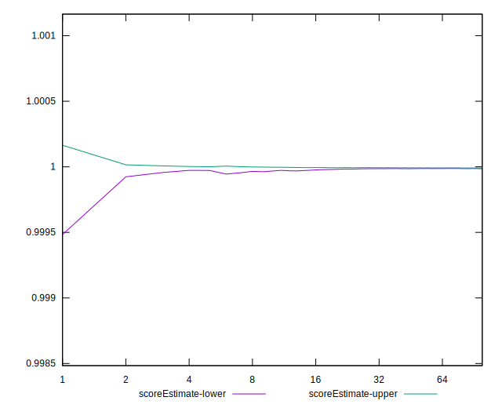
## P Score


```yaml
p90min: 0.9998896657355476
p90max: 0.9999974311975479
p90range: 0.00010776546200030879
p90mean: 0.9999826203823989
median: 0.9999887485741619
p90stdev: 0.000019834388419621167
mad: 0.000007211702600540271
stdevBySn: 0.000010153678374752706
lfitCenter: 0.9999815778033003
lfitStdev: 0.00001828471671183851
mfitCenter: 0.9999815778033003
mfitStdev: 0.000022916493974815746
mfitConfidence: 0.0000022916493974815744
p90skewness: -2.7253012573574433
p90eccentricity: 1.0000000000000002
p90discretization: 3.1333333333333333
outlandishness: 0.999985065680283

```

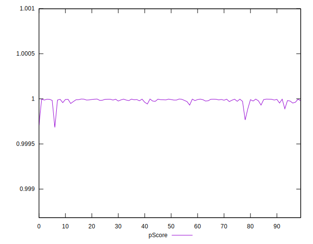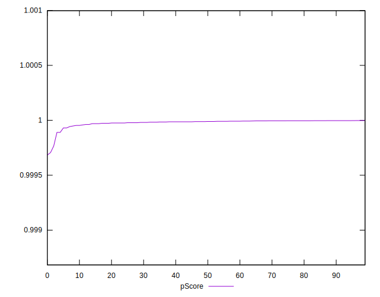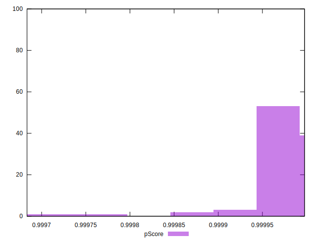
## Score Difference


```yaml
p90min: 0
p90max: 0
p90range: 0
p90mean: 0
median: 0
p90stdev: 0
mad: 0
stdevBySn: 0
lfitCenter: 0
lfitStdev: 0
mfitCenter: 0
mfitStdev: 0
mfitConfidence: 0
p90skewness: .nan
p90eccentricity: .nan
p90discretization: 94
outlandishness: .nan

```


## P Score Difference


```yaml
p90min: -0.00011033426445239414
p90max: -0.0000025688024520853503
p90range: 0.00010776546200030879
p90mean: -0.000017379617601183544
median: -0.000011251425838076923
p90stdev: 0.000019834388419621167
mad: 0.0000072117026004847595
stdevBySn: 0.000010153678374752706
lfitCenter: -0.000018422196700021496
lfitStdev: 0.000018284716712067156
mfitCenter: -0.000018422196700021496
mfitStdev: 0.000022916493975102307
mfitConfidence: 0.0000022916493975102308
p90skewness: -2.7253012573395776
p90eccentricity: 1
p90discretization: 3.1333333333333333
outlandishness: 2.0438835357085168

```

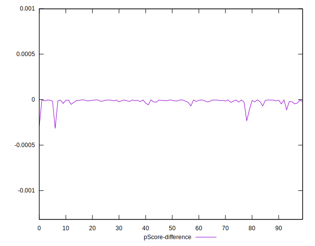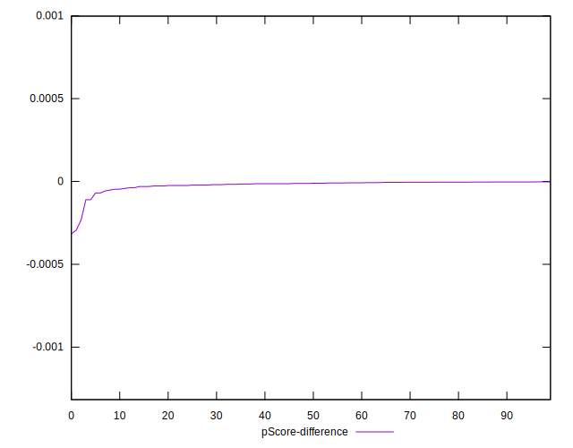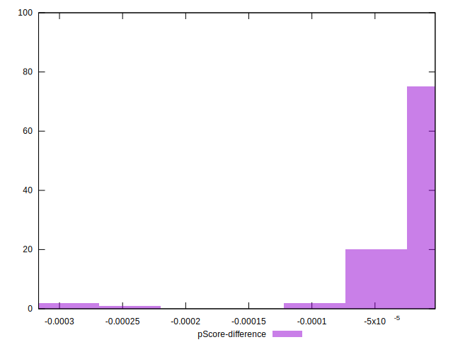