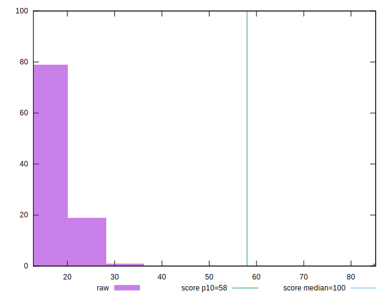

# //estimated-input-latency/samples/music

[→ Parent](../..)


## Raw


```yaml
p90min: 12.8
p90max: 25.400000000000002
p90range: 12.600000000000001
p90mean: 17.048226950354618
median: 16.4
p90stdev: 3.275994848342404
mad: 2.3999999999999986
stdevBySn: 3.8163199999999993
lfitCenter: 17.132678972939573
lfitStdev: 3.364173516097345
mfitCenter: 17.132678972939573
mfitStdev: 4.216366232349884
mfitConfidence: 0.4216366232349884
p90skewness: 0.7366990617908065
p90eccentricity: 1.0000000000000002
p90discretization: 2.1363636363636362
outlandishness: 1.0903015479089915

```


## Score


```yaml
p90min: 1
p90max: 1
p90range: 0
p90mean: 1
median: 1
p90stdev: 0
mad: 0
stdevBySn: 0
lfitCenter: 0.9983712395266081
lfitStdev: 0.004063697814756543
mfitCenter: 0.9983712395266081
mfitStdev: 0.005093089926137364
mfitConfidence: 0.0005093089926137364
p90skewness: .nan
p90eccentricity: .nan
p90discretization: 94
outlandishness: 0.9930122500000002

```


## Raw Estimate


## Score Estimate


## P Score


```yaml
p90min: 0.9993681325117603
p90max: 0.9999993380488856
p90range: 0.0006312055371253678
p90mean: 0.9999397023388802
median: 0.9999891648152126
p90stdev: 0.00011964453076996927
mad: 0.000009885059016667697
stdevBySn: 0.000013347943681644393
lfitCenter: 0.9983061968669695
lfitStdev: 0.0040997237263534015
mfitCenter: 0.9983061968669695
mfitStdev: 0.0051382417104968185
mfitConfidence: 0.0005138241710496819
p90skewness: -3.112106354469686
p90eccentricity: 0.9999999999999989
p90discretization: 2.186046511627907
outlandishness: 0.9929122074366641

```


## Score Difference


```yaml
p90min: 0
p90max: 0
p90range: 0
p90mean: 0
median: 0
p90stdev: 0
mad: 0
stdevBySn: 0
lfitCenter: 0
lfitStdev: 0
mfitCenter: 0
mfitStdev: 0
mfitConfidence: 0
p90skewness: .nan
p90eccentricity: .nan
p90discretization: 94
outlandishness: .nan

```


## P Score Difference


```yaml
p90min: -0.0006318674882397346
p90max: -6.619511143668433e-7
p90range: 0.0006312055371253678
p90mean: -0.00006029766112015855
median: -0.000010835184787394425
p90stdev: 0.00011964453076996922
mad: 0.000009885059016667697
stdevBySn: 0.000013347943681644393
lfitCenter: -0.00006504265963823785
lfitStdev: 0.00010991793218315052
mfitCenter: -0.00006504265963823785
mfitStdev: 0.00013776169848825064
mfitConfidence: 0.000013776169848825063
p90skewness: -3.1121063544693635
p90eccentricity: 0.9999999999999999
p90discretization: 2.186046511627907
outlandishness: 3.345083617095426

```

