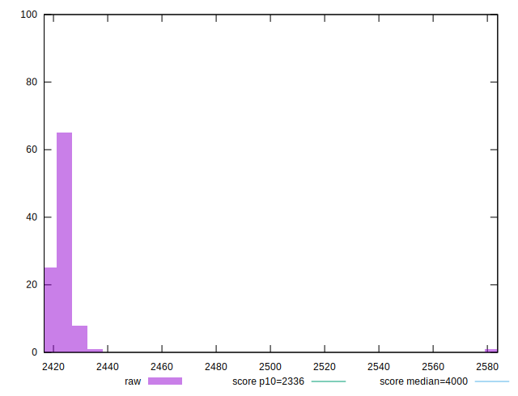

# //first-contentful-paint/samples/astro

[→ Parent](../..)


## Raw


```yaml
p90min: 2418.8858999999998
p90max: 2430.013
p90range: 11.127100000000155
p90mean: 2422.7972361702127
median: 2422.4165000000003
p90stdev: 2.291050687415823
mad: 1.2415499999997337
stdevBySn: 2.2021358999999903
lfitCenter: 2423.4607399560173
lfitStdev: 2.975848760896985
mfitCenter: 2423.4607399560173
mfitStdev: 3.729673326297961
mfitConfidence: 0.3729673326297961
p90skewness: 0.9448783619578419
p90eccentricity: 0.9999999999999999
p90discretization: 1
outlandishness: 1.001384231162607

```


## Score


```yaml
p90min: 0.88
p90max: 0.88
p90range: 0
p90mean: 0.8799999999999998
median: 0.88
p90stdev: 2.220446049250313e-16
mad: 0
stdevBySn: 0
lfitCenter: 0.879906927972949
lfitStdev: 0.0003488597911093873
mfitCenter: 0.879906927972949
mfitStdev: 0.0004372309085782877
mfitConfidence: 0.00004372309085782877
p90skewness: 1
p90eccentricity: 1
p90discretization: 94
outlandishness: 0.9995455061983466

```


## Raw Estimate


## Score Estimate


## P Score


```yaml
p90min: 0.8824922008294536
p90max: 0.8846335828771277
p90range: 0.002141382047674112
p90mean: 0.883882537005298
median: 0.8839560904555948
p90stdev: 0.0004407169185378625
mad: 0.0002386773910204587
stdevBySn: 0.000423043768144915
lfitCenter: 0.8837466868953061
lfitStdev: 0.0005887993590646507
mfitCenter: 0.8837466868953061
mfitStdev: 0.0007379505615005894
mfitConfidence: 0.00007379505615005895
p90skewness: -0.9505059751583451
p90eccentricity: 1.0000000000000002
p90discretization: 1
outlandishness: 0.9992299551995472

```


## Score Difference


```yaml
p90min: 0
p90max: 0
p90range: 0
p90mean: 0
median: 0
p90stdev: 0
mad: 0
stdevBySn: 0
lfitCenter: 0
lfitStdev: 0
mfitCenter: 0
mfitStdev: 0
mfitConfidence: 0
p90skewness: .nan
p90eccentricity: .nan
p90discretization: 94
outlandishness: .nan

```


## P Score Difference


```yaml
p90min: 0.0020072416958597517
p90max: 0.004616699496701293
p90range: 0.0026094578008415414
p90mean: 0.003854597205497308
median: 0.003948788571031314
p90stdev: 0.0004741962400583378
mad: 0.00023549472409956085
stdevBySn: 0.000423043768144915
lfitCenter: 0.003832271778177696
lfitStdev: 0.0004090259265067612
mfitCenter: 0.003832271778177696
mfitStdev: 0.0005126379767353327
mfitConfidence: 0.00005126379767353327
p90skewness: -1.2863339450322864
p90eccentricity: 1.0000000000000002
p90discretization: 1
outlandishness: 0.9425100248920599

```

