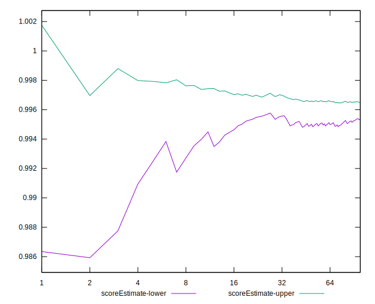
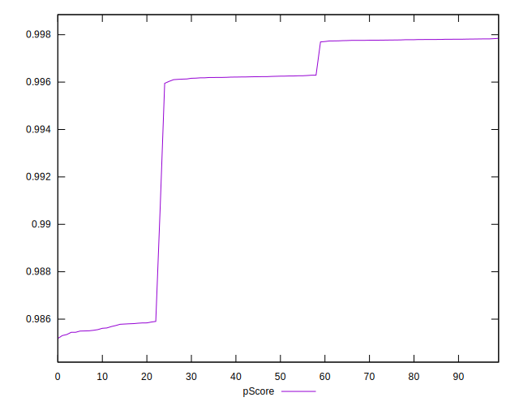

# //first-contentful-paint/samples/music

[→ Parent](../..)


## Raw


```yaml
p90min: 1208.817
p90max: 1600.871
p90range: 392.0540000000001
p90mean: 1331.2685914893616
median: 1302.415
p90stdev: 145.786416289785
mad: 89.8200999999998
stdevBySn: 110.04728425999996
lfitCenter: 1316.5151146699945
lfitStdev: 107.3146767037913
mfitCenter: 1316.5151146699945
mfitStdev: 134.49900158964263
mfitConfidence: 13.449900158964263
p90skewness: 1.0713619793908626
p90eccentricity: 1.0000000000000004
p90discretization: 1.010752688172043
outlandishness: 1.0067385205524508

```


## Score


```yaml
p90min: 0.99
p90max: 1
p90range: 0.010000000000000009
p90mean: 0.9977659574468084
median: 1
p90stdev: 0.004165270627755726
mad: 0
stdevBySn: 0
lfitCenter: 0.9984384869158043
lfitStdev: 0.0033029358858236674
mfitCenter: 0.9984384869158043
mfitStdev: 0.004139616244514955
mfitConfidence: 0.00041396162445149547
p90skewness: -1.328104555020798
p90eccentricity: 0.9999999999999978
p90discretization: 47
outlandishness: 0.9996673695994552

```


## Raw Estimate


## Score Estimate


## P Score


```yaml
p90min: 0.9854437953944815
p90max: 0.9978227331857854
p90range: 0.012378937791303946
p90mean: 0.9945424289998102
median: 0.9962476216052303
p90stdev: 0.0047038927601561155
mad: 0.001523654988992651
stdevBySn: 0.0018608043991353393
lfitCenter: 0.9951609820870203
lfitStdev: 0.0036043755615778068
mfitCenter: 0.9951609820870203
mfitStdev: 0.004517414852065575
mfitConfidence: 0.0004517414852065575
p90skewness: -1.2811609219045699
p90eccentricity: 1.0000000000000004
p90discretization: 1.010752688172043
outlandishness: 0.9996398541307322

```


## Score Difference


```yaml
p90min: 0
p90max: 0
p90range: 0
p90mean: 0
median: 0
p90stdev: 0
mad: 0
stdevBySn: 0
lfitCenter: 0
lfitStdev: 0
mfitCenter: 0
mfitStdev: 0
mfitConfidence: 0
p90skewness: .nan
p90eccentricity: .nan
p90discretization: 94
outlandishness: .nan

```


## P Score Difference


```yaml
p90min: -0.004556204605518532
p90max: -0.0021766190021439424
p90range: 0.00237958560337459
p90mean: -0.003254578886431742
median: -0.0037487665981064677
p90stdev: 0.0008962346519725835
mad: 0.000733008122335066
stdevBySn: 0.0009026962942581689
lfitCenter: -0.0032804022435857813
lfitStdev: 0.0010057224910353922
mfitCenter: -0.0032804022435857813
mfitStdev: 0.0012604862174991733
mfitConfidence: 0.00012604862174991734
p90skewness: 0.17349755666021383
p90eccentricity: 0.9999999999999996
p90discretization: 1.010752688172043
outlandishness: 0.9890293937897552

```

