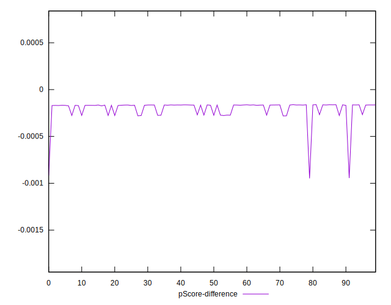

# //first-cpu-idle/samples/agenda

[→ Parent](../..)


## Raw


```yaml
p90min: 1211.5739999999998
p90max: 1297.4343000000001
p90range: 85.86030000000028
p90mean: 1232.6366670212765
median: 1215.1254000000001
p90stdev: 32.86568021999881
mad: 2.3122500000000628
stdevBySn: 3.3613431000002376
lfitCenter: 1230.7242013494083
lfitStdev: 32.70421147396537
mfitCenter: 1230.7242013494083
mfitStdev: 40.98865063132112
mfitConfidence: 4.098865063132112
p90skewness: 1.3180612937890366
p90eccentricity: 1
p90discretization: 1.010752688172043
outlandishness: 1.0130071041075608

```


## Score


```yaml
p90min: 1
p90max: 1
p90range: 0
p90mean: 1
median: 1
p90stdev: 0
mad: 0
stdevBySn: 0
lfitCenter: 1
lfitStdev: 0
mfitCenter: 1
mfitStdev: 0
mfitConfidence: 0
p90skewness: .nan
p90eccentricity: .nan
p90discretization: 94
outlandishness: 1

```


## Raw Estimate


## Score Estimate


## P Score


```yaml
p90min: 0.9997190954098972
p90max: 0.9998384036778012
p90range: 0.00011930826790396143
p90mean: 0.9998101358300738
median: 0.9998344699764417
p90stdev: 0.000045583255955012746
mad: 0.0000025866018751874442
stdevBySn: 0.0000037542050385191764
lfitCenter: 0.9998078770450374
lfitStdev: 0.00005589525574839945
mfitCenter: 0.9998078770450374
mfitStdev: 0.00007005431430882614
mfitConfidence: 0.000007005431430882613
p90skewness: -1.3241526962773886
p90eccentricity: 0.9999999999999994
p90discretization: 1.010752688172043
outlandishness: 0.9999569079459187

```


## Score Difference


```yaml
p90min: 0
p90max: 0
p90range: 0
p90mean: 0
median: 0
p90stdev: 0
mad: 0
stdevBySn: 0
lfitCenter: 0
lfitStdev: 0
mfitCenter: 0
mfitStdev: 0
mfitConfidence: 0
p90skewness: .nan
p90eccentricity: .nan
p90discretization: 94
outlandishness: .nan

```


## P Score Difference


```yaml
p90min: -0.0002809045901027707
p90max: -0.00016159632219880926
p90range: 0.00011930826790396143
p90mean: -0.00018986416992665726
median: -0.00016553002355834678
p90stdev: 0.00004558325595501274
mad: 0.0000025866018751874442
stdevBySn: 0.0000037542050385191764
lfitCenter: -0.00019212295496288248
lfitStdev: 0.00005589525574862074
mfitCenter: -0.00019212295496288248
mfitStdev: 0.00007005431430910349
mfitConfidence: 0.000007005431430910348
p90skewness: -1.324152696281742
p90eccentricity: 1.0000000000000004
p90discretization: 1.010752688172043
outlandishness: 1.2397952778796006

```

