# //first-cpu-idle/samples/astro

[→ Parent](../..)


## Raw


```yaml
p90min: 6647.502199999999
p90max: 6904.968
p90range: 257.46580000000085
p90mean: 6809.184739361702
median: 6802.294000000001
p90stdev: 74.08783425127301
mad: 55.934000000001106
stdevBySn: 92.98940719999916
lfitCenter: 6818.908397255082
lfitStdev: 71.45935076064097
mfitCenter: 6818.908397255082
mfitStdev: 89.56101464181857
mfitConfidence: 8.956101464181858
p90skewness: -0.7401814514788032
p90eccentricity: 0.9999999999999996
p90discretization: 1
outlandishness: 1.0044172388430497

```

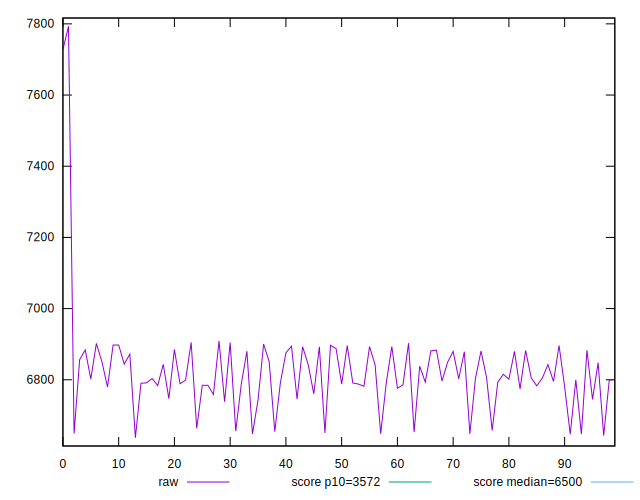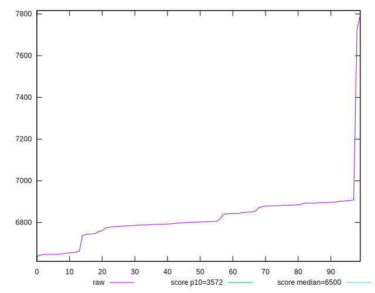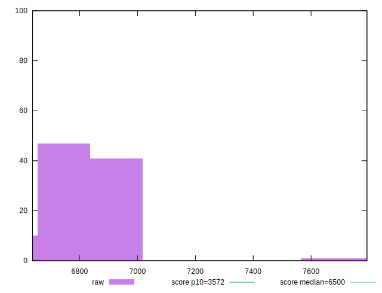
## Score


```yaml
p90min: 0.45
p90max: 0.48
p90range: 0.02999999999999997
p90mean: 0.4598936170212768
median: 0.46
p90stdev: 0.009282181609287505
mad: 0.009999999999999953
stdevBySn: 0.011925999999999945
lfitCenter: 0.4587028601971591
lfitStdev: 0.007668016854841312
mfitCenter: 0.4587028601971591
mfitStdev: 0.009610433939016581
mfitConfidence: 0.0009610433939016581
p90skewness: 0.8990244639381271
p90eccentricity: 1.0000000000000009
p90discretization: 23.5
outlandishness: 0.9930816350889374

```

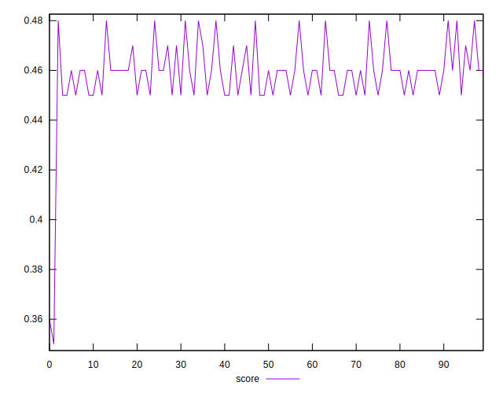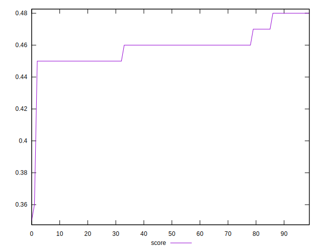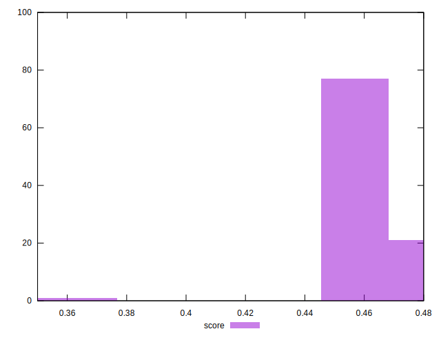
## Raw Estimate

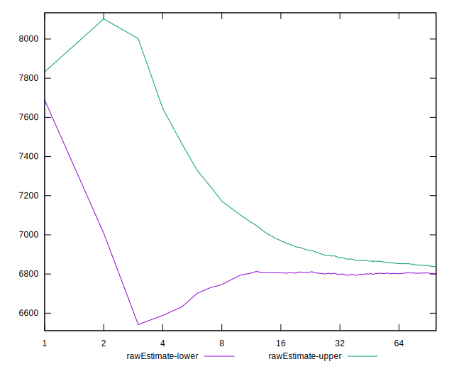
## Score Estimate

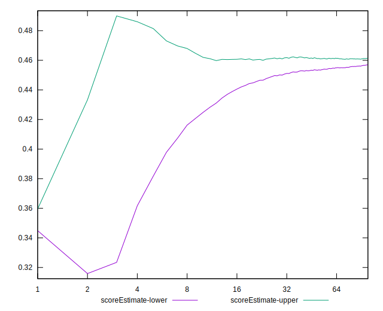
## P Score


```yaml
p90min: 0.44852918025027066
p90max: 0.48084456929938163
p90range: 0.032315389049110965
p90mean: 0.4604408159423948
median: 0.4612405695415047
p90stdev: 0.009290430313013779
mad: 0.007023613569860643
stdevBySn: 0.011540118411466396
lfitCenter: 0.4593094172198743
lfitStdev: 0.008760390687492882
mfitCenter: 0.4593094172198743
mfitStdev: 0.010979521508089944
mfitConfidence: 0.0010979521508089943
p90skewness: 0.766264861037082
p90eccentricity: 1
p90discretization: 1
outlandishness: 0.9928143486647555

```

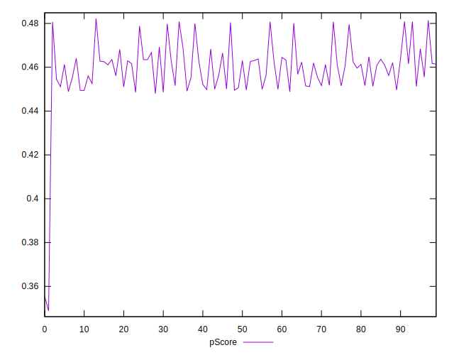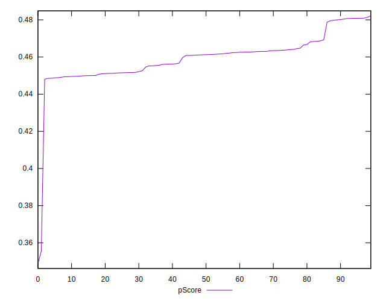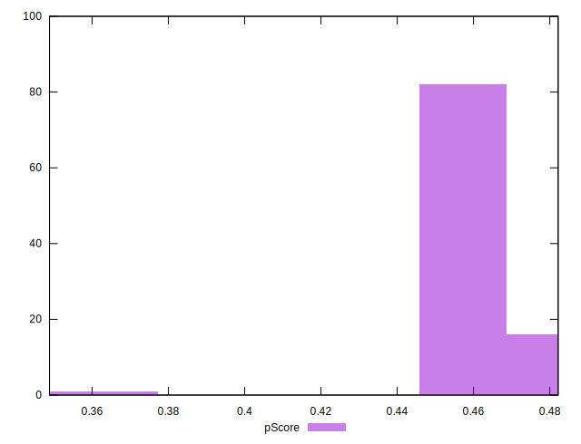
## Score Difference


```yaml
p90min: 0
p90max: 5.551115123125783e-17
p90range: 5.551115123125783e-17
p90mean: 2.9527208101732887e-18
median: 0
p90stdev: 1.2457542745436651e-17
mad: 0
stdevBySn: 0
lfitCenter: 2.2729039546157425e-18
lfitStdev: 5.4640483521104424e-18
mfitCenter: 2.2729039546157425e-18
mfitStdev: 6.848169053566399e-18
mfitConfidence: 6.848169053566399e-19
p90skewness: 3.981981890375808
p90eccentricity: 0.9999999999999967
p90discretization: 47
outlandishness: 2.262016

```

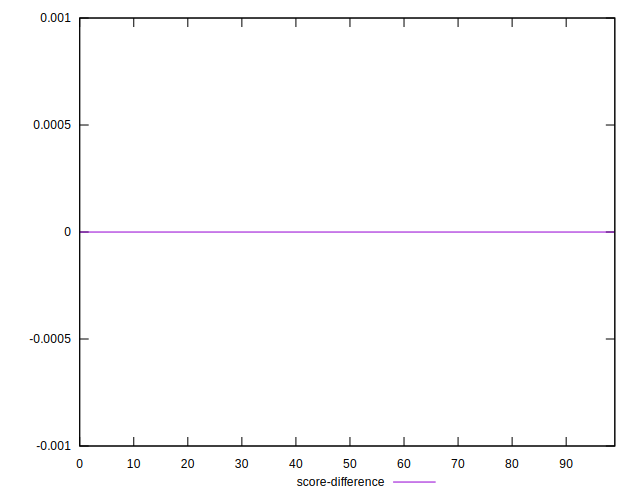
## P Score Difference


```yaml
p90min: -0.004463560906537711
p90max: 0.004092464035537979
p90range: 0.00855602494207569
p90mean: 0.0005179162924700406
median: 0.0008820175030987698
p90stdev: 0.002088573065141899
mad: 0.001455559872745732
stdevBySn: 0.0021313124549341067
lfitCenter: 0.0006060876701172352
lfitStdev: 0.0016856560974803168
mfitCenter: 0.0006060876701172352
mfitStdev: 0.002112656619750001
mfitConfidence: 0.0002112656619750001
p90skewness: -0.5870452569638849
p90eccentricity: 1.0000000000000007
p90discretization: 1
outlandishness: 0.8716926328692897

```

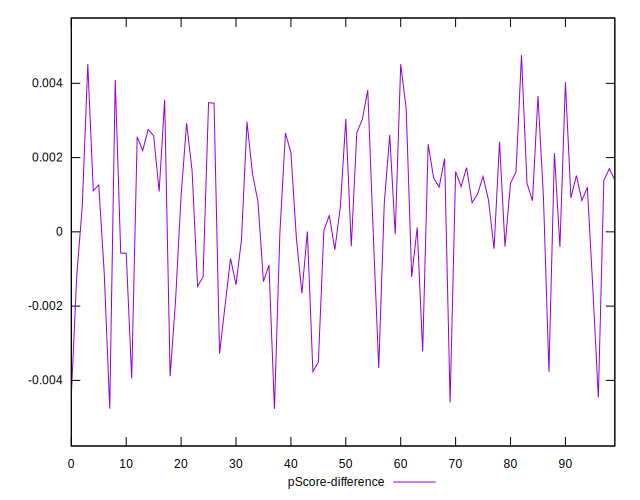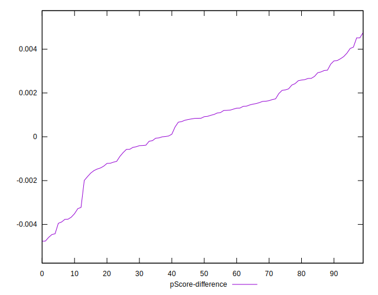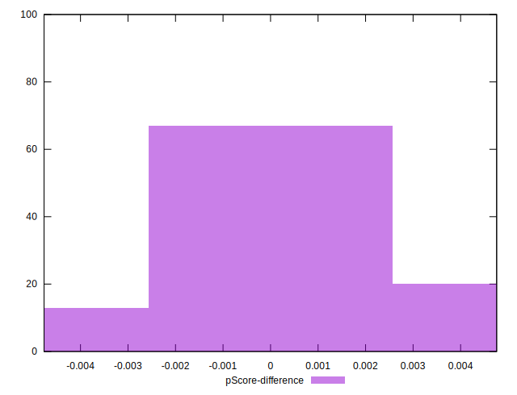