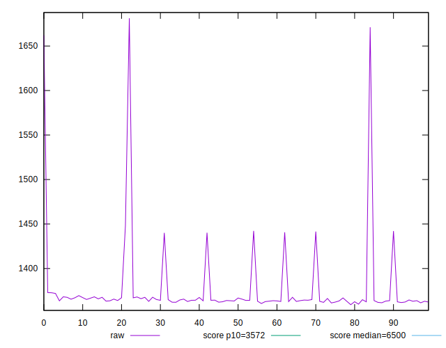
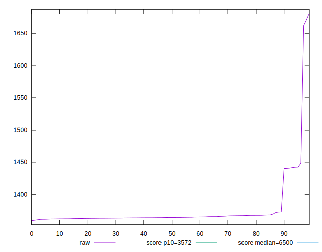
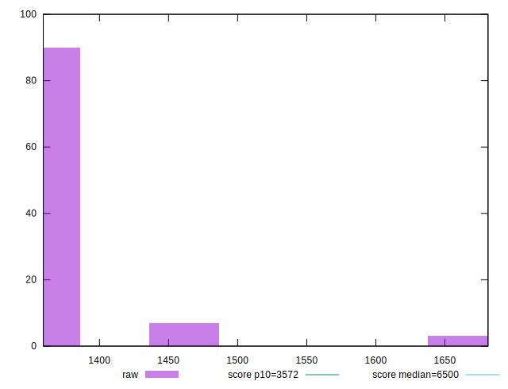
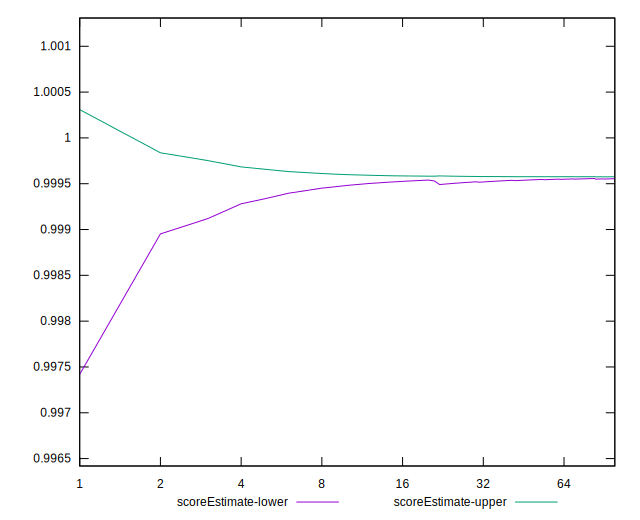
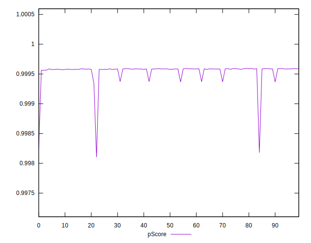
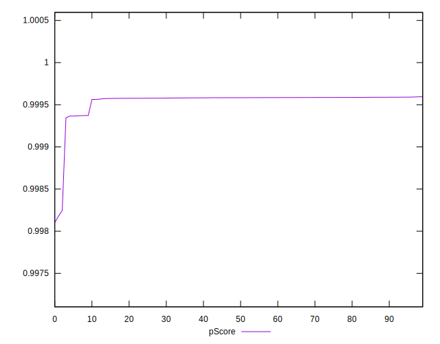
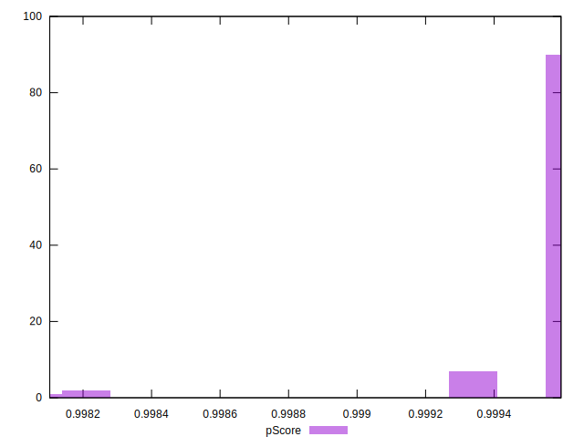
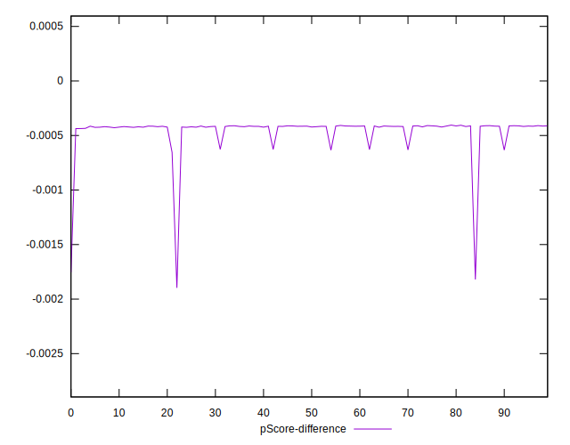
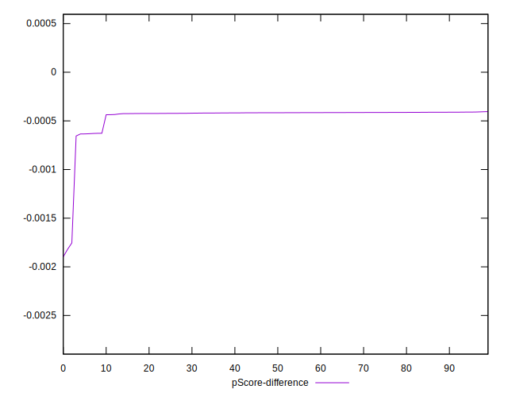
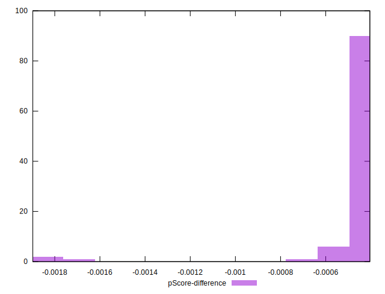

# //first-cpu-idle/samples/card

[→ Parent](../..)


## Raw


```yaml
p90min: 1361.3310000000001
p90max: 1448.4814999999999
p90range: 87.15049999999974
p90mean: 1370.5044648936168
median: 1364.3101499999998
p90stdev: 20.480799139706477
mad: 1.6497000000000526
stdevBySn: 2.4814726350000353
lfitCenter: 1371.9681256010122
lfitStdev: 17.51803609144666
mfitCenter: 1371.9681256010122
mfitStdev: 21.955602313505928
mfitConfidence: 2.195560231350593
p90skewness: 3.178740420385679
p90eccentricity: 1.0000000000000004
p90discretization: 1
outlandishness: 1.0127558612789165

```


## Score


```yaml
p90min: 1
p90max: 1
p90range: 0
p90mean: 1
median: 1
p90stdev: 0
mad: 0
stdevBySn: 0
lfitCenter: 1
lfitStdev: 0
mfitCenter: 1
mfitStdev: 0
mfitConfidence: 0
p90skewness: .nan
p90eccentricity: .nan
p90discretization: 94
outlandishness: 1

```


## Raw Estimate


## Score Estimate


## P Score


```yaml
p90min: 0.9993447892068008
p90max: 0.9995908226383625
p90range: 0.00024603343156170965
p90mean: 0.9995666567486369
median: 0.9995838625396649
p90stdev: 0.000057330719786821856
mad: 0.0000038798314438426296
stdevBySn: 0.000005835468263148092
lfitCenter: 0.9995546765935204
lfitStdev: 0.00006761859091648431
mfitCenter: 0.9995546765935204
mfitStdev: 0.00008474733602625963
mfitConfidence: 0.000008474733602625963
p90skewness: -3.2015107092639425
p90eccentricity: 1.0000000000000007
p90discretization: 1
outlandishness: 0.9999181581502673

```


## Score Difference


```yaml
p90min: 0
p90max: 0
p90range: 0
p90mean: 0
median: 0
p90stdev: 0
mad: 0
stdevBySn: 0
lfitCenter: 0
lfitStdev: 0
mfitCenter: 0
mfitStdev: 0
mfitConfidence: 0
p90skewness: .nan
p90eccentricity: .nan
p90discretization: 94
outlandishness: .nan

```


## P Score Difference


```yaml
p90min: -0.0006552107931991902
p90max: -0.00040917736163748053
p90range: 0.00024603343156170965
p90mean: -0.000433343251363105
median: -0.0004161374603350865
p90stdev: 0.000057330719786821876
mad: 0.0000038798314438426296
stdevBySn: 0.000005835468263148092
lfitCenter: -0.0004453234064792852
lfitStdev: 0.00006761859091610304
mfitCenter: -0.0004453234064792852
mfitStdev: 0.00008474733602578178
mfitConfidence: 0.000008474733602578177
p90skewness: -3.2015107092709214
p90eccentricity: 0.9999999999999999
p90discretization: 1
outlandishness: 1.197693308252422

```

