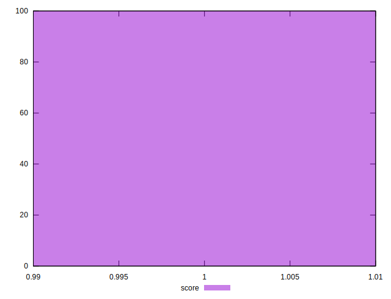

# //first-cpu-idle/samples/music

[→ Parent](../..)


## Raw


```yaml
p90min: 1208.817
p90max: 1600.871
p90range: 392.0540000000001
p90mean: 1331.2685914893616
median: 1302.415
p90stdev: 145.786416289785
mad: 89.8200999999998
stdevBySn: 110.04728425999996
lfitCenter: 1316.5151146699945
lfitStdev: 107.3146767037913
mfitCenter: 1316.5151146699945
mfitStdev: 134.49900158964263
mfitConfidence: 13.449900158964263
p90skewness: 1.0713619793908626
p90eccentricity: 1.0000000000000004
p90discretization: 1.010752688172043
outlandishness: 1.0067385205524508

```


## Score


```yaml
p90min: 1
p90max: 1
p90range: 0
p90mean: 1
median: 1
p90stdev: 0
mad: 0
stdevBySn: 0
lfitCenter: 1
lfitStdev: 0
mfitCenter: 1
mfitStdev: 0
mfitConfidence: 0
p90skewness: .nan
p90eccentricity: .nan
p90discretization: 94
outlandishness: 1

```


## Raw Estimate


## Score Estimate


## P Score


```yaml
p90min: 0.9986481818153756
p90max: 0.999841404670813
p90range: 0.0011932228554373259
p90mean: 0.9995344345859097
median: 0.9997104411330326
p90stdev: 0.0004551125557954152
mad: 0.00012683959739495654
stdevBySn: 0.0001548582870060828
lfitCenter: 0.9995962528076391
lfitStdev: 0.0003501105169512817
mfitCenter: 0.9995962528076391
mfitStdev: 0.0004387984609594171
mfitConfidence: 0.000043879846095941706
p90skewness: -1.304871071348844
p90eccentricity: 1.0000000000000002
p90discretization: 1.010752688172043
outlandishness: 0.9999642216942641

```


## Score Difference


```yaml
p90min: 0
p90max: 0
p90range: 0
p90mean: 0
median: 0
p90stdev: 0
mad: 0
stdevBySn: 0
lfitCenter: 0
lfitStdev: 0
mfitCenter: 0
mfitStdev: 0
mfitConfidence: 0
p90skewness: .nan
p90eccentricity: .nan
p90discretization: 94
outlandishness: .nan

```


## P Score Difference


```yaml
p90min: -0.001351818184624376
p90max: -0.0001585953291870501
p90range: 0.0011932228554373259
p90mean: -0.0004655654140901156
median: -0.00028955886696740984
p90stdev: 0.0004551125557954154
mad: 0.00012683959739501205
stdevBySn: 0.0001548582870060828
lfitCenter: -0.000403747192361376
lfitStdev: 0.0003501105169516792
mfitCenter: -0.000403747192361376
mfitStdev: 0.0004387984609599153
mfitConfidence: 0.00004387984609599153
p90skewness: -1.3048710713490839
p90eccentricity: 0.9999999999999997
p90discretization: 1.010752688172043
outlandishness: 1.0782891573237139

```

