# //first-meaningful-paint/samples/agenda

[→ Parent](../..)


## Raw


```yaml
p90min: 1211.5739999999998
p90max: 1297.4343000000001
p90range: 85.86030000000028
p90mean: 1232.6366670212765
median: 1215.1254000000001
p90stdev: 32.86568021999881
mad: 2.3122500000000628
stdevBySn: 3.3613431000002376
lfitCenter: 1230.7242013494083
lfitStdev: 32.70421147396537
mfitCenter: 1230.7242013494083
mfitStdev: 40.98865063132112
mfitConfidence: 4.098865063132112
p90skewness: 1.3180612937890366
p90eccentricity: 1
p90discretization: 1.010752688172043
outlandishness: 1.0130071041075608

```

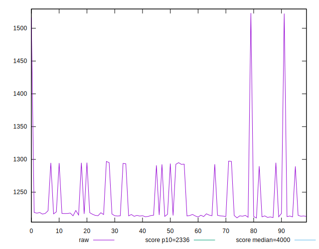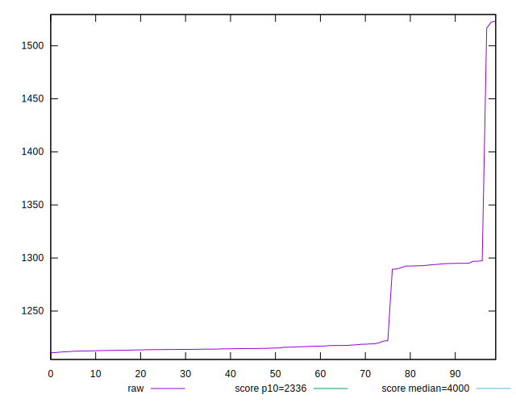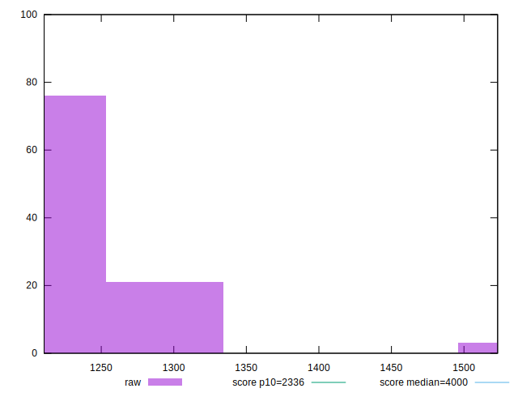
## Score


```yaml
p90min: 1
p90max: 1
p90range: 0
p90mean: 1
median: 1
p90stdev: 0
mad: 0
stdevBySn: 0
lfitCenter: 0.9998566332053863
lfitStdev: 0.0003542151281481916
mfitCenter: 0.9998566332053863
mfitStdev: 0.0004439428282058643
mfitConfidence: 0.00004439428282058643
p90skewness: .nan
p90eccentricity: .nan
p90discretization: 94
outlandishness: 0.9994000900000001

```

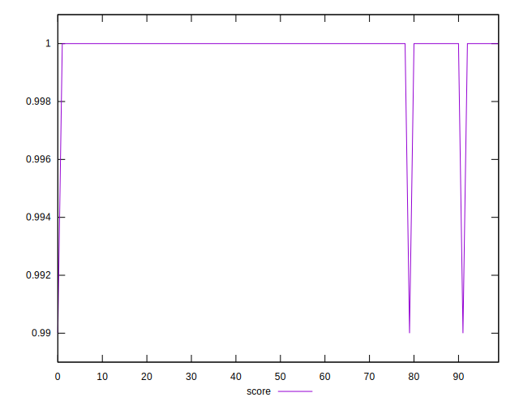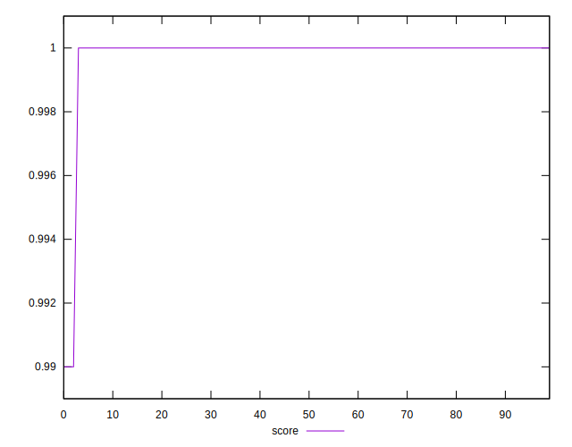
## Raw Estimate


## Score Estimate

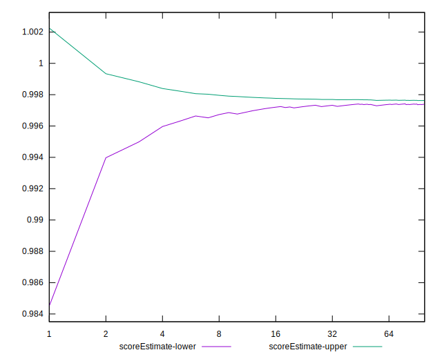
## P Score


```yaml
p90min: 0.9963485196887236
p90max: 0.997785273622152
p90range: 0.0014367539334283475
p90mean: 0.9974431791461489
median: 0.9977362887365888
p90stdev: 0.00054918391594853
mad: 0.000032166196727800855
stdevBySn: 0.00004669087614740283
lfitCenter: 0.9974295559462767
lfitStdev: 0.0006444477406193934
mfitCenter: 0.9974295559462767
mfitStdev: 0.0008076954648920558
mfitConfidence: 0.00008076954648920559
p90skewness: -1.3233322621215589
p90eccentricity: 1.0000000000000002
p90discretization: 1.010752688172043
outlandishness: 0.9995372847111204

```

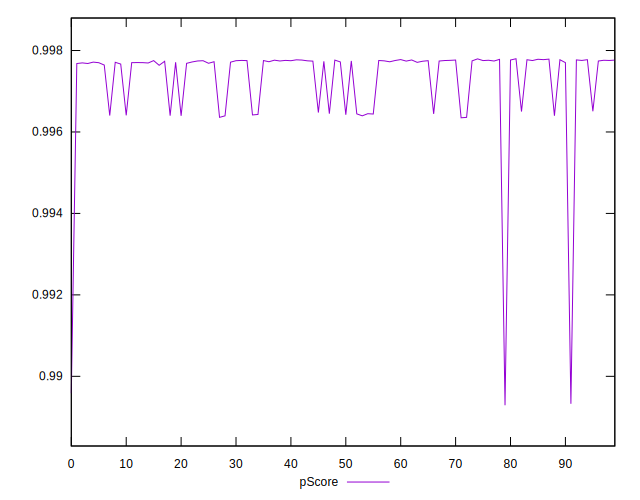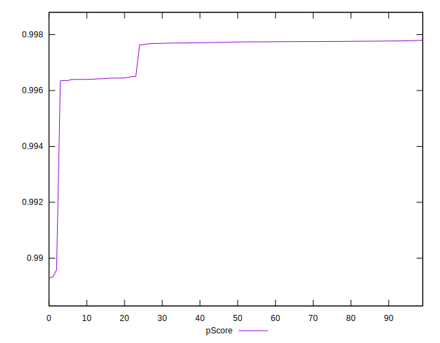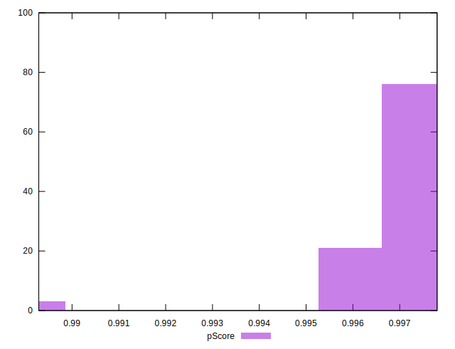
## Score Difference


```yaml
p90min: 0
p90max: 0
p90range: 0
p90mean: 0
median: 0
p90stdev: 0
mad: 0
stdevBySn: 0
lfitCenter: 0
lfitStdev: 0
mfitCenter: 0
mfitStdev: 0
mfitConfidence: 0
p90skewness: .nan
p90eccentricity: .nan
p90discretization: 94
outlandishness: .nan

```


## P Score Difference


```yaml
p90min: -0.0036037345539219334
p90max: -0.002201908546528797
p90range: 0.0014018260073931366
p90mean: -0.0025109037491553303
median: -0.0022590433593372428
p90stdev: 0.0005154017642891655
mad: 0.000030380608285918154
stdevBySn: 0.00004669087614740283
lfitCenter: -0.0024105081824552454
lfitStdev: 0.00037940368284598174
mfitCenter: -0.0024105081824552454
mfitStdev: 0.00047551199993891565
mfitConfidence: 0.000047551199993891564
p90skewness: -1.5586331078423499
p90eccentricity: 0.9999999999999996
p90discretization: 1.010752688172043
outlandishness: 0.9815348752893625

```

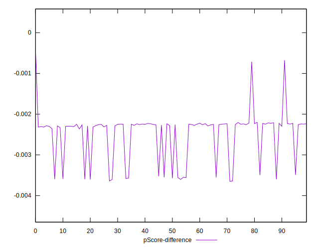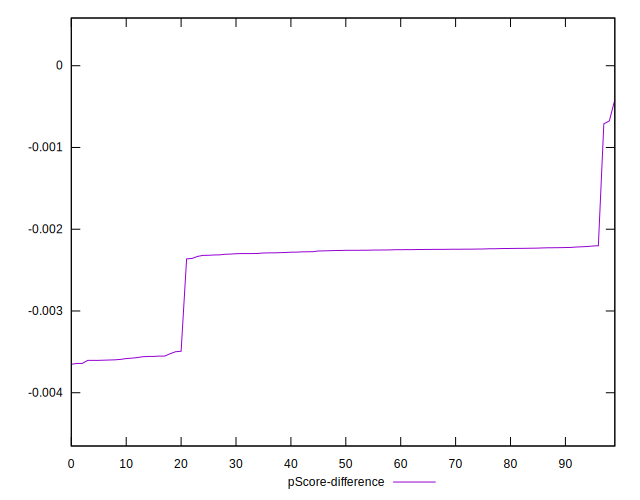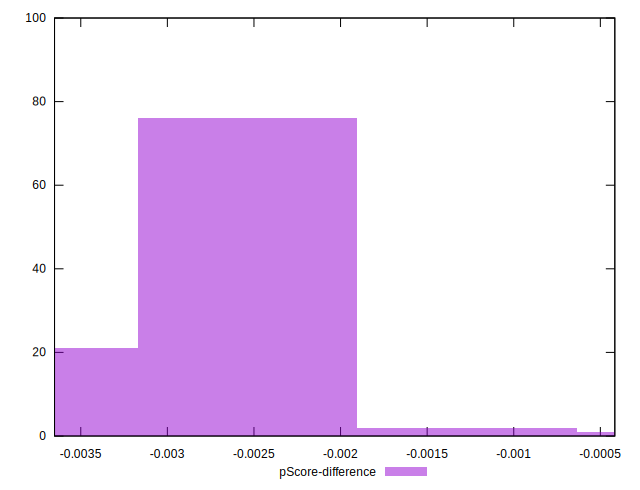