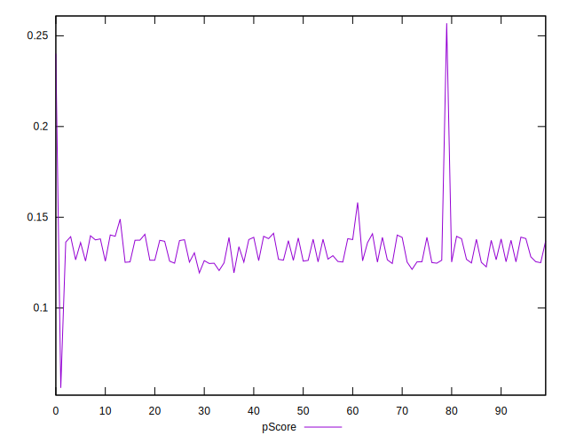

# //first-meaningful-paint/samples/astro

[→ Parent](../..)


## Raw


```yaml
p90min: 6190.737050000001
p90max: 6540.6595000000025
p90range: 349.92245000000185
p90mean: 6398.858278191488
median: 6448.52425
p90stdev: 83.50092500941099
mad: 87.79375000000118
stdevBySn: 119.27222415000088
lfitCenter: 6398.432137074752
lfitStdev: 114.38997551761587
mfitCenter: 6398.432137074752
mfitStdev: 143.36657362766346
mfitConfidence: 14.336657362766346
p90skewness: -0.1925418392866115
p90eccentricity: 1
p90discretization: 1
outlandishness: 0.9976517439454528

```


## Score


```yaml
p90min: 0.12
p90max: 0.15
p90range: 0.03
p90mean: 0.1335106382978725
median: 0.13
p90stdev: 0.006950806903795594
mad: 0.010000000000000009
stdevBySn: 0.011926000000000011
lfitCenter: 0.13443161955114521
lfitStdev: 0.008981694097147185
mfitCenter: 0.13443161955114521
mfitStdev: 0.011256884200324899
mfitConfidence: 0.0011256884200324898
p90skewness: -0.4085812679551184
p90eccentricity: 0.9999999999999988
p90discretization: 23.5
outlandishness: 1.0239504792622338

```


## Raw Estimate


## Score Estimate


## P Score


```yaml
p90min: 0.1206621999823334
p90max: 0.14901380293383998
p90range: 0.02835160295150657
p90mean: 0.13163151690813074
median: 0.12758674494451833
p90stdev: 0.006663575451354625
mad: 0.0066061369806932335
stdevBySn: 0.009006509575672379
lfitCenter: 0.13211207574421222
lfitStdev: 0.009338940355126892
mfitCenter: 0.13211207574421222
mfitStdev: 0.011704625986404465
mfitConfidence: 0.0011704625986404464
p90skewness: 0.22617801497466325
p90eccentricity: 0.9999999999999999
p90discretization: 1
outlandishness: 1.024485099436063

```


## Score Difference


```yaml
p90min: 0
p90max: 0
p90range: 0
p90mean: 0
median: 0
p90stdev: 0
mad: 0
stdevBySn: 0
lfitCenter: 0
lfitStdev: 0
mfitCenter: 0
mfitStdev: 0
mfitConfidence: 0
p90skewness: .nan
p90eccentricity: .nan
p90discretization: 94
outlandishness: .nan

```


## P Score Difference


```yaml
p90min: -0.004718862761094789
p90max: 0.004700841311188586
p90range: 0.009419704072283375
p90mean: -0.0019868443358288935
median: -0.0025388129409480986
p90stdev: 0.002389820759451424
mad: 0.0015065593857766513
stdevBySn: 0.002332342285404528
lfitCenter: -0.00212855004067739
lfitStdev: 0.001866777119361131
mfitCenter: -0.00212855004067739
mfitStdev: 0.002339658157266674
mfitConfidence: 0.0002339658157266674
p90skewness: 1.2160093307831379
p90eccentricity: 0.9999999999999999
p90discretization: 1
outlandishness: 0.8827387147467982

```

