# //first-meaningful-paint/samples/card

[→ Parent](../..)


## Raw


```yaml
p90min: 1361.3310000000001
p90max: 1448.4814999999999
p90range: 87.15049999999974
p90mean: 1370.5044648936168
median: 1364.3101499999998
p90stdev: 20.480799139706477
mad: 1.6497000000000526
stdevBySn: 2.4814726350000353
lfitCenter: 1371.9681256010122
lfitStdev: 17.51803609144666
mfitCenter: 1371.9681256010122
mfitStdev: 21.955602313505928
mfitConfidence: 2.195560231350593
p90skewness: 3.178740420385679
p90eccentricity: 1.0000000000000004
p90discretization: 1
outlandishness: 1.0127558612789165

```

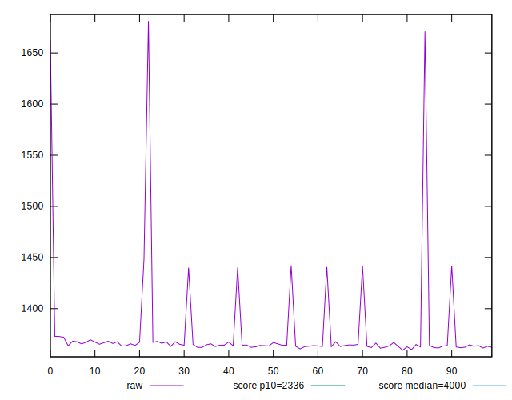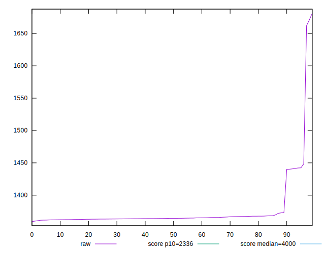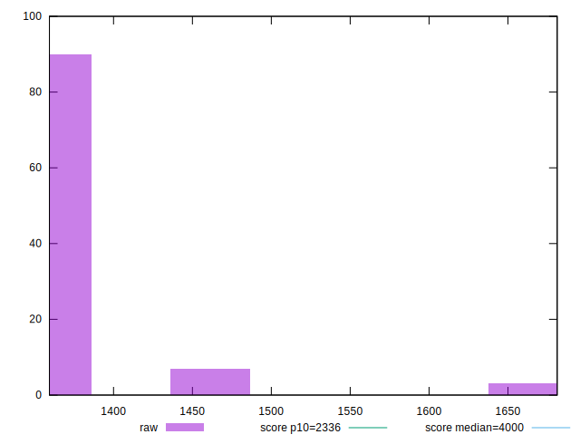
## Score


```yaml
p90min: 0.99
p90max: 0.99
p90range: 0
p90mean: 0.9899999999999988
median: 0.99
p90stdev: 1.2212453270876722e-15
mad: 0
stdevBySn: 0
lfitCenter: 0.9898566332053863
lfitStdev: 0.0003542151281481916
mfitCenter: 0.9898566332053863
mfitStdev: 0.0004439428282058643
mfitConfidence: 0.00004439428282058643
p90skewness: 1
p90eccentricity: 1
p90discretization: 94
outlandishness: 0.9993940312213039

```

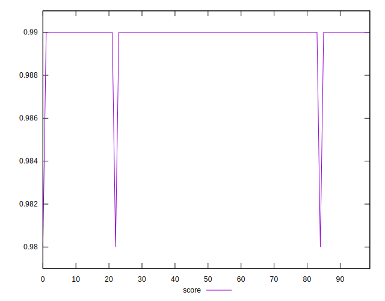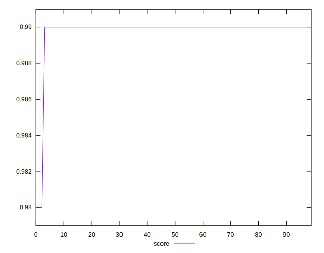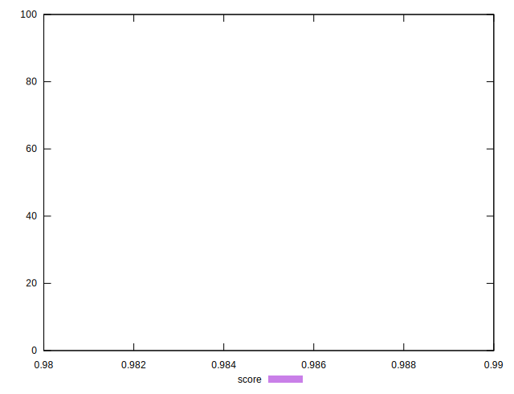
## Raw Estimate

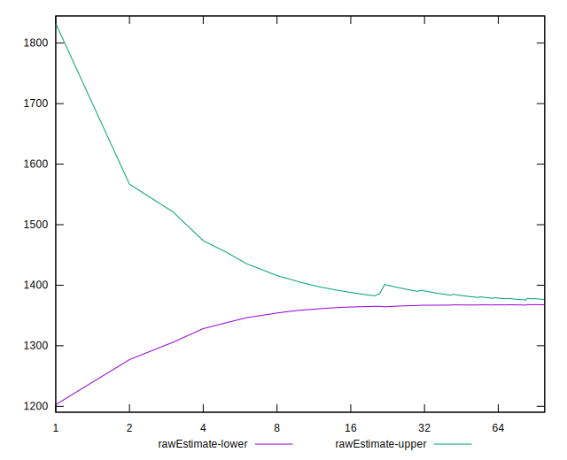
## Score Estimate

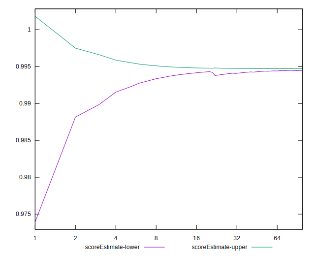
## P Score


```yaml
p90min: 0.9922463030461406
p90max: 0.9948879936022291
p90range: 0.0026416905560885384
p90mean: 0.9946253543640049
median: 0.9948106629712157
p90stdev: 0.0006166151948863292
mad: 0.000043058483093827427
stdevBySn: 0.00006476313806610212
lfitCenter: 0.99451841040457
lfitStdev: 0.0006753682257972026
mfitCenter: 0.99451841040457
mfitStdev: 0.0008464485461370535
mfitConfidence: 0.00008464485461370535
p90skewness: -3.197778646829796
p90eccentricity: 1.0000000000000007
p90discretization: 1
outlandishness: 0.999207816184301

```

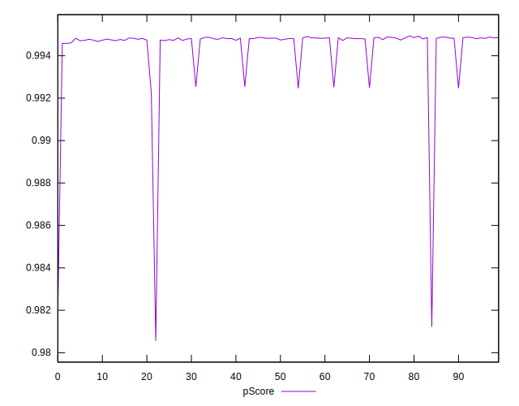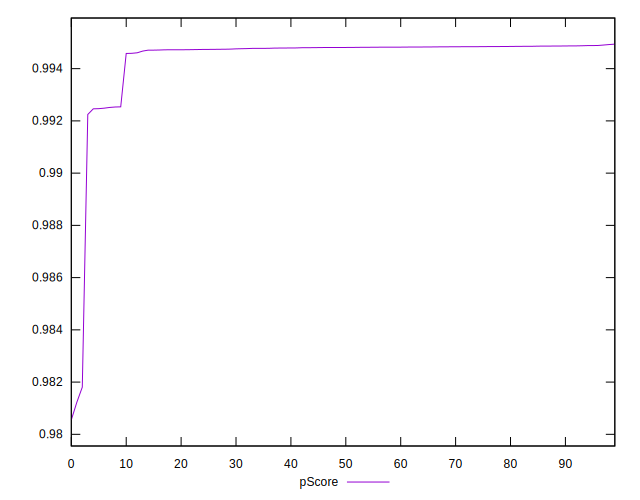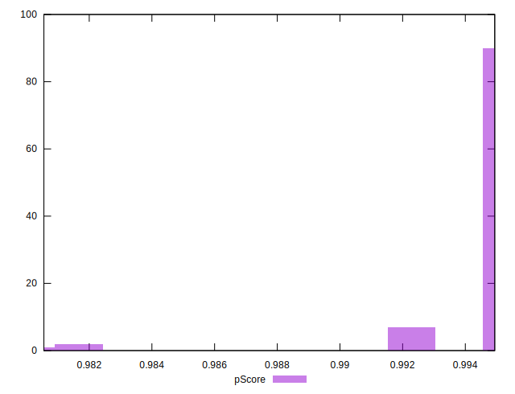
## Score Difference


```yaml
p90min: 0
p90max: 0
p90range: 0
p90mean: 0
median: 0
p90stdev: 0
mad: 0
stdevBySn: 0
lfitCenter: 0
lfitStdev: 0
mfitCenter: 0
mfitStdev: 0
mfitConfidence: 0
p90skewness: .nan
p90eccentricity: .nan
p90discretization: 94
outlandishness: .nan

```


## P Score Difference


```yaml
p90min: 0.0022463030461405964
p90max: 0.004887993602229135
p90range: 0.0026416905560885384
p90mean: 0.00462535436400468
median: 0.004810662971215629
p90stdev: 0.0006166151948863293
mad: 0.000043058483093827427
stdevBySn: 0.00006476313806610212
lfitCenter: 0.00466177719918346
lfitStdev: 0.00033821322220454553
mfitCenter: 0.00466177719918346
mfitStdev: 0.0004238874132425191
mfitConfidence: 0.00004238874132425191
p90skewness: -3.1977786468308453
p90eccentricity: 0.9999999999999996
p90discretization: 1
outlandishness: 0.9597500667321358

```

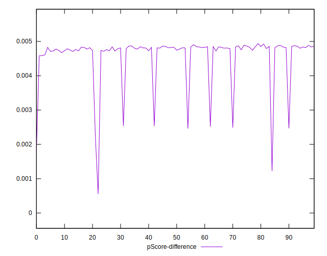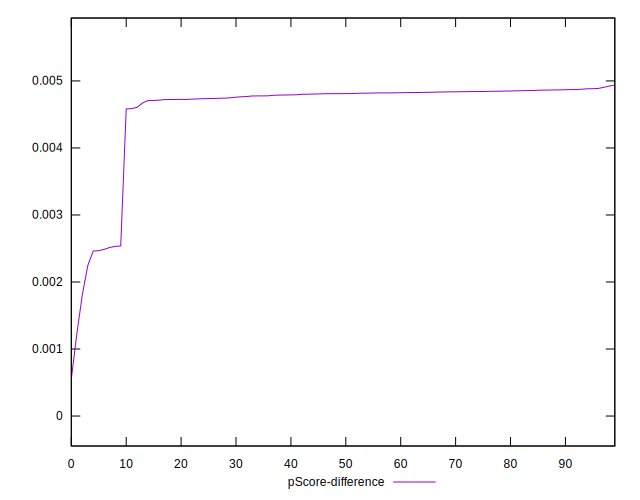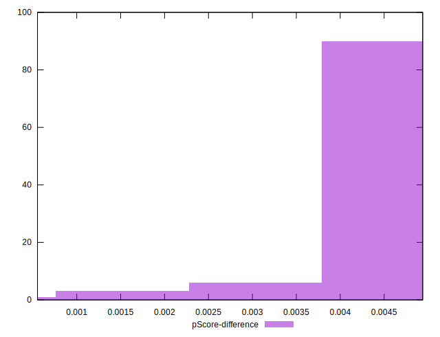