# //interactive/samples/agenda

[→ Parent](../..)


## Raw


```yaml
p90min: 1211.5739999999998
p90max: 1297.4343000000001
p90range: 85.86030000000028
p90mean: 1232.6366670212765
median: 1215.1254000000001
p90stdev: 32.86568021999881
mad: 2.3122500000000628
stdevBySn: 3.3613431000002376
lfitCenter: 1230.7242013494083
lfitStdev: 32.70421147396537
mfitCenter: 1230.7242013494083
mfitStdev: 40.98865063132112
mfitConfidence: 4.098865063132112
p90skewness: 1.3180612937890366
p90eccentricity: 1
p90discretization: 1.010752688172043
outlandishness: 1.0130071041075608

```

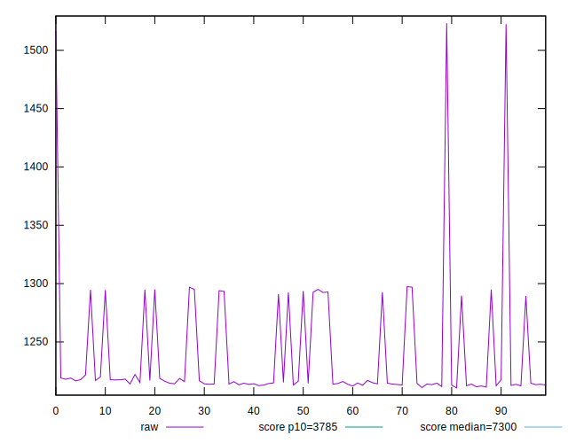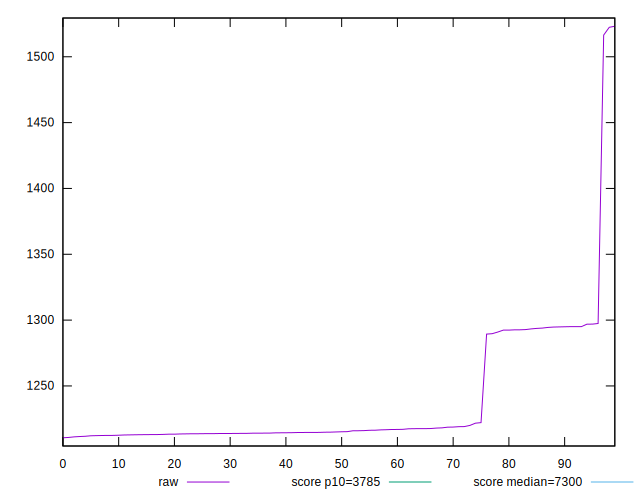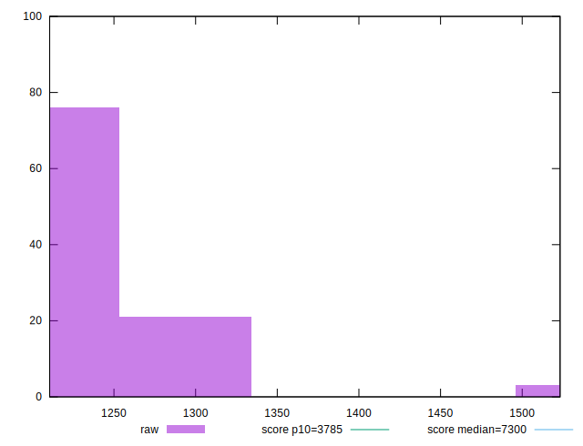
## Score


```yaml
p90min: 1
p90max: 1
p90range: 0
p90mean: 1
median: 1
p90stdev: 0
mad: 0
stdevBySn: 0
lfitCenter: 1
lfitStdev: 0
mfitCenter: 1
mfitStdev: 0
mfitConfidence: 0
p90skewness: .nan
p90eccentricity: .nan
p90discretization: 94
outlandishness: 1

```


## Raw Estimate

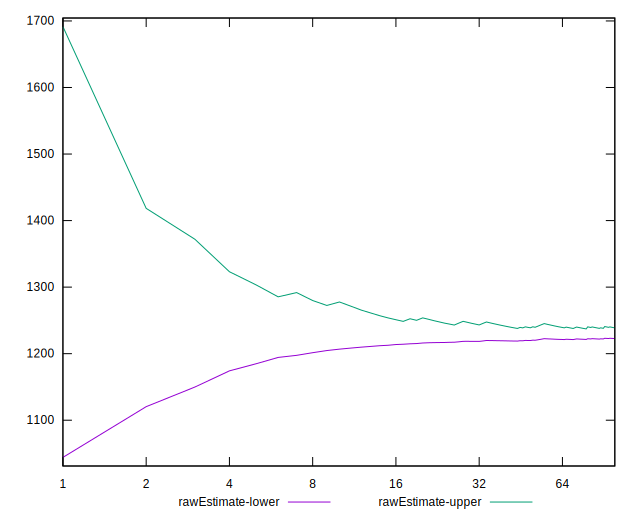
## Score Estimate

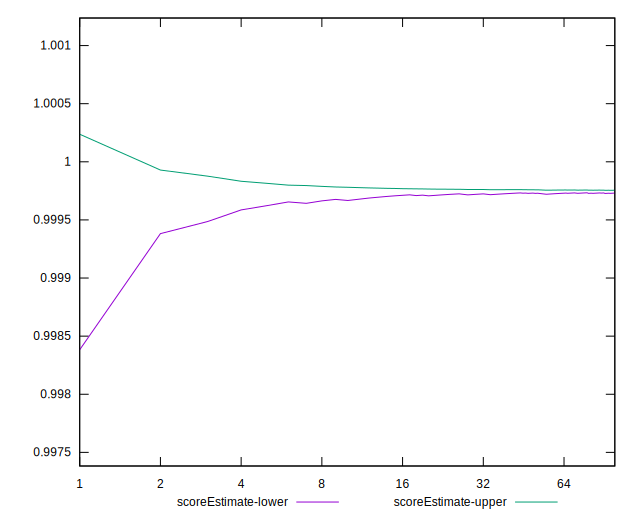
## P Score


```yaml
p90min: 0.9996248316049157
p90max: 0.9997708990774443
p90range: 0.00014606747252865482
p90mean: 0.9997361404799616
median: 0.9997659369043291
p90stdev: 0.0000558268641774271
mad: 0.0000032587283091967123
stdevBySn: 0.000004730183193021876
lfitCenter: 0.9997344344700634
lfitStdev: 0.00006619256485422804
mfitCenter: 0.9997344344700634
mfitStdev: 0.00008296007740045507
mfitConfidence: 0.000008296007740045507
p90skewness: -1.3234317833011728
p90eccentricity: 1.0000000000000007
p90discretization: 1.010752688172043
outlandishness: 0.9999517140149441

```

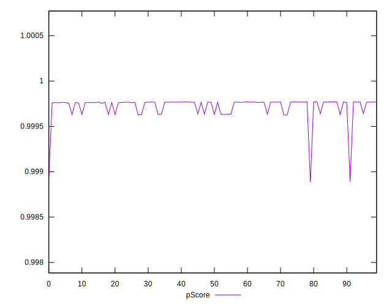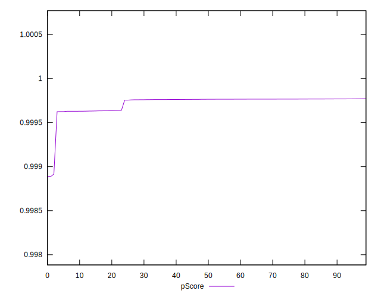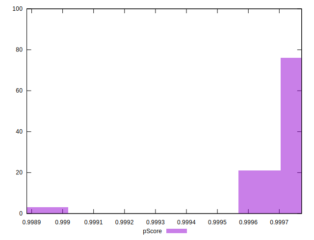
## Score Difference


```yaml
p90min: 0
p90max: 0
p90range: 0
p90mean: 0
median: 0
p90stdev: 0
mad: 0
stdevBySn: 0
lfitCenter: 0
lfitStdev: 0
mfitCenter: 0
mfitStdev: 0
mfitConfidence: 0
p90skewness: .nan
p90eccentricity: .nan
p90discretization: 94
outlandishness: .nan

```


## P Score Difference


```yaml
p90min: -0.0003751683950843354
p90max: -0.0002291009225556806
p90range: 0.00014606747252865482
p90mean: -0.0002638595200384991
median: -0.0002340630956708667
p90stdev: 0.0000558268641774271
mad: 0.0000032587283091967123
stdevBySn: 0.000004730183193021876
lfitCenter: -0.00026556552993739155
lfitStdev: 0.00006619256485489496
mfitCenter: -0.00026556552993739155
mfitStdev: 0.00008296007740129093
mfitConfidence: 0.000008296007740129094
p90skewness: -1.3234317832887348
p90eccentricity: 0.9999999999999999
p90discretization: 1.010752688172043
outlandishness: 1.1913206866098767

```

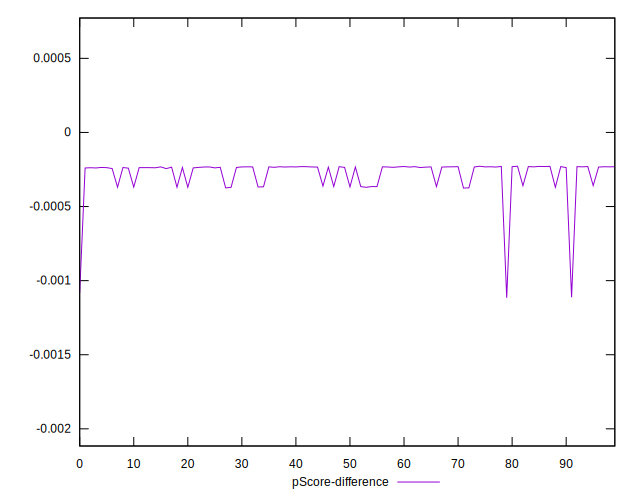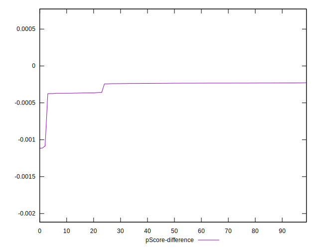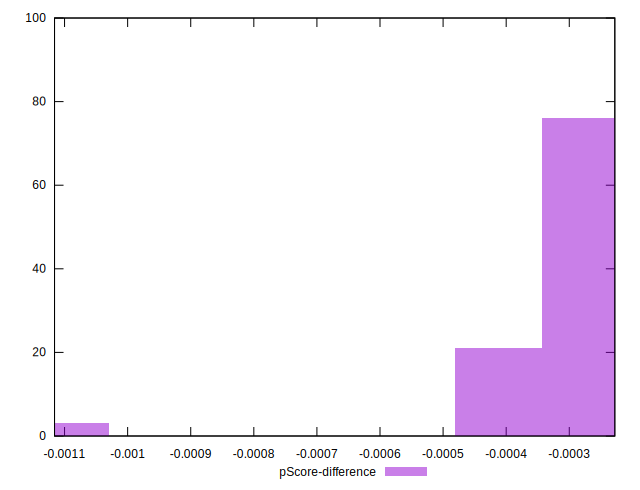