# //interactive/samples/astro

[→ Parent](../..)


## Raw


```yaml
p90min: 14475.333150000002
p90max: 14801.880999999998
p90range: 326.5478499999954
p90mean: 14624.706851595744
median: 14626.231499999998
p90stdev: 65.14895639919594
mad: 40.59150000000409
stdevBySn: 62.345252050002166
lfitCenter: 14631.55146251764
lfitStdev: 54.967818169571196
mfitCenter: 14631.55146251764
mfitStdev: 68.89194367863341
mfitConfidence: 6.889194367863341
p90skewness: -0.15766176558007558
p90eccentricity: 1.0000000000000002
p90discretization: 1
outlandishness: 1.001558362785213

```

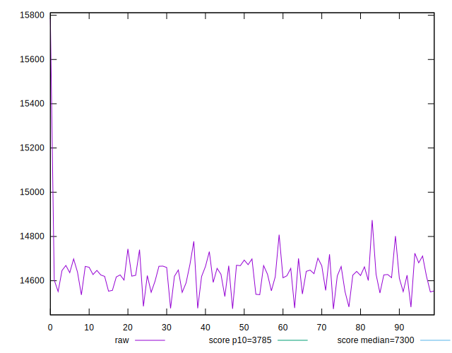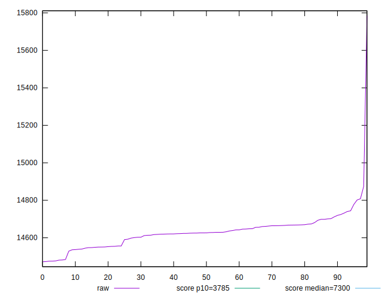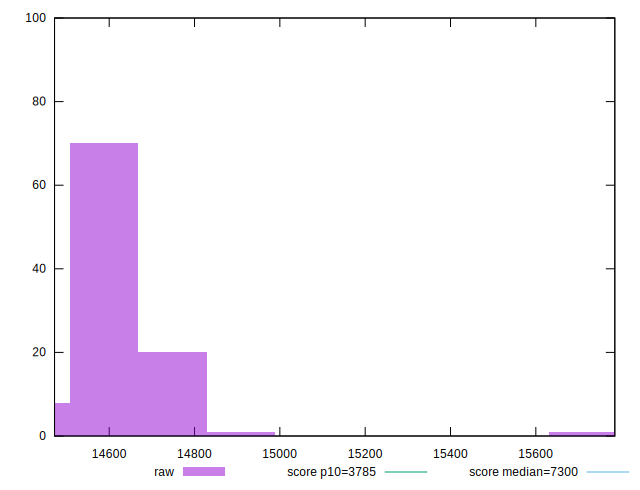
## Score


```yaml
p90min: 0.08
p90max: 0.09
p90range: 0.009999999999999995
p90mean: 0.08978723404255311
median: 0.09
p90stdev: 0.0014430489325798432
mad: 0
stdevBySn: 0
lfitCenter: 0.08970796537936314
lfitStdev: 0.0007140511940158079
mfitCenter: 0.08970796537936314
mfitStdev: 0.0008949304571275423
mfitConfidence: 0.00008949304571275423
p90skewness: -6.634888026970219
p90eccentricity: 1
p90discretization: 47
outlandishness: 0.9913930077940746

```

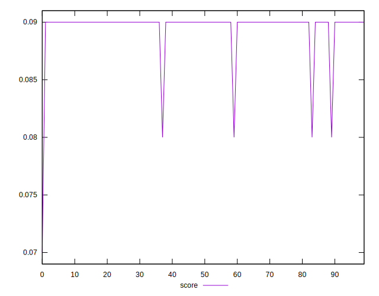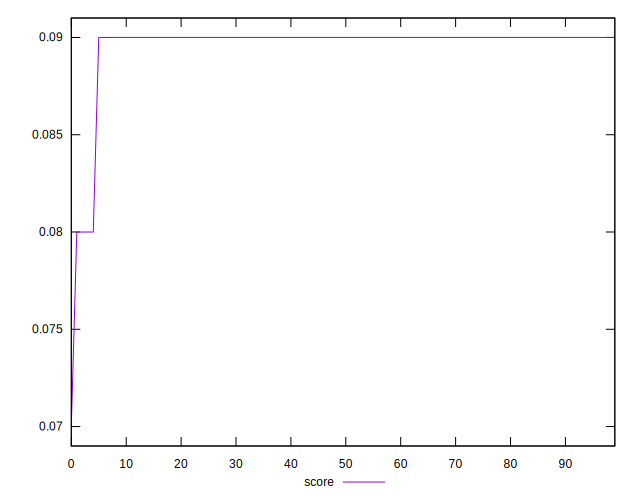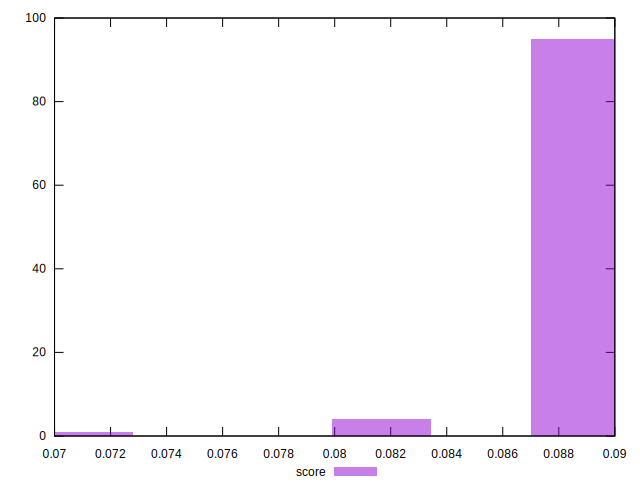
## Raw Estimate

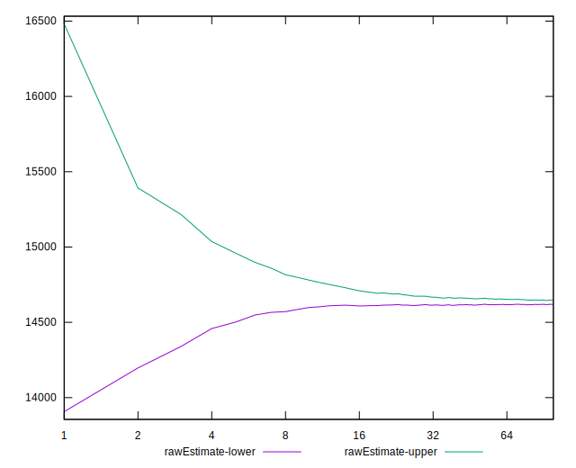
## Score Estimate

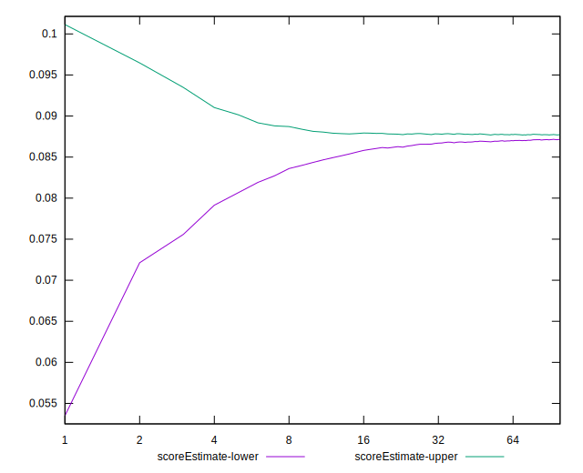
## P Score


```yaml
p90min: 0.08391537489667156
p90max: 0.09082669009874939
p90range: 0.006911315202077828
p90mean: 0.08760659187737473
median: 0.08756298501698517
p90stdev: 0.0013853320849242154
mad: 0.000857184473825906
stdevBySn: 0.0013217727921889823
lfitCenter: 0.08747390800977037
lfitStdev: 0.0011423706376209482
mfitCenter: 0.08747390800977037
mfitStdev: 0.0014317492716251436
mfitConfidence: 0.00014317492716251436
p90skewness: 0.209970303335902
p90eccentricity: 0.9999999999999999
p90discretization: 1
outlandishness: 0.9953083649925335

```

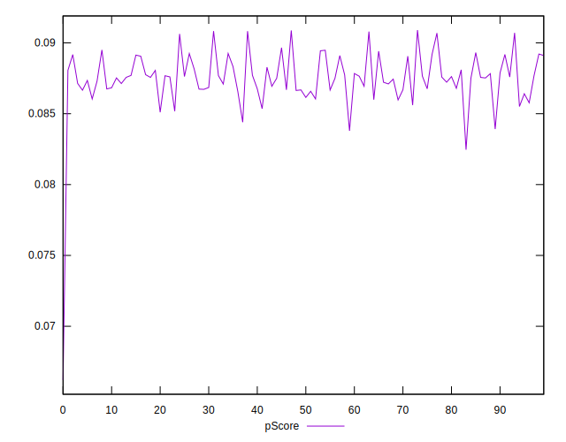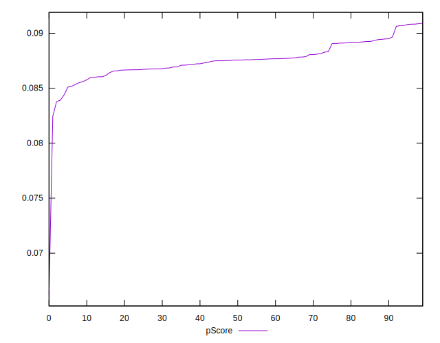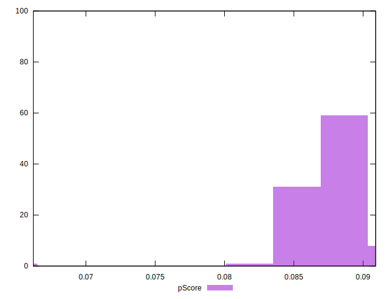
## Score Difference


```yaml
p90min: 0
p90max: 0
p90range: 0
p90mean: 0
median: 0
p90stdev: 0
mad: 0
stdevBySn: 0
lfitCenter: 0
lfitStdev: 0
mfitCenter: 0
mfitStdev: 0
mfitConfidence: 0
p90skewness: .nan
p90eccentricity: .nan
p90discretization: 94
outlandishness: .nan

```


## P Score Difference


```yaml
p90min: -0.004490054400377336
p90max: 0.0024603794446692168
p90range: 0.0069504338450465525
p90mean: -0.002102759894779302
median: -0.002405108633518921
p90stdev: 0.0014172808812979367
mad: 0.0008890908233218087
stdevBySn: 0.0013196358806246817
lfitCenter: -0.0021549768292401603
lfitStdev: 0.001160845906169139
mfitCenter: -0.0021549768292401603
mfitStdev: 0.0014549045869105914
mfitConfidence: 0.00014549045869105914
p90skewness: 0.845043509248024
p90eccentricity: 1
p90discretization: 1
outlandishness: 0.9038892465190158

```

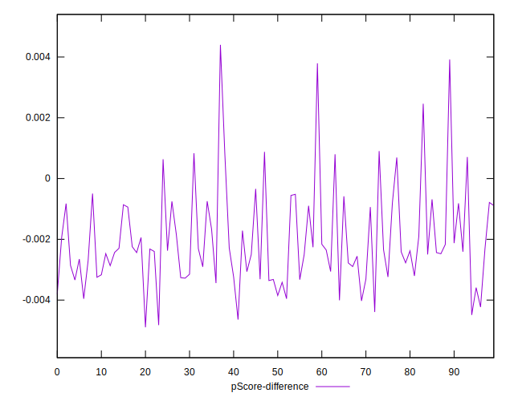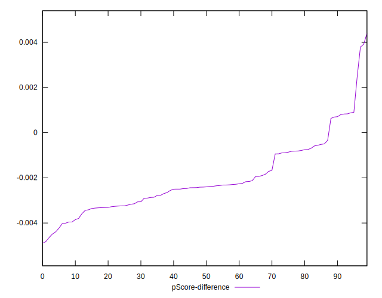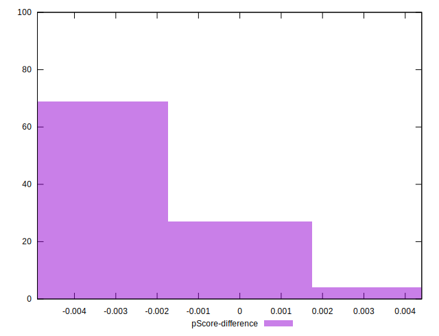