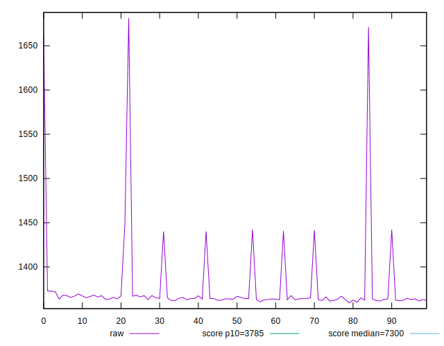
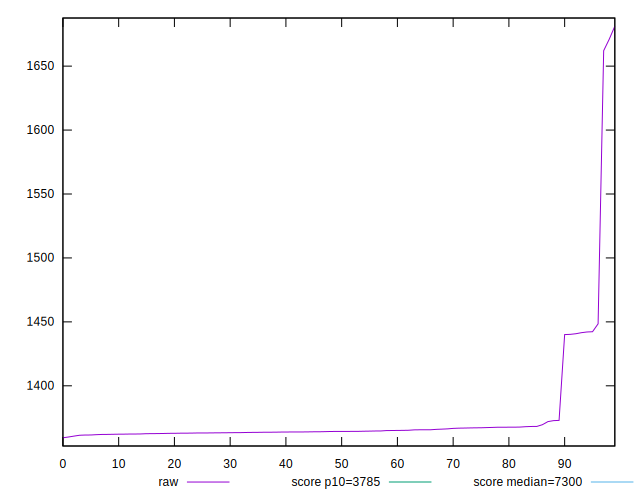
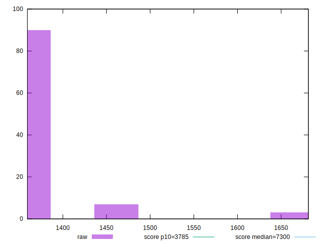
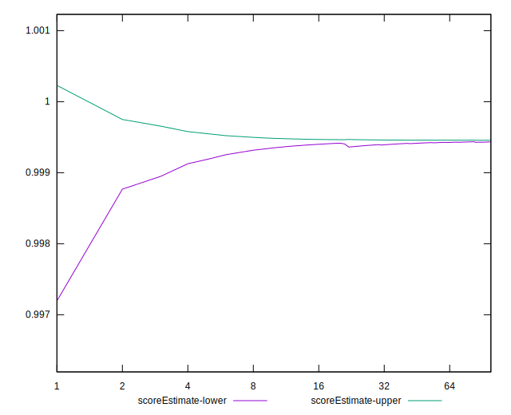
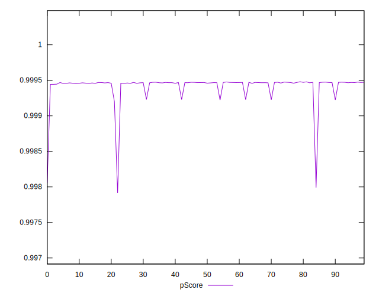
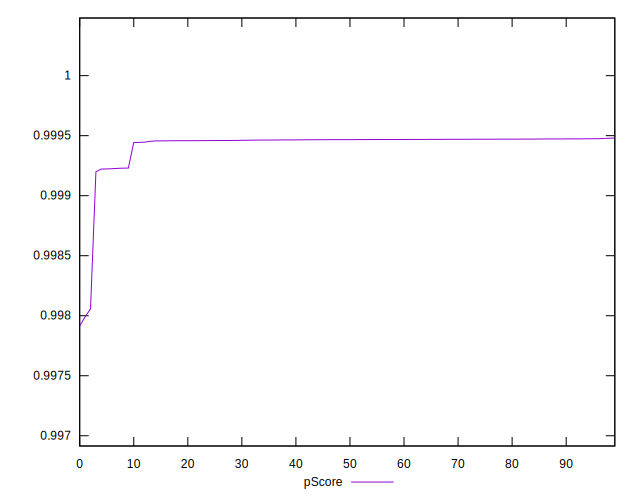
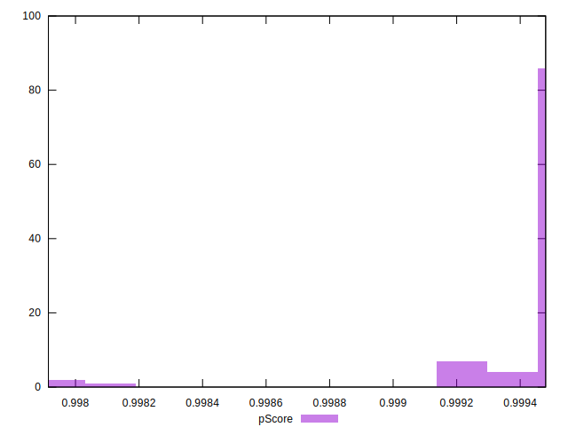
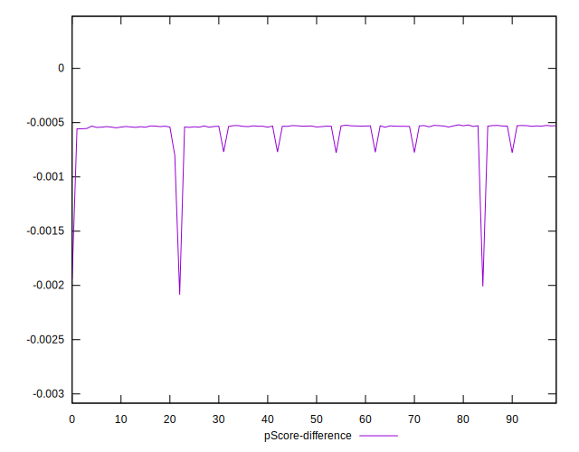
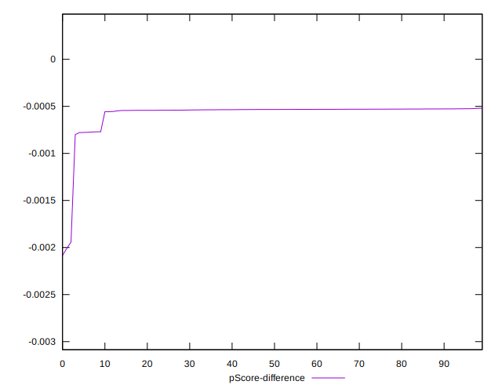
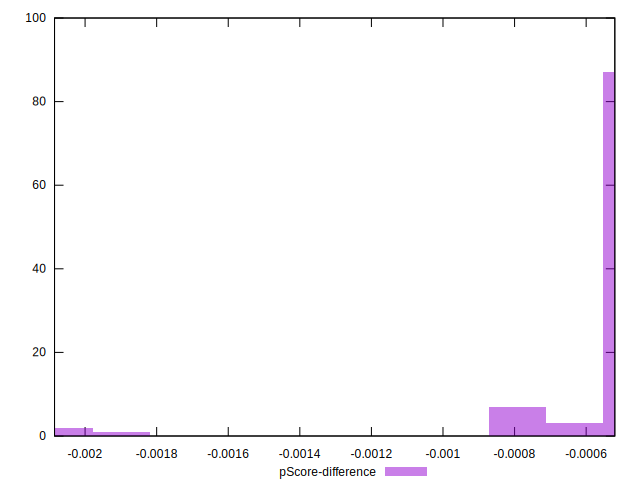

# //interactive/samples/card

[→ Parent](../..)


## Raw


```yaml
p90min: 1361.3310000000001
p90max: 1448.4814999999999
p90range: 87.15049999999974
p90mean: 1370.5044648936168
median: 1364.3101499999998
p90stdev: 20.480799139706477
mad: 1.6497000000000526
stdevBySn: 2.4814726350000353
lfitCenter: 1371.9681256010122
lfitStdev: 17.51803609144666
mfitCenter: 1371.9681256010122
mfitStdev: 21.955602313505928
mfitConfidence: 2.195560231350593
p90skewness: 3.178740420385679
p90eccentricity: 1.0000000000000004
p90discretization: 1
outlandishness: 1.0127558612789165

```


## Score


```yaml
p90min: 1
p90max: 1
p90range: 0
p90mean: 1
median: 1
p90stdev: 0
mad: 0
stdevBySn: 0
lfitCenter: 1
lfitStdev: 0
mfitCenter: 1
mfitStdev: 0
mfitConfidence: 0
p90skewness: .nan
p90eccentricity: .nan
p90discretization: 94
outlandishness: 1

```


## Raw Estimate


## Score Estimate


## P Score


```yaml
p90min: 0.9991992614580013
p90max: 0.999474864484094
p90range: 0.0002756030260926412
p90mean: 0.9994475632620938
median: 0.9994668773311517
p90stdev: 0.0000642941280715282
mad: 0.000004448657394517941
stdevBySn: 0.000006691085708642814
lfitCenter: 0.9994355577638898
lfitStdev: 0.00007244547985452217
mfitCenter: 0.9994355577638898
mfitStdev: 0.00009079694417764165
mfitConfidence: 0.000009079694417764165
p90skewness: -3.198908559269514
p90eccentricity: 0.9999999999999997
p90discretization: 1
outlandishness: 0.9999142004462813

```


## Score Difference


```yaml
p90min: 0
p90max: 0
p90range: 0
p90mean: 0
median: 0
p90stdev: 0
mad: 0
stdevBySn: 0
lfitCenter: 0
lfitStdev: 0
mfitCenter: 0
mfitStdev: 0
mfitConfidence: 0
p90skewness: .nan
p90eccentricity: .nan
p90discretization: 94
outlandishness: .nan

```


## P Score Difference


```yaml
p90min: -0.0008007385419986912
p90max: -0.00052513551590605
p90range: 0.0002756030260926412
p90mean: -0.0005524367379065741
median: -0.0005331226688483071
p90stdev: 0.00006429412807152819
mad: 0.000004448657394517941
stdevBySn: 0.000006691085708642814
lfitCenter: -0.0005644422361104403
lfitStdev: 0.00007244547985480806
mfitCenter: -0.0005644422361104403
mfitStdev: 0.00009079694417799996
mfitConfidence: 0.000009079694417799996
p90skewness: -3.1989085592662088
p90eccentricity: 1.0000000000000004
p90discretization: 1
outlandishness: 1.1612526047900658

```

