# //interactive/samples/music

[→ Parent](../..)


## Raw


```yaml
p90min: 11790.253
p90max: 12059.725000000002
p90range: 269.4720000000016
p90mean: 11865.951485106381
median: 11866.698999999999
p90stdev: 65.64910256488298
mad: 56.075049999997646
stdevBySn: 80.97768907499852
lfitCenter: 11871.866037541417
lfitStdev: 65.4063857145006
mfitCenter: 11871.866037541417
mfitStdev: 81.97474796918065
mfitConfidence: 8.197474796918065
p90skewness: 0.9026051194744682
p90eccentricity: 0.9999999999999999
p90discretization: 1
outlandishness: 1.003647321758868

```

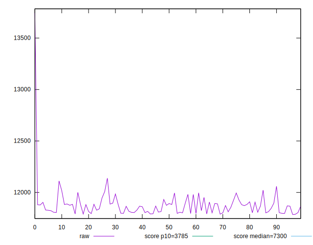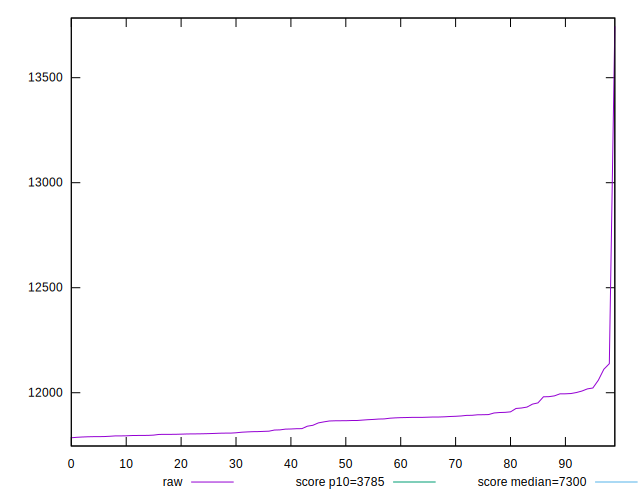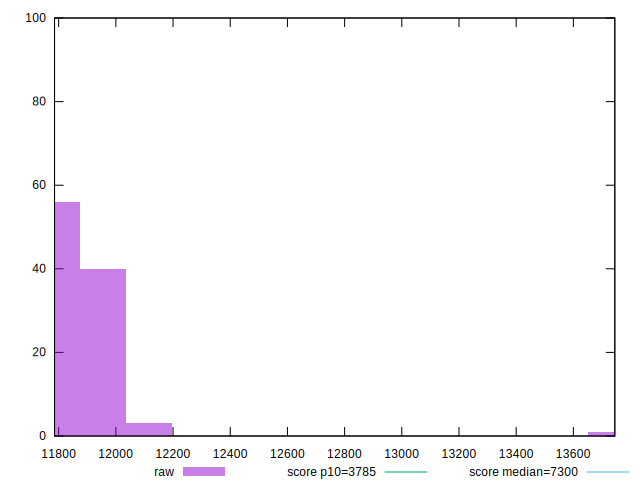
## Score


```yaml
p90min: 0.16
p90max: 0.17
p90range: 0.010000000000000009
p90mean: 0.16989361702127653
median: 0.17
p90stdev: 0.0010259202937226556
mad: 0
stdevBySn: 0
lfitCenter: 0.16962010834248048
lfitStdev: 0.0010504460976779031
mfitCenter: 0.16962010834248048
mfitStdev: 0.0013165389460323724
mfitConfidence: 0.00013165389460323724
p90skewness: -9.539955591519675
p90eccentricity: 1.0000000000000033
p90discretization: 47
outlandishness: 0.9918513581155032

```

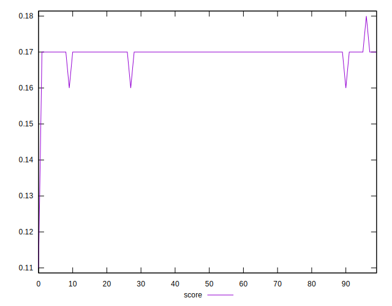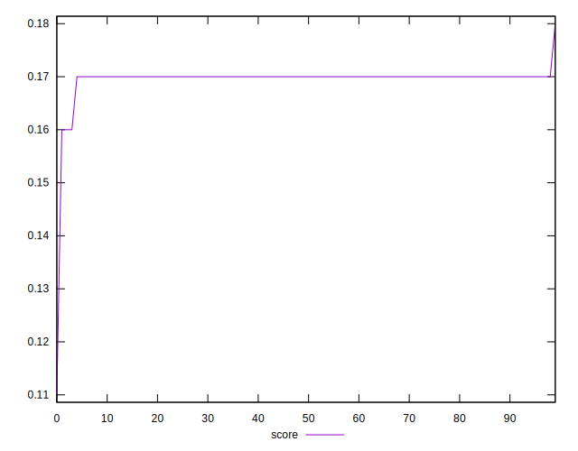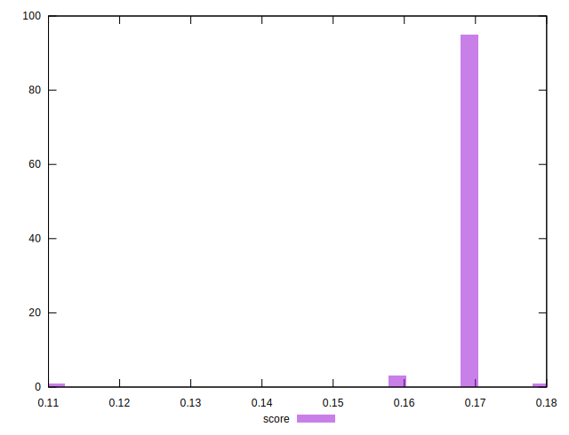
## Raw Estimate

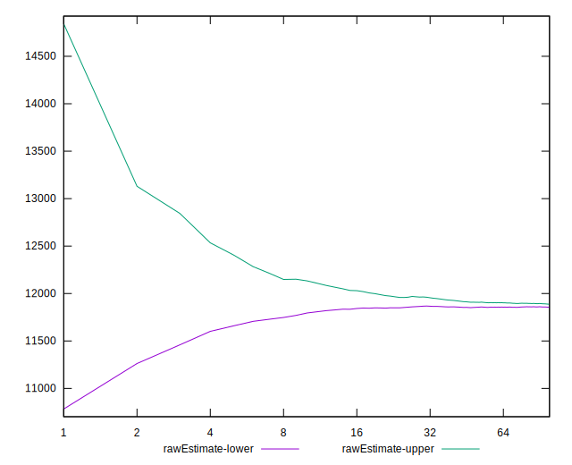
## Score Estimate

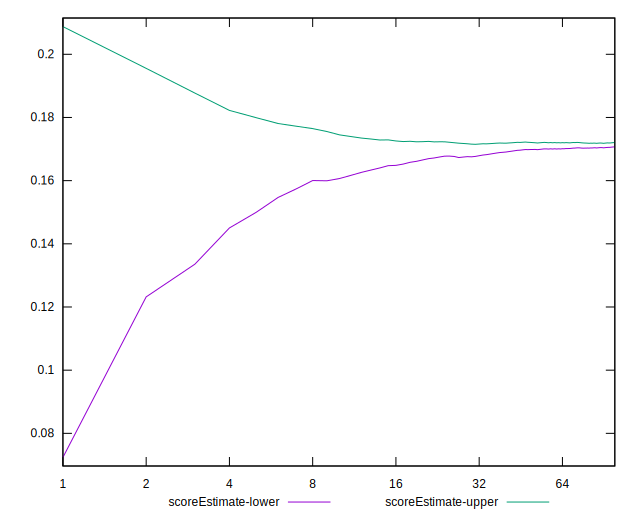
## P Score


```yaml
p90min: 0.16367716755761097
p90max: 0.17480011356735753
p90range: 0.01112294600974656
p90mean: 0.17162397999165818
median: 0.17157112092476565
p90stdev: 0.0027289534070021717
mad: 0.0023627617048253002
stdevBySn: 0.003388892802053079
lfitCenter: 0.17144469585201666
lfitStdev: 0.002625963585261534
mfitCenter: 0.17144469585201666
mfitStdev: 0.00329115728879568
mfitConfidence: 0.00032911572887956797
p90skewness: -0.8718023820607751
p90eccentricity: 1.0000000000000002
p90discretization: 1
outlandishness: 0.9913554576720675

```

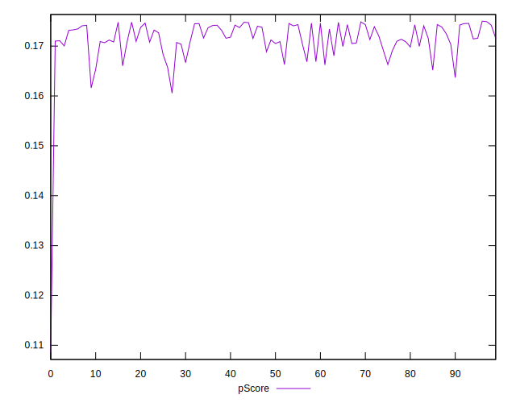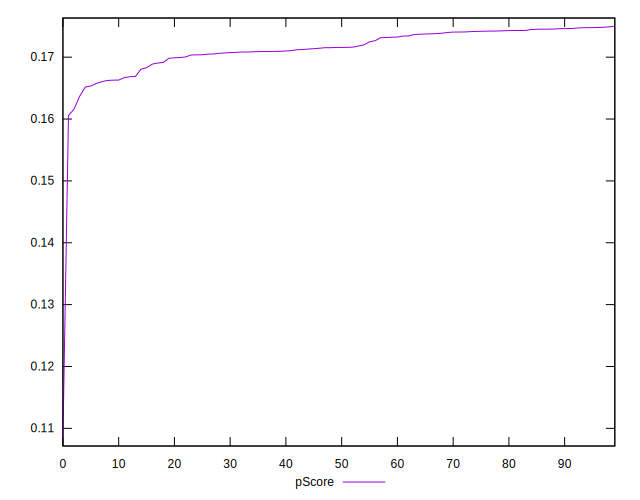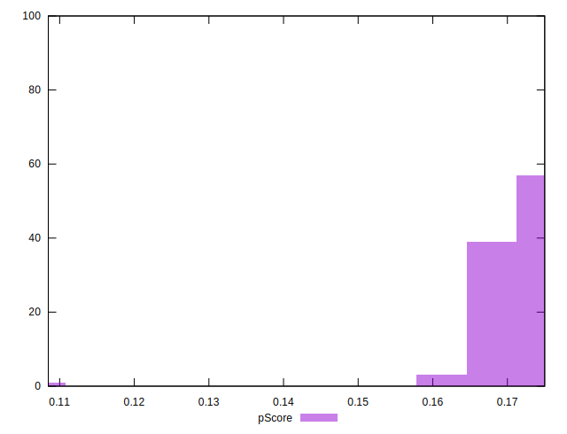
## Score Difference


```yaml
p90min: 0
p90max: 0
p90range: 0
p90mean: 0
median: 0
p90stdev: 0
mad: 0
stdevBySn: 0
lfitCenter: 0
lfitStdev: 0
mfitCenter: 0
mfitStdev: 0
mfitConfidence: 0
p90skewness: .nan
p90eccentricity: .nan
p90discretization: 94
outlandishness: .nan

```


## P Score Difference


```yaml
p90min: -0.0042415839396753585
p90max: 0.004774816132943477
p90range: 0.009016400072618835
p90mean: 0.001787192846207637
median: 0.0015798788886857429
p90stdev: 0.002437280248429864
mad: 0.0021788124509610485
stdevBySn: 0.0031773568242852795
lfitCenter: 0.0018507877630845075
lfitStdev: 0.0021136119531585352
mfitCenter: 0.0018507877630845075
mfitStdev: 0.002649019744358175
mfitConfidence: 0.0002649019744358175
p90skewness: -0.7172704979520014
p90eccentricity: 1.0000000000000002
p90discretization: 1
outlandishness: 0.8842346665145562

```

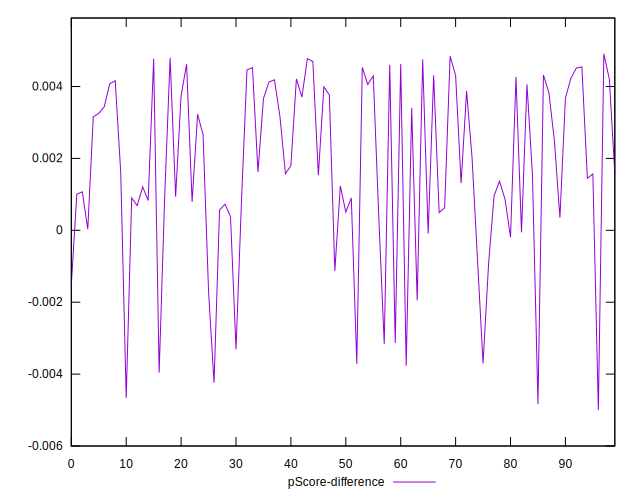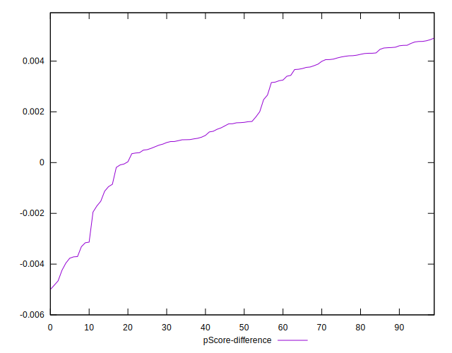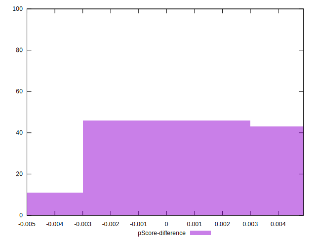