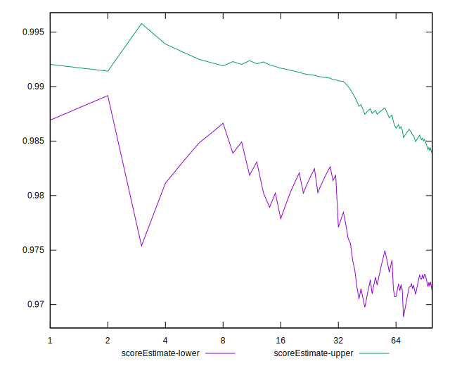
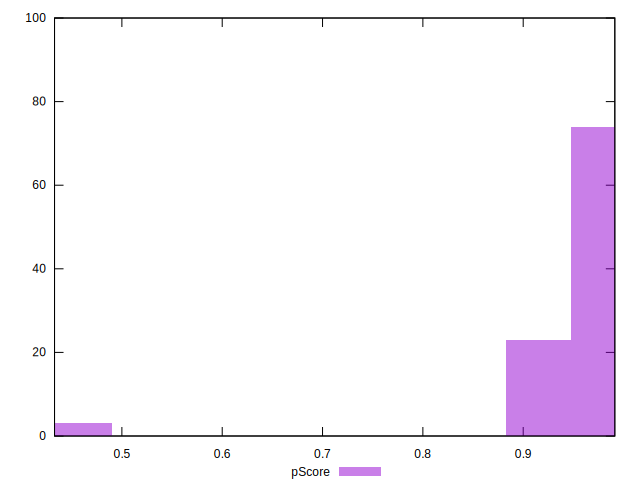

# //largest-contentful-paint/samples/agenda

[→ Parent](../..)


## Raw


```yaml
p90min: 1674.6306
p90max: 2524.8016000000002
p90range: 850.1710000000003
p90mean: 1920.0414122340428
median: 1687.9401
p90stdev: 279.6219316835971
mad: 13.479900000000157
stdevBySn: 17.167894410000216
lfitCenter: 1915.9339713028305
lfitStdev: 337.1115644674747
mfitCenter: 1915.9339713028305
mfitStdev: 422.5066900247759
mfitConfidence: 42.250669002477586
p90skewness: 0.5666981034902222
p90eccentricity: 1.0000000000000004
p90discretization: 1.010752688172043
outlandishness: 1.0662491033719668

```


## Score


```yaml
p90min: 0.9
p90max: 0.99
p90range: 0.08999999999999997
p90mean: 0.97031914893617
median: 0.99
p90stdev: 0.025325629422754136
mad: 0
stdevBySn: 0
lfitCenter: 0.9664586079721719
lfitStdev: 0.035460121371384296
mfitCenter: 0.9664586079721719
mfitStdev: 0.04444267147039955
mfitConfidence: 0.004444267147039955
p90skewness: -1.1086094174052672
p90eccentricity: 1.0000000000000007
p90discretization: 10.444444444444445
outlandishness: 0.9680652724127367

```


## Raw Estimate


## Score Estimate


## P Score


```yaml
p90min: 0.895194178184638
p90max: 0.9912048082621292
p90range: 0.09601063007749122
p90mean: 0.9702433589952042
median: 0.9906772599313783
p90stdev: 0.02656857267151503
mad: 0.000534153770846979
stdevBySn: 0.0006798311348572206
lfitCenter: 0.9666948094955774
lfitStdev: 0.03668795836360113
mfitCenter: 0.9666948094955774
mfitStdev: 0.04598153693261232
mfitConfidence: 0.004598153693261232
p90skewness: -1.0635263439206981
p90eccentricity: 0.9999999999999997
p90discretization: 1.010752688172043
outlandishness: 0.968367154083582

```


## Score Difference


```yaml
p90min: 0
p90max: 1.1102230246251565e-16
p90range: 1.1102230246251565e-16
p90mean: 2.834611977766357e-17
median: 0
p90stdev: 4.8410215627951996e-17
mad: 0
stdevBySn: 0
lfitCenter: 2.0465485132864467e-17
lfitStdev: 4.1843008190823885e-17
mfitCenter: 2.0465485132864467e-17
mfitStdev: 5.2442433766137654e-17
mfitConfidence: 5.2442433766137656e-18
p90skewness: 1.1222850838908165
p90eccentricity: 1.0000000000000009
p90discretization: 47
outlandishness: 1.1183062500000003

```


## P Score Difference


```yaml
p90min: -0.003698858230347879
p90max: 0.003939344679975476
p90range: 0.007638202910323355
p90mean: 0.00009362281994237588
median: 0.0008496600534465548
p90stdev: 0.0018737528252015681
mad: 0.00036175364877877314
stdevBySn: 0.0006234762410893762
lfitCenter: 0.0002703734647492621
lfitStdev: 0.0016270427155766025
mfitCenter: 0.0002703734647492621
mfitStdev: 0.0020391956395002836
mfitConfidence: 0.00020391956395002836
p90skewness: -0.5013478214502549
p90eccentricity: 1.0000000000000002
p90discretization: 1.010752688172043
outlandishness: 0.6292020693593714

```

