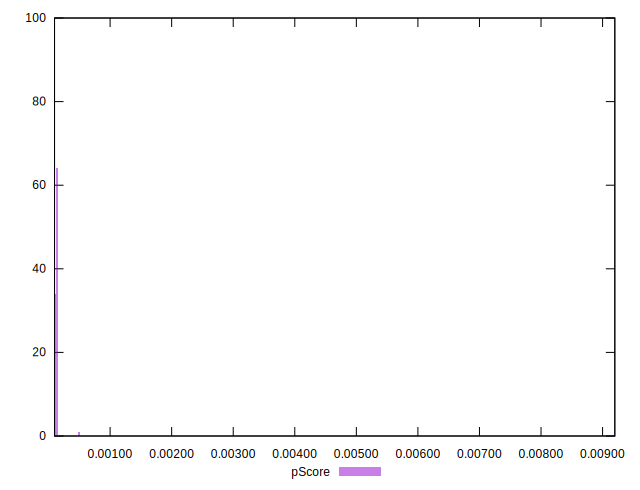

# //largest-contentful-paint/samples/astro

[→ Parent](../..)


## Raw


```yaml
p90min: 15074.819999999996
p90max: 15628.444500000001
p90range: 553.6245000000054
p90mean: 15324.839786170209
median: 15301.27505
p90stdev: 131.17744693463268
mad: 77.31875000000036
stdevBySn: 132.62876275749852
lfitCenter: 15282.935600628049
lfitStdev: 146.58265267104107
mfitCenter: 15282.935600628049
mfitStdev: 183.7141110626844
mfitConfidence: 18.37141110626844
p90skewness: 0.6606163576410008
p90eccentricity: 0.9999999999999997
p90discretization: 1
outlandishness: 0.9908667161997479

```


## Score


```yaml
p90min: 0
p90max: 0
p90range: 0
p90mean: 0
median: 0
p90stdev: 0
mad: 0
stdevBySn: 0
lfitCenter: 0.00004653601352548583
lfitStdev: 0.00011610565185019101
mfitCenter: 0.00004653601352548583
mfitStdev: 0.0001455168550325012
mfitConfidence: 0.00001455168550325012
p90skewness: .nan
p90eccentricity: .nan
p90discretization: 94
outlandishness: .inf

```


## Raw Estimate


## Score Estimate


## P Score


```yaml
p90min: 0.0001012619250569391
p90max: 0.00014872231444024164
p90range: 0.00004746038938330255
p90mean: 0.0001254750490943334
median: 0.0001270128295848827
p90stdev: 0.000011093222547289676
mad: 0.000006966468346247812
stdevBySn: 0.000011906974201663014
lfitCenter: 0.0001698365966288052
lfitStdev: 0.00010929887619910658
mfitCenter: 0.0001698365966288052
mfitStdev: 0.0001369858268708779
mfitConfidence: 0.000013698582687087789
p90skewness: -0.48145668625259025
p90eccentricity: 1.0000000000000002
p90discretization: 1
outlandishness: 3.0575377895673945

```


## Score Difference


```yaml
p90min: 0
p90max: 0
p90range: 0
p90mean: 0
median: 0
p90stdev: 0
mad: 0
stdevBySn: 0
lfitCenter: 0
lfitStdev: 0
mfitCenter: 0
mfitStdev: 0
mfitConfidence: 0
p90skewness: .nan
p90eccentricity: .nan
p90discretization: 94
outlandishness: .nan

```


## P Score Difference


```yaml
p90min: 0.00010040598955135538
p90max: 0.00014405145937829156
p90range: 0.00004364546982693618
p90mean: 0.00012496104563806864
median: 0.00012695803965906416
p90stdev: 0.000011123479466630072
mad: 0.000007021258272066344
stdevBySn: 0.000011906974201663014
lfitCenter: 0.00012306684055853601
lfitStdev: 0.00001754422506040456
mfitCenter: 0.00012306684055853601
mfitStdev: 0.00002198842531857561
mfitConfidence: 0.000002198842531857561
p90skewness: -0.5577003897363828
p90eccentricity: 1.0000000000000002
p90discretization: 1
outlandishness: 0.913027495688808

```

