# //largest-contentful-paint/samples/card

[→ Parent](../..)


## Raw


```yaml
p90min: 1823.9778000000001
p90max: 2363.4123999999997
p90range: 539.4345999999996
p90mean: 2101.252445212766
median: 2134.3352000000004
p90stdev: 233.43270372619722
mad: 221.87572499999965
stdevBySn: 264.9861195700002
lfitCenter: 2103.3315150536996
lfitStdev: 255.71676302752874
mfitCenter: 2103.3315150536996
mfitStdev: 320.4934345734535
mfitConfidence: 32.04934345734535
p90skewness: -0.052666351104571345
p90eccentricity: 0.9999999999999999
p90discretization: 1
outlandishness: 0.9979231917922609

```

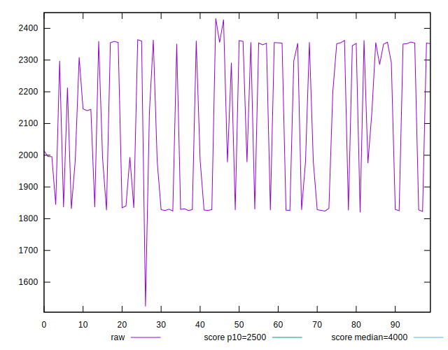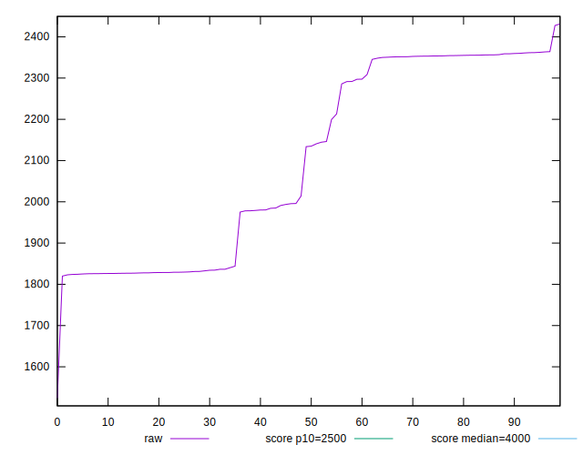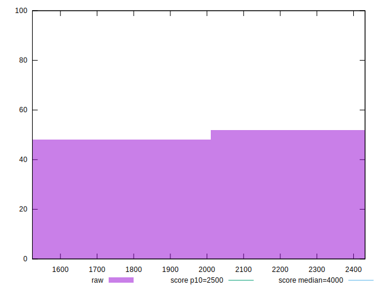
## Score


```yaml
p90min: 0.92
p90max: 0.98
p90range: 0.05999999999999994
p90mean: 0.9546808510638306
median: 0.96
p90stdev: 0.023596886183849794
mad: 0.020000000000000018
stdevBySn: 0.023852000000000022
lfitCenter: 0.9553202559363878
lfitStdev: 0.026142393151673774
mfitCenter: 0.9553202559363878
mfitStdev: 0.032764630953221824
mfitConfidence: 0.0032764630953221823
p90skewness: -0.14949242703937413
p90eccentricity: 1.0000000000000007
p90discretization: 13.428571428571429
outlandishness: 0.9994117201519542

```

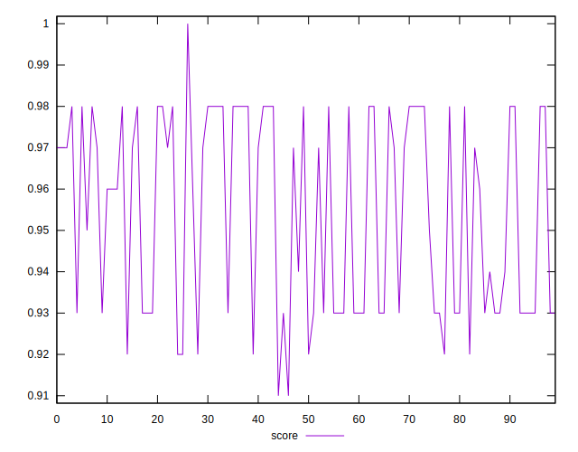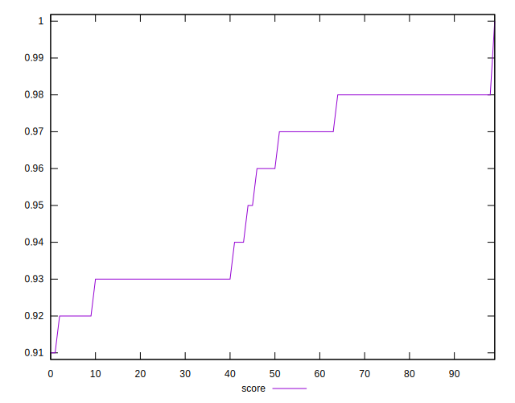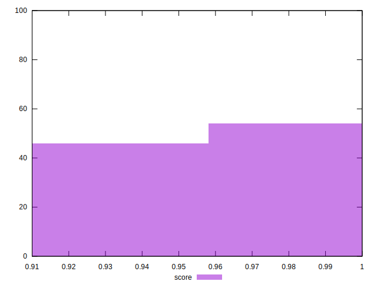
## Raw Estimate

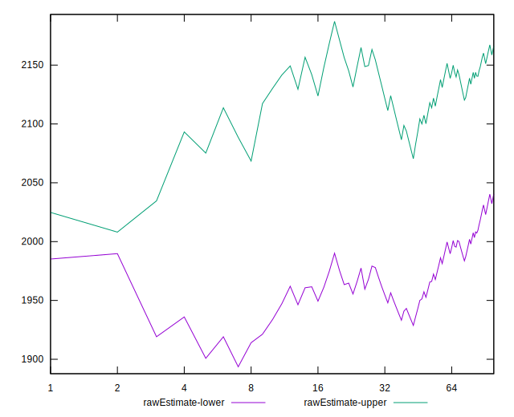
## Score Estimate

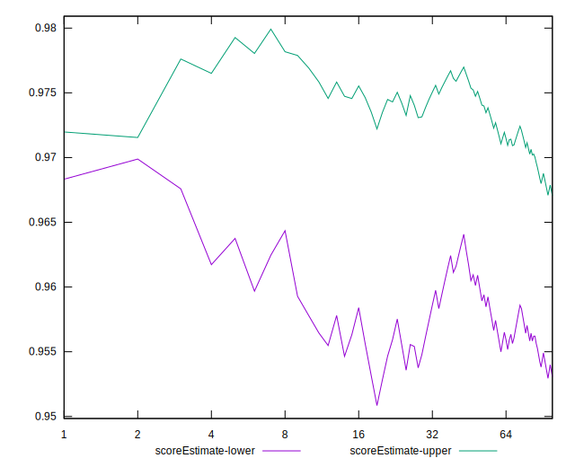
## P Score


```yaml
p90min: 0.9243205234424433
p90max: 0.9838709442319252
p90range: 0.05955042078948192
p90mean: 0.9550383061454503
median: 0.9566195492175971
p90stdev: 0.025925536828491722
mad: 0.02710400135094948
stdevBySn: 0.03236596767655706
lfitCenter: 0.9553765655430433
lfitStdev: 0.028426685620313797
mfitCenter: 0.9553765655430433
mfitStdev: 0.035627567000812495
mfitConfidence: 0.0035627567000812493
p90skewness: -0.06802990411552373
p90eccentricity: 1.0000000000000002
p90discretization: 1
outlandishness: 0.999661934812562

```

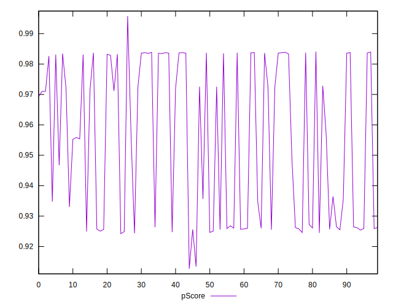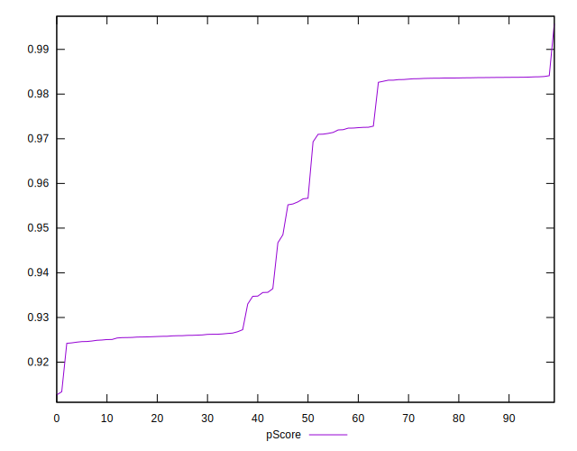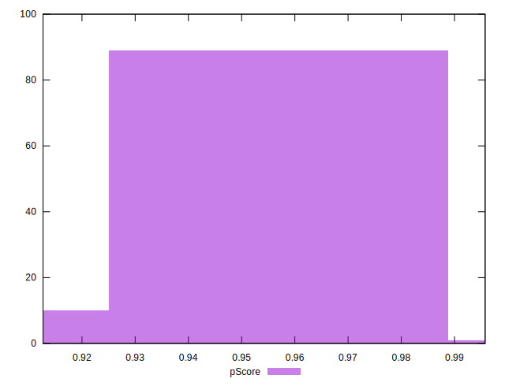
## Score Difference


```yaml
p90min: 0
p90max: 1.1102230246251565e-16
p90range: 1.1102230246251565e-16
p90mean: 2.362176648138631e-18
median: 0
p90stdev: 1.6021061506108986e-17
mad: 0
stdevBySn: 0
lfitCenter: 2.7255820612844e-18
lfitStdev: 6.664295900958648e-18
mfitCenter: 2.7255820612844e-18
mfitStdev: 8.352456276329808e-18
mfitConfidence: 8.352456276329809e-19
p90skewness: 6.634888026970368
p90eccentricity: 0.9999999999999994
p90discretization: 47
outlandishness: 5.522500000000001

```

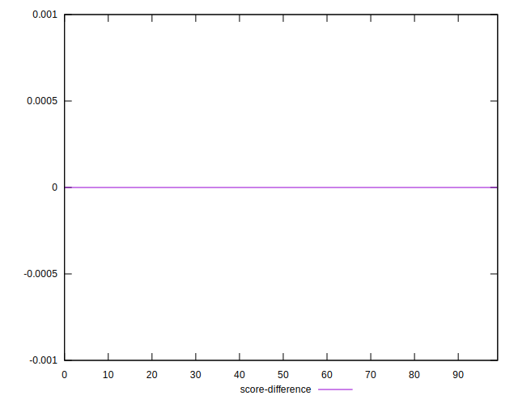
## P Score Difference


```yaml
p90min: -0.0045949659037402
p90max: 0.004739473570186115
p90range: 0.009334439473926315
p90mean: 0.0005073956228498961
median: 0.002563256897060051
p90stdev: 0.003592267451448541
mad: 0.0016113296640182795
stdevBySn: 0.0025668987895786847
lfitCenter: 0.0008084683234751637
lfitStdev: 0.003809221208466994
mfitCenter: 0.0008084683234751637
mfitStdev: 0.004774150797537671
mfitConfidence: 0.0004774150797537671
p90skewness: -0.3863669365256767
p90eccentricity: 1.0000000000000004
p90discretization: 1
outlandishness: 0.8832591993037681

```

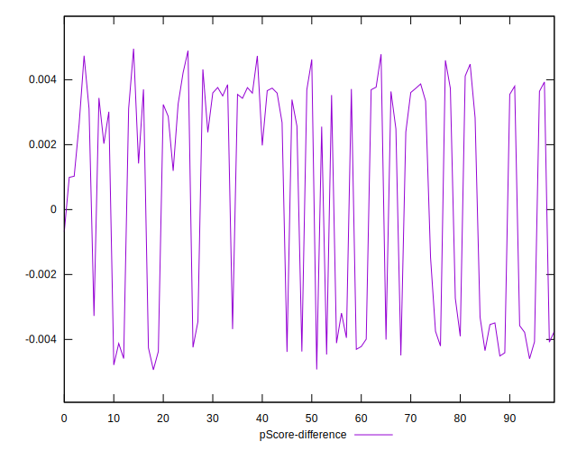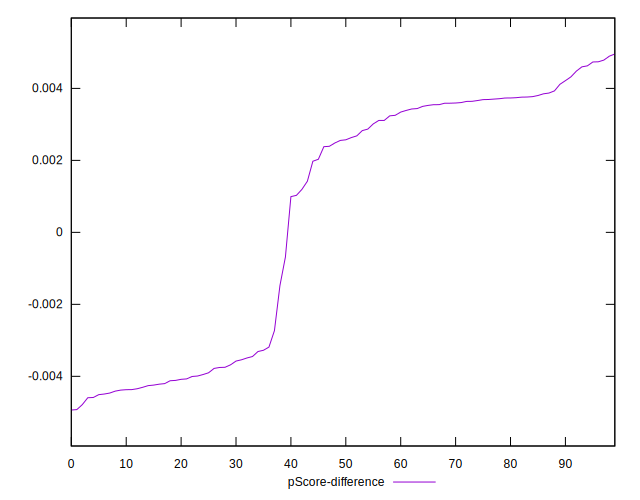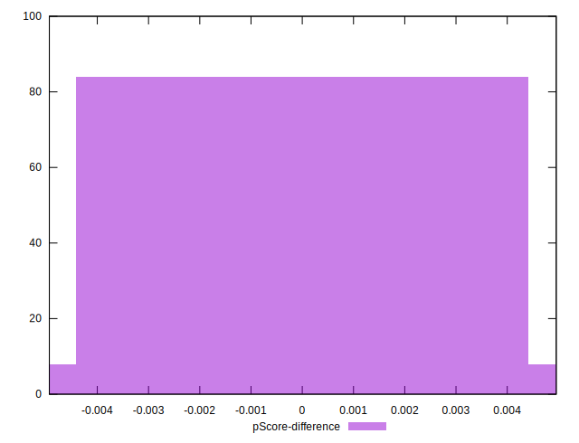