# //largest-contentful-paint/samples/music

[→ Parent](../..)


## Raw


```yaml
p90min: 1973.8000000000002
p90max: 2974.376
p90range: 1000.576
p90mean: 2280.4782473404257
median: 2213.70475
p90stdev: 281.9537084863379
mad: 88.30275000000006
stdevBySn: 169.8678021100004
lfitCenter: 2275.3925773944425
lfitStdev: 214.0480088851511
mfitCenter: 2275.3925773944425
mfitStdev: 268.26939586993774
mfitConfidence: 26.826939586993774
p90skewness: 1.533897859285094
p90eccentricity: 0.9999999999999997
p90discretization: 1
outlandishness: 1.0411193062526398

```

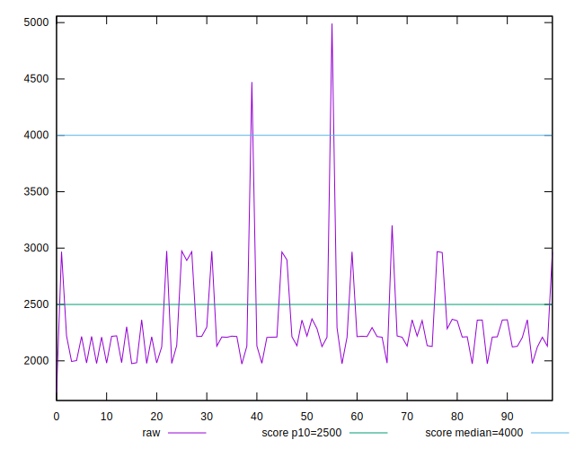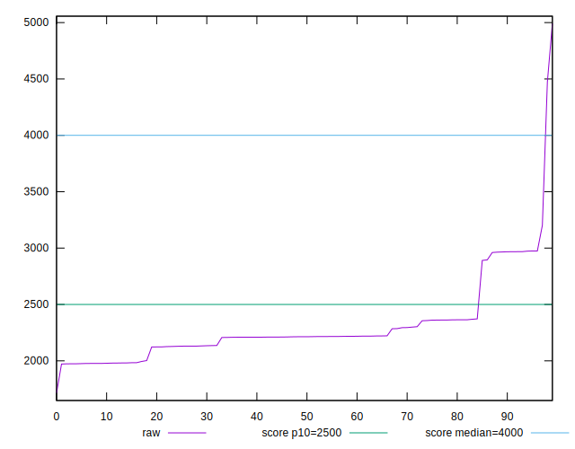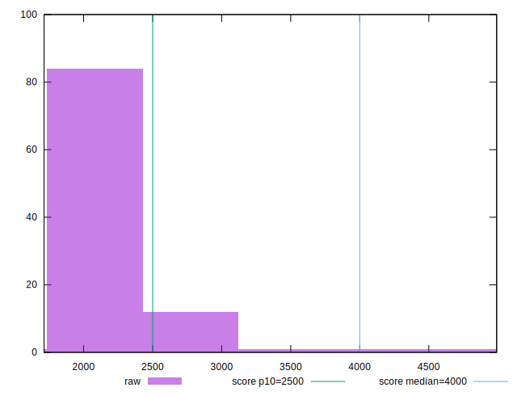
## Score


```yaml
p90min: 0.79
p90max: 0.97
p90range: 0.17999999999999994
p90mean: 0.9304255319148942
median: 0.95
p90stdev: 0.05438074779827917
mad: 0.010000000000000009
stdevBySn: 0.02385199999999989
lfitCenter: 0.9320909096095276
lfitStdev: 0.04393521941753771
mfitCenter: 0.9320909096095276
mfitStdev: 0.05506463167746686
mfitConfidence: 0.005506463167746686
p90skewness: -1.9569379682982275
p90eccentricity: 0.9999999999999989
p90discretization: 11.75
outlandishness: 0.9728328442536783

```

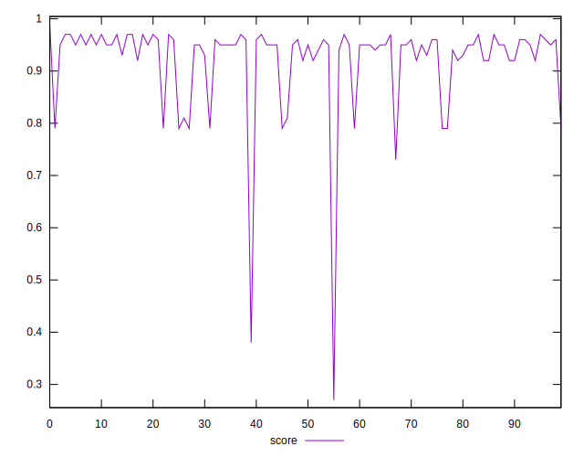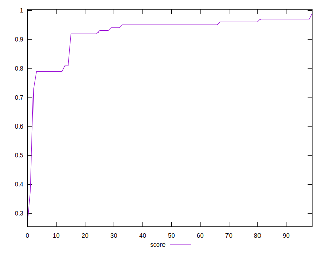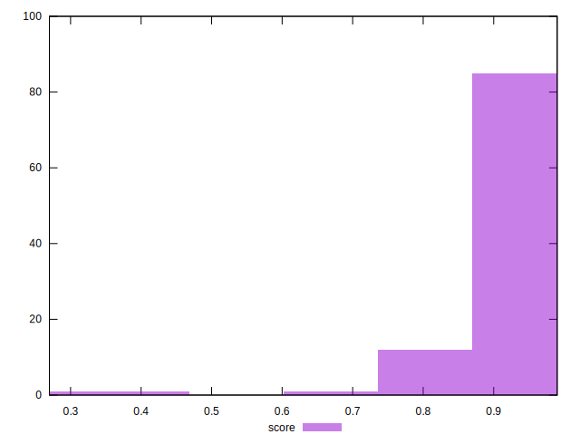
## Raw Estimate

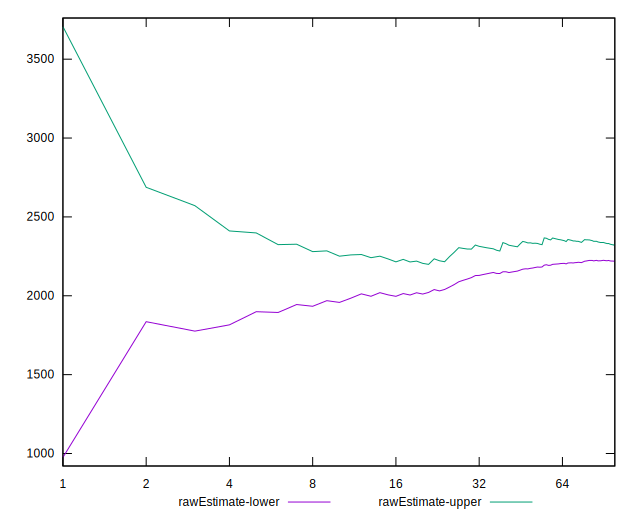
## Score Estimate

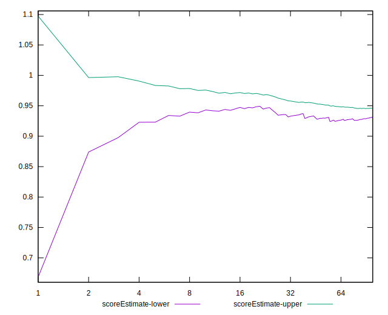
## P Score


```yaml
p90min: 0.7903994331522255
p90max: 0.9729447090417191
p90range: 0.18254527588949365
p90mean: 0.929685381935569
median: 0.946647281024751
p90stdev: 0.05334836259965716
mad: 0.01137544130202911
stdevBySn: 0.01747328565961473
lfitCenter: 0.9305639153222065
lfitStdev: 0.04212750554250054
mfitCenter: 0.9305639153222065
mfitStdev: 0.05279899831938162
mfitConfidence: 0.005279899831938162
p90skewness: -1.9418150785693336
p90eccentricity: 1.0000000000000004
p90discretization: 1
outlandishness: 0.9730578335572315

```

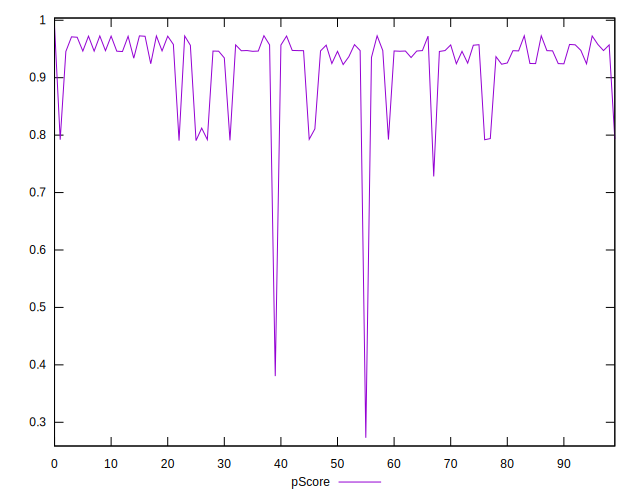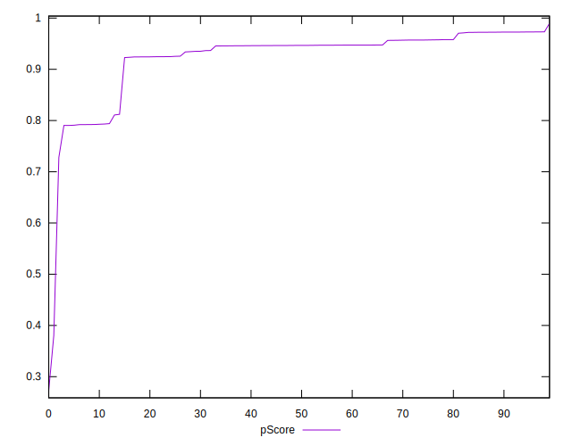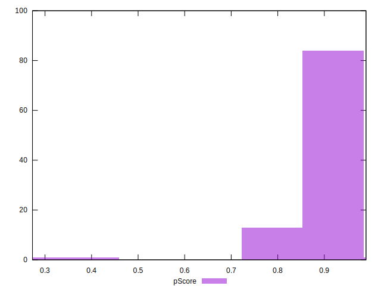
## Score Difference


```yaml
p90min: 0
p90max: 1.1102230246251565e-16
p90range: 1.1102230246251565e-16
p90mean: 4.133809134242604e-17
median: 0
p90stdev: 5.367133577997813e-17
mad: 0
stdevBySn: 0
lfitCenter: 3.455557667402701e-17
lfitStdev: 5.965822729476045e-17
mfitCenter: 3.455557667402701e-17
mfitStdev: 7.477049975094197e-17
mfitConfidence: 7.477049975094197e-18
p90skewness: 0.5281426177627956
p90eccentricity: 0.9999999999999997
p90discretization: 47
outlandishness: 1.0415660408163268

```

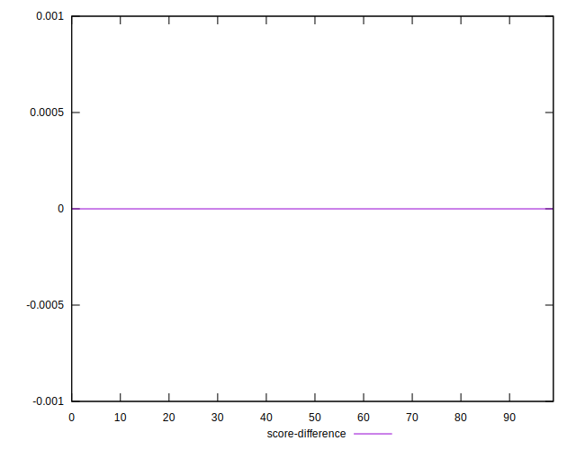
## P Score Difference


```yaml
p90min: -0.004445538569883056
p90max: 0.004540133221981102
p90range: 0.008985671791864158
p90mean: -0.0006593773148329753
median: -0.002448091614540515
p90stdev: 0.0029947414516622362
mad: 0.001912506079197407
stdevBySn: 0.0026520234675380936
lfitCenter: -0.0008666387833470052
lfitStdev: 0.0031813882563797853
mfitCenter: -0.0008666387833470052
mfitStdev: 0.003987278882022463
mfitConfidence: 0.0003987278882022463
p90skewness: 0.34244595922480964
p90eccentricity: 0.9999999999999996
p90discretization: 1
outlandishness: 0.8955679633882481

```

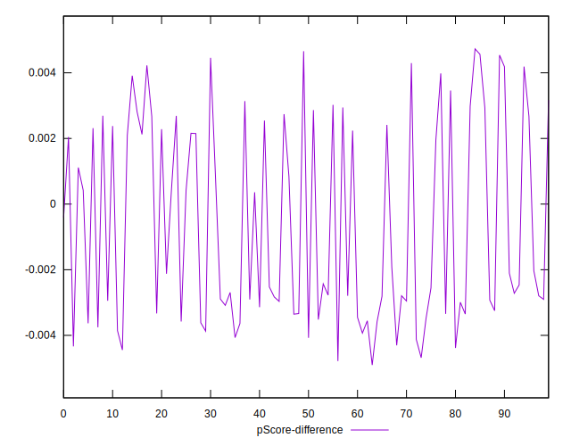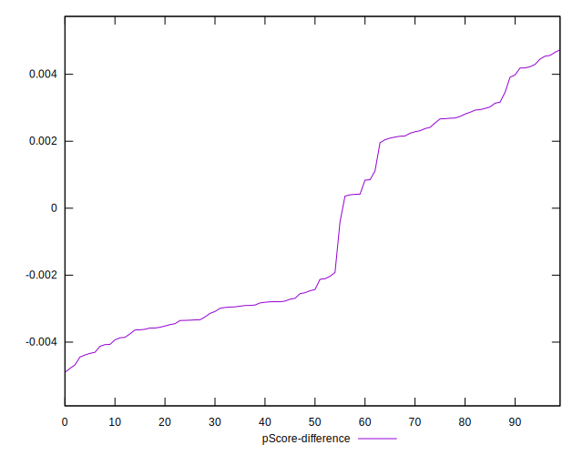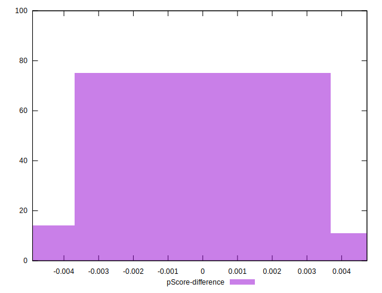