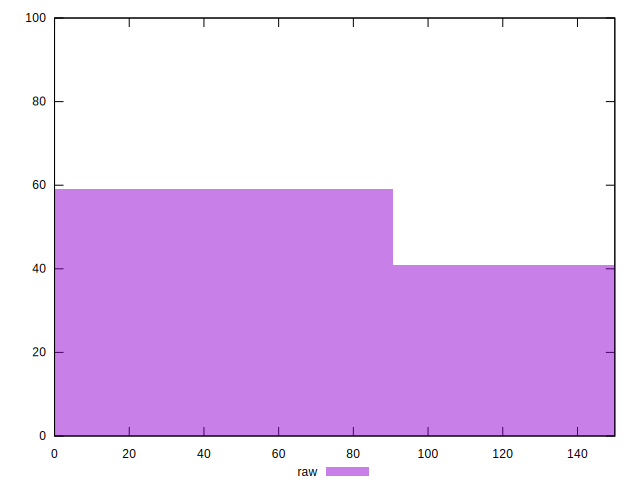
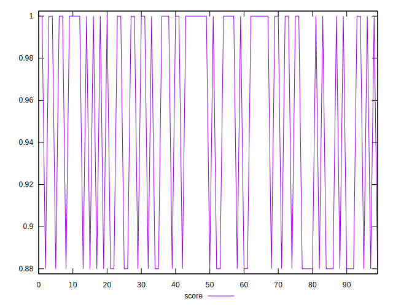
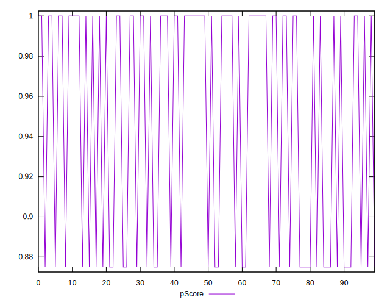

# //legacy-javascript/samples/astro

[→ Parent](../..)


## Raw


```yaml
p90min: 0
p90max: 150
p90range: 150
p90mean: 60.638297872340424
median: 0
p90stdev: 73.61210166811149
mad: 0
stdevBySn: 0
lfitCenter: 52.974450010085164
lfitStdev: 85.89170924077474
mfitCenter: 52.974450010085164
mfitStdev: 107.64929357797668
mfitConfidence: 10.764929357797667
p90skewness: 0.390199486285854
p90eccentricity: 1.0000000000000002
p90discretization: 47
outlandishness: 1.0286229916897507

```


## Score


```yaml
p90min: 0.88
p90max: 1
p90range: 0.12
p90mean: 0.9514893617021272
median: 1
p90stdev: 0.05888968133448914
mad: 0
stdevBySn: 0
lfitCenter: 0.957620439991932
lfitStdev: 0.06871336739261977
mfitCenter: 0.957620439991932
mfitStdev: 0.0861194348623813
mfitConfidence: 0.00861194348623813
p90skewness: -0.3901994862858465
p90eccentricity: 1.0000000000000029
p90discretization: 47
outlandishness: 0.9985515088117356

```


## Raw Estimate


## Score Estimate


## P Score


```yaml
p90min: 0.875
p90max: 1
p90range: 0.125
p90mean: 0.949468085106383
median: 1
p90stdev: 0.06134341805675953
mad: 0
stdevBySn: 0
lfitCenter: 0.9558546249915958
lfitStdev: 0.07157642436731222
mfitCenter: 0.9558546249915958
mfitStdev: 0.08970774464831381
mfitConfidence: 0.00897077446483138
p90skewness: -0.39019948628585654
p90eccentricity: 1.0000000000000016
p90discretization: 47
outlandishness: 0.9984879669514863

```


## Score Difference


```yaml
p90min: 0
p90max: 0
p90range: 0
p90mean: 0
median: 0
p90stdev: 0
mad: 0
stdevBySn: 0
lfitCenter: 0
lfitStdev: 0
mfitCenter: 0
mfitStdev: 0
mfitConfidence: 0
p90skewness: .nan
p90eccentricity: .nan
p90discretization: 94
outlandishness: .nan

```


## P Score Difference


```yaml
p90min: -0.0050000000000000044
p90max: 0
p90range: 0.0050000000000000044
p90mean: -0.0020212765957446826
median: 0
p90stdev: 0.002453736722270385
mad: 0
stdevBySn: 0
lfitCenter: -0.0017658150003361734
lfitStdev: 0.002863056974692495
mfitCenter: -0.0017658150003361734
mfitStdev: 0.00358830978593256
mfitConfidence: 0.000358830978593256
p90skewness: -0.390199486285854
p90eccentricity: 1.0000000000000002
p90discretization: 47
outlandishness: 1.0286229916897511

```

