# //mainthread-work-breakdown/samples/agenda

[→ Parent](../..)


## Raw


```yaml
p90min: 614.8959999999998
p90max: 677.6200000000002
p90range: 62.72400000000039
p90mean: 646.5076170212767
median: 647.3180000000002
p90stdev: 15.351131571782608
mad: 11.926000000000101
stdevBySn: 18.009452599999694
lfitCenter: 647.7050267996214
lfitStdev: 14.218789348460037
mfitCenter: 647.7050267996214
mfitStdev: 17.82060972386787
mfitConfidence: 1.782060972386787
p90skewness: -0.224706844778043
p90eccentricity: 1
p90discretization: 1
outlandishness: 1.0051683725580591

```

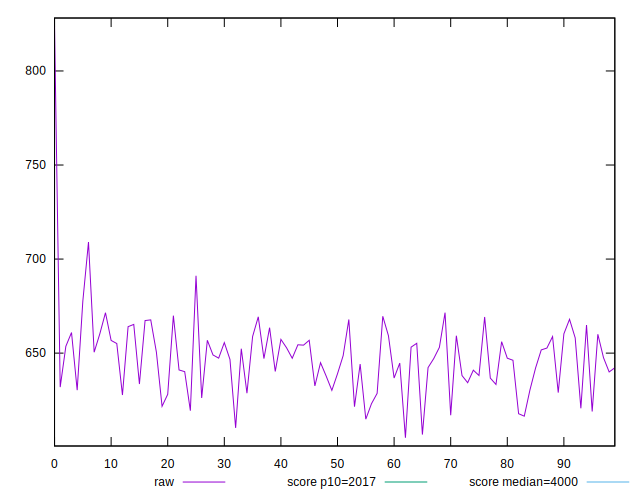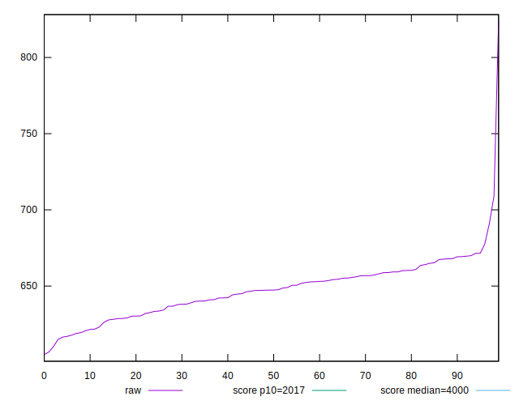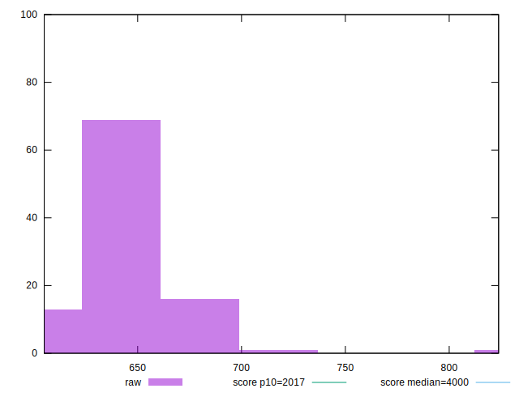
## Score


```yaml
p90min: 1
p90max: 1
p90range: 0
p90mean: 1
median: 1
p90stdev: 0
mad: 0
stdevBySn: 0
lfitCenter: 1
lfitStdev: 0
mfitCenter: 1
mfitStdev: 0
mfitConfidence: 0
p90skewness: .nan
p90eccentricity: .nan
p90discretization: 94
outlandishness: 1

```


## Raw Estimate

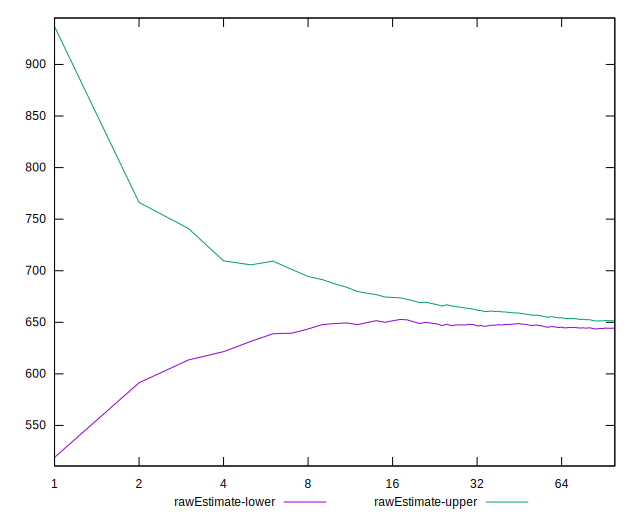
## Score Estimate

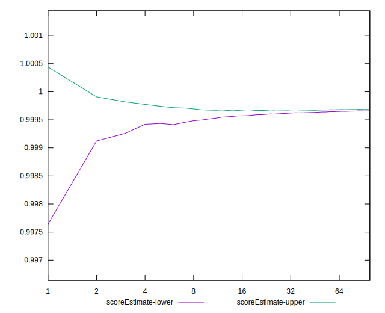
## P Score


```yaml
p90min: 0.999555007424727
p90max: 0.9997716708214304
p90range: 0.00021666339670334267
p90mean: 0.9996731962273007
median: 0.9996737537237362
p90stdev: 0.00005230251297623808
mad: 0.000043024004472314026
stdevBySn: 0.000060334570154686324
lfitCenter: 0.9996666577737808
lfitStdev: 0.00005325612990398566
mfitCenter: 0.9996666577737808
mfitStdev: 0.00006674666057453932
mfitConfidence: 0.000006674666057453932
p90skewness: 0.0048643649693129775
p90eccentricity: 1.0000000000000002
p90discretization: 1.010752688172043
outlandishness: 0.9999734728773442

```

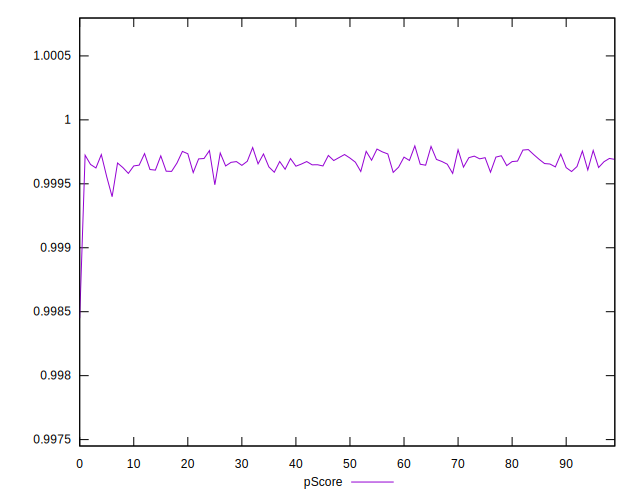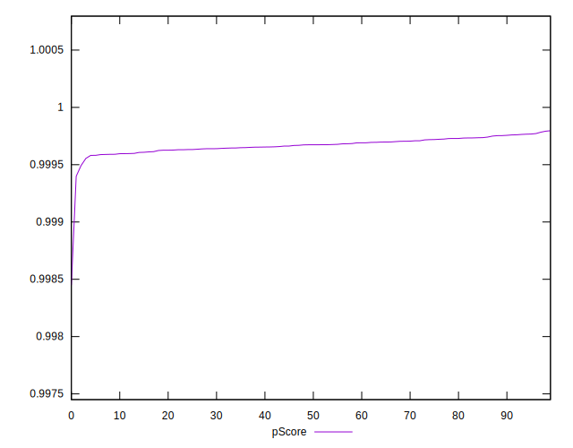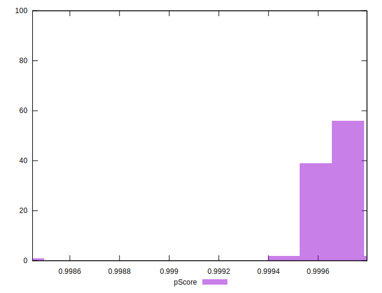
## Score Difference


```yaml
p90min: 0
p90max: 0
p90range: 0
p90mean: 0
median: 0
p90stdev: 0
mad: 0
stdevBySn: 0
lfitCenter: 0
lfitStdev: 0
mfitCenter: 0
mfitStdev: 0
mfitConfidence: 0
p90skewness: .nan
p90eccentricity: .nan
p90discretization: 94
outlandishness: .nan

```


## P Score Difference


```yaml
p90min: -0.0004449925752729733
p90max: -0.00022832917856963064
p90range: 0.00021666339670334267
p90mean: -0.0003268037726992836
median: -0.0003262462762637641
p90stdev: 0.0000523025129762381
mad: 0.000043024004472314026
stdevBySn: 0.000060334570154686324
lfitCenter: -0.00033334222621906397
lfitStdev: 0.0000532561299039675
mfitCenter: -0.00033334222621906397
mfitStdev: 0.00006674666057451657
mfitConfidence: 0.000006674666057451657
p90skewness: 0.004864364985435336
p90eccentricity: 0.9999999999999994
p90discretization: 1.010752688172043
outlandishness: 1.0827915646865005

```

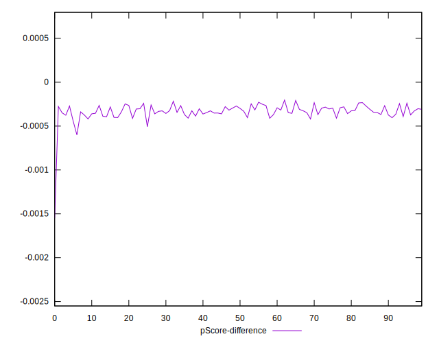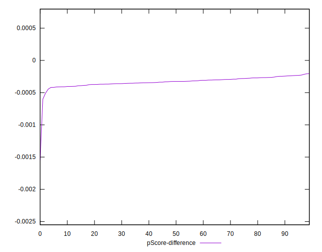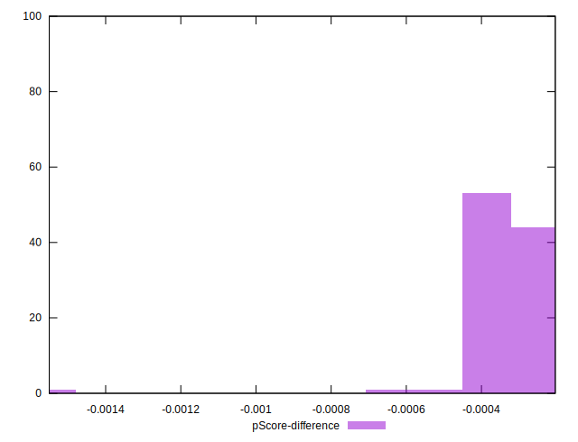