# //mainthread-work-breakdown/samples/astro

[→ Parent](../..)


## Raw


```yaml
p90min: 2269.3079999999973
p90max: 2470.5119999999956
p90range: 201.20399999999836
p90mean: 2339.988382978721
median: 2325.1479999999974
p90stdev: 48.85080801202525
mad: 23.72199999999907
stdevBySn: 38.04155480000098
lfitCenter: 2337.497492158393
lfitStdev: 39.28935706079393
mfitCenter: 2337.497492158393
mfitStdev: 49.2419066998789
mfitConfidence: 4.92419066998789
p90skewness: 1.0887657444881642
p90eccentricity: 0.9999999999999994
p90discretization: 1
outlandishness: 1.0041688496493821

```

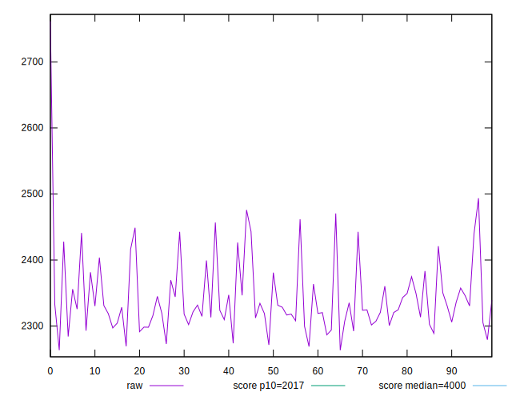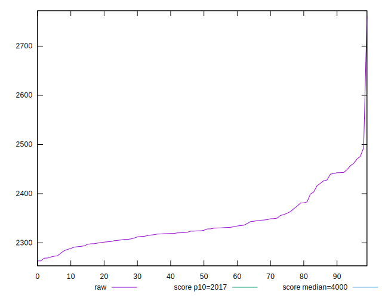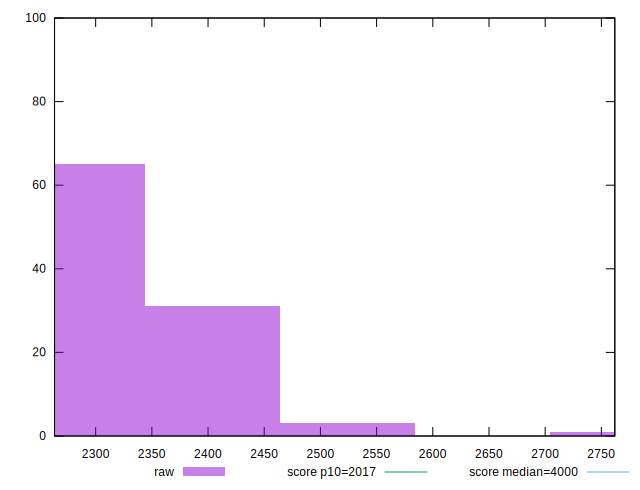
## Score


```yaml
p90min: 0.82
p90max: 0.86
p90range: 0.040000000000000036
p90mean: 0.8422340425531921
median: 0.845
p90stdev: 0.010122048329323868
mad: 0.0050000000000000044
stdevBySn: 0.011926000000000011
lfitCenter: 0.8429004408639956
lfitStdev: 0.009513351593402239
mfitCenter: 0.8429004408639956
mfitStdev: 0.011923218057261615
mfitConfidence: 0.0011923218057261614
p90skewness: -0.9498517608412961
p90eccentricity: 0.9999999999999987
p90discretization: 18.8
outlandishness: 0.9980204324553356

```

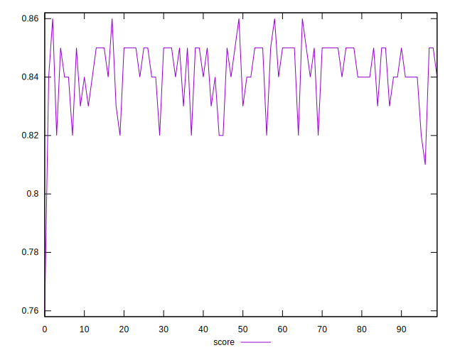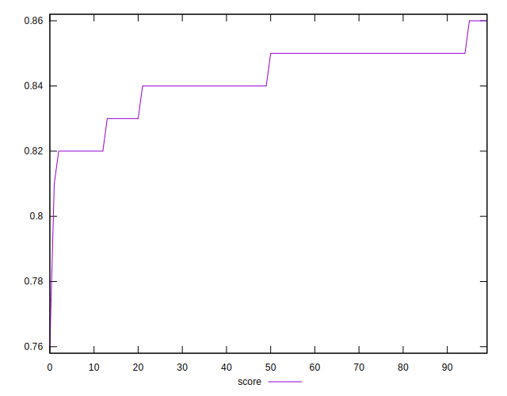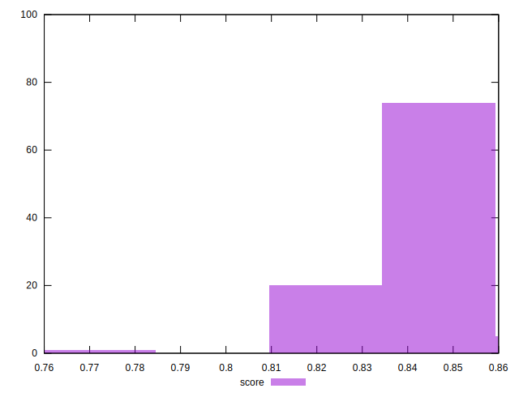
## Raw Estimate

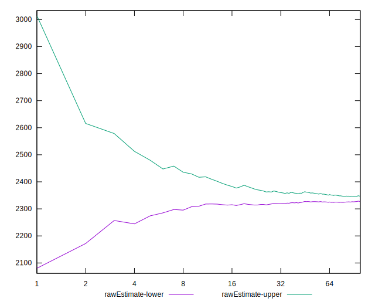
## Score Estimate

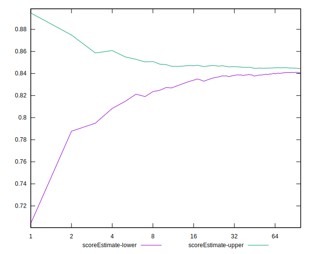
## P Score


```yaml
p90min: 0.8164544253422972
p90max: 0.8556415913123901
p90range: 0.039187165970092974
p90mean: 0.842114298882276
median: 0.8450521799053518
p90stdev: 0.00950796882171859
mad: 0.004549473420561445
stdevBySn: 0.007269720866552509
lfitCenter: 0.8425940480401349
lfitStdev: 0.0076680586692372266
mfitCenter: 0.8425940480401349
mfitStdev: 0.009610486345590178
mfitConfidence: 0.0009610486345590178
p90skewness: -1.1189202496944588
p90eccentricity: 1.0000000000000004
p90discretization: 1
outlandishness: 0.9976169018492038

```

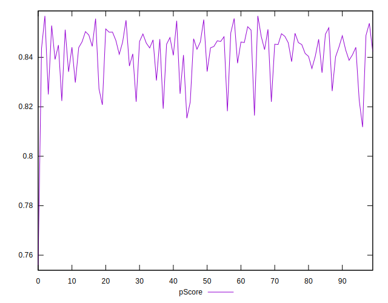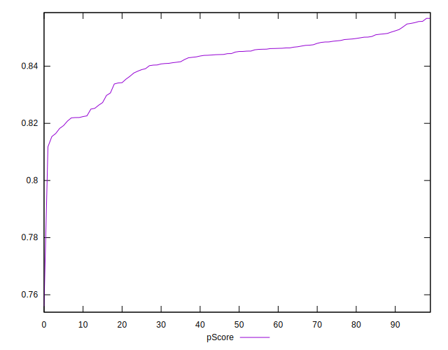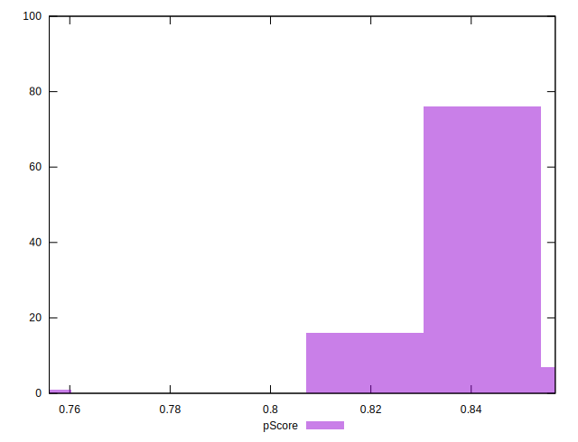
## Score Difference


```yaml
p90min: 0
p90max: 1.1102230246251565e-16
p90range: 1.1102230246251565e-16
p90mean: 1.8897413185109047e-17
median: 0
p90stdev: 4.172435856076853e-17
mad: 0
stdevBySn: 0
lfitCenter: 1.2691963892908624e-17
lfitStdev: 2.817708533426843e-17
mfitCenter: 1.2691963892908624e-17
mfitStdev: 3.531473943331906e-17
mfitConfidence: 3.531473943331906e-18
p90skewness: 1.7550294029241171
p90eccentricity: 0.9999999999999979
p90discretization: 47
outlandishness: 1.2460140625

```

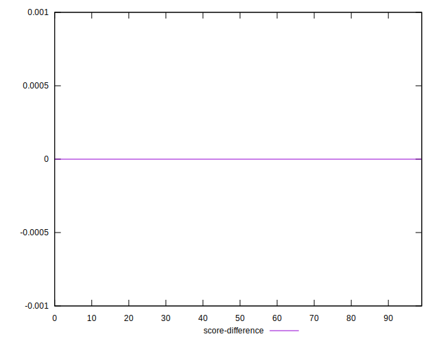
## P Score Difference


```yaml
p90min: -0.0047405055957684405
p90max: 0.004777044827009802
p90range: 0.009517550422778243
p90mean: -0.0003135301056576875
median: -0.0002533226660524912
p90stdev: 0.002882441016658385
mad: 0.0027810667882132156
stdevBySn: 0.003469074109361973
lfitCenter: -0.00031855171056685224
lfitStdev: 0.0026024172079258927
mfitCenter: -0.00031855171056685224
mfitStdev: 0.0032616462811686604
mfitConfidence: 0.000326164628116866
p90skewness: 0.07685422108775336
p90eccentricity: 0.9999999999999996
p90discretization: 1
outlandishness: 0.8538841030282182

```

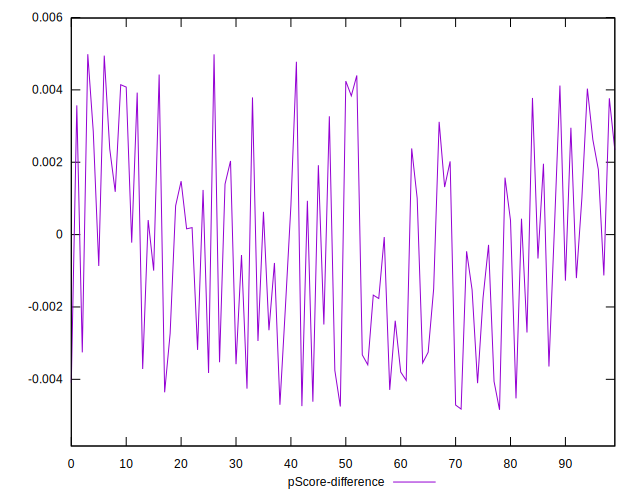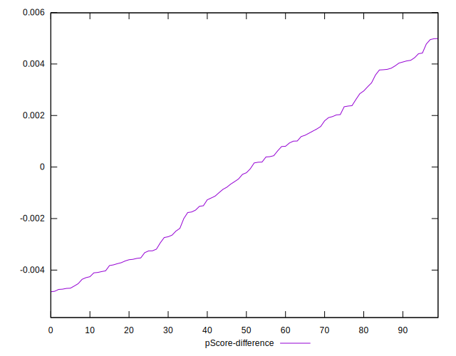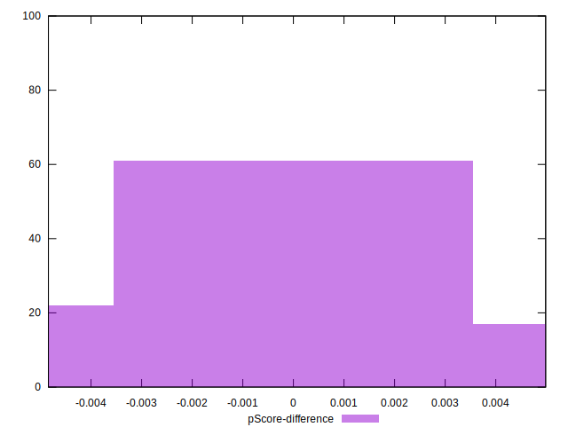