# //mainthread-work-breakdown/samples/card

[→ Parent](../..)


## Raw


```yaml
p90min: 639.7440000000001
p90max: 705.8240000000004
p90range: 66.08000000000027
p90mean: 674.5537872340425
median: 674.636
p90stdev: 16.25962438253467
mad: 13.592000000000382
stdevBySn: 19.06490360000016
lfitCenter: 675.5586132009961
lfitStdev: 15.09822991411475
mfitCenter: 675.5586132009961
mfitStdev: 18.922825018840758
mfitConfidence: 1.8922825018840759
p90skewness: -0.0904795054963133
p90eccentricity: 0.9999999999999989
p90discretization: 1
outlandishness: 1.0049504549824737

```

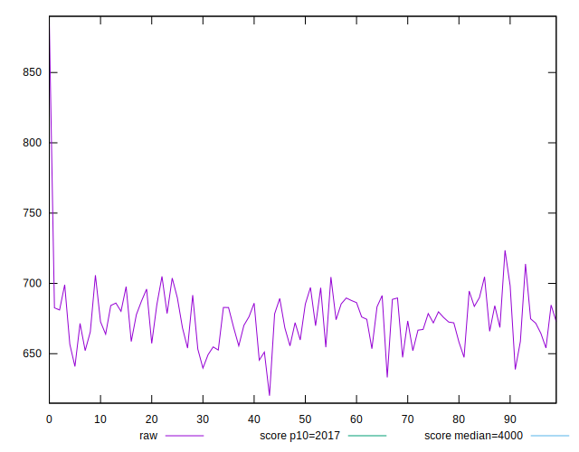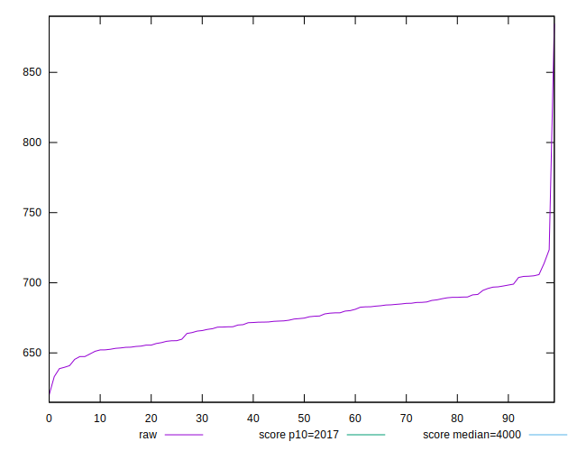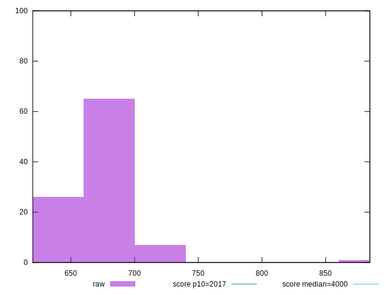
## Score


```yaml
p90min: 1
p90max: 1
p90range: 0
p90mean: 1
median: 1
p90stdev: 0
mad: 0
stdevBySn: 0
lfitCenter: 1
lfitStdev: 0
mfitCenter: 1
mfitStdev: 0
mfitConfidence: 0
p90skewness: .nan
p90eccentricity: .nan
p90discretization: 94
outlandishness: 1

```


## Raw Estimate

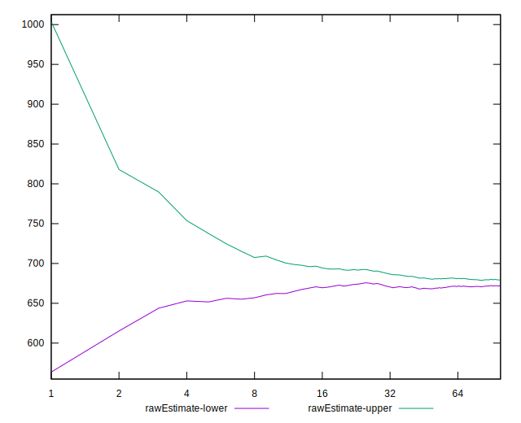
## Score Estimate

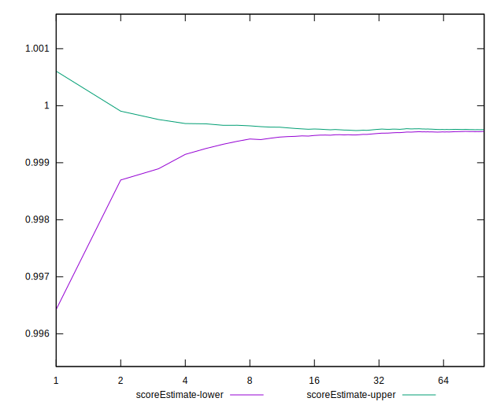
## P Score


```yaml
p90min: 0.9994165587793484
p90max: 0.9996991289020958
p90range: 0.00028257012274734983
p90mean: 0.9995639533167961
median: 0.9995680048497658
p90stdev: 0.00007001217324764052
mad: 0.000060108664375779775
stdevBySn: 0.00008330533058900295
lfitCenter: 0.9995556156116489
lfitStdev: 0.00007208956929718075
mfitCenter: 0.9995556156116489
mfitStdev: 0.00009035087644405695
mfitConfidence: 0.000009035087644405696
p90skewness: -0.13818025991424285
p90eccentricity: 0.9999999999999997
p90discretization: 1
outlandishness: 0.9999622030413297

```

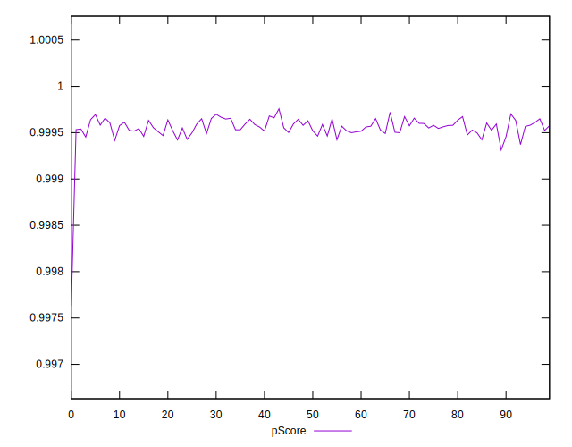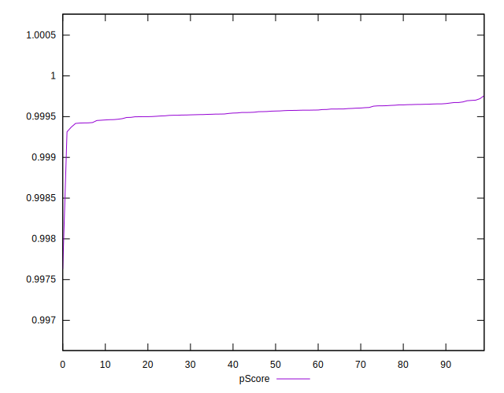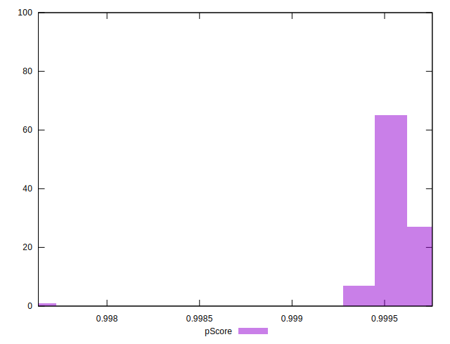
## Score Difference


```yaml
p90min: 0
p90max: 0
p90range: 0
p90mean: 0
median: 0
p90stdev: 0
mad: 0
stdevBySn: 0
lfitCenter: 0
lfitStdev: 0
mfitCenter: 0
mfitStdev: 0
mfitConfidence: 0
p90skewness: .nan
p90eccentricity: .nan
p90discretization: 94
outlandishness: .nan

```


## P Score Difference


```yaml
p90min: -0.0005834412206515704
p90max: -0.0003008710979042206
p90range: 0.00028257012274734983
p90mean: -0.00043604668320393043
median: -0.0004319951502341768
p90stdev: 0.00007001217324764052
mad: 0.000060108664375779775
stdevBySn: 0.00008330533058900295
lfitCenter: -0.0004443843883512877
lfitStdev: 0.00007208956929720484
mfitCenter: -0.0004443843883512877
mfitStdev: 0.00009035087644408716
mfitConfidence: 0.000009035087644408716
p90skewness: -0.13818025992031482
p90eccentricity: 0.9999999999999996
p90discretization: 1
outlandishness: 1.088520809120866

```

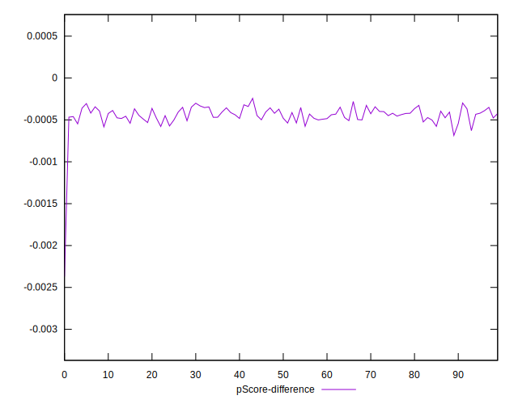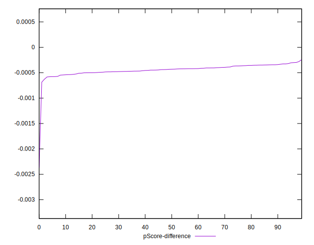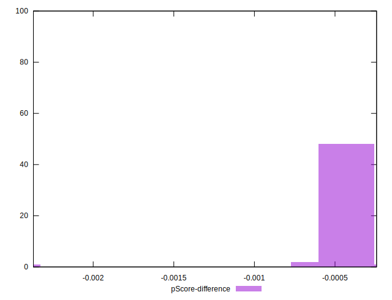