# //mainthread-work-breakdown/samples/music

[→ Parent](../..)


## Raw


```yaml
p90min: 1693.1400000000026
p90max: 1795.4519999999989
p90range: 102.31199999999626
p90mean: 1737.068000000001
median: 1736.2540000000008
p90stdev: 20.177877804190775
mad: 14.565999999999917
stdevBySn: 23.9831859999988
lfitCenter: 1739.4712681593696
lfitStdev: 20.584641879962792
mfitCenter: 1739.4712681593696
mfitStdev: 25.799022705694156
mfitConfidence: 2.5799022705694155
p90skewness: 0.2829403652675011
p90eccentricity: 0.9999999999999997
p90discretization: 1
outlandishness: 1.006518104209962

```

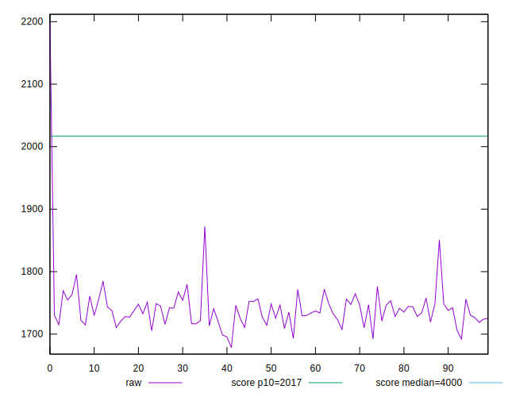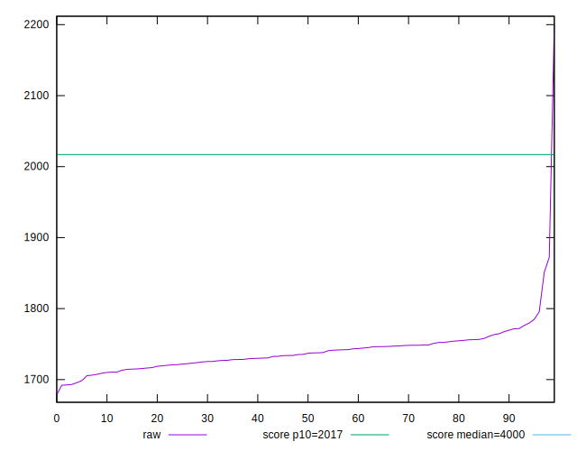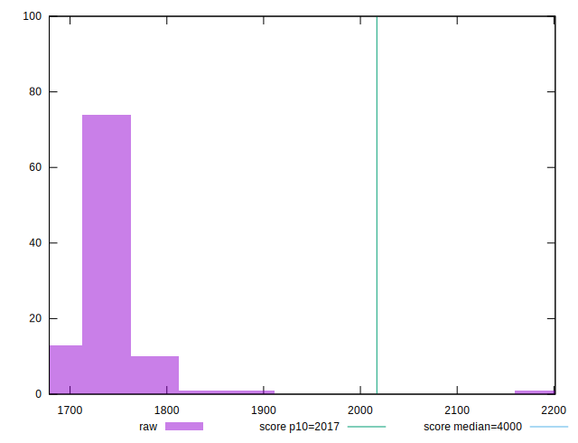
## Score


```yaml
p90min: 0.93
p90max: 0.95
p90range: 0.019999999999999907
p90mean: 0.9401063829787223
median: 0.94
p90stdev: 0.0023038731731603846
mad: 0
stdevBySn: 0
lfitCenter: 0.9397261771818458
lfitStdev: 0.0014181681102896802
mfitCenter: 0.9397261771818458
mfitStdev: 0.0017774101435045694
mfitConfidence: 0.00017774101435045694
p90skewness: 0.7313287234759894
p90eccentricity: 1.000000000000002
p90discretization: 31.333333333333332
outlandishness: 0.9984977921471637

```

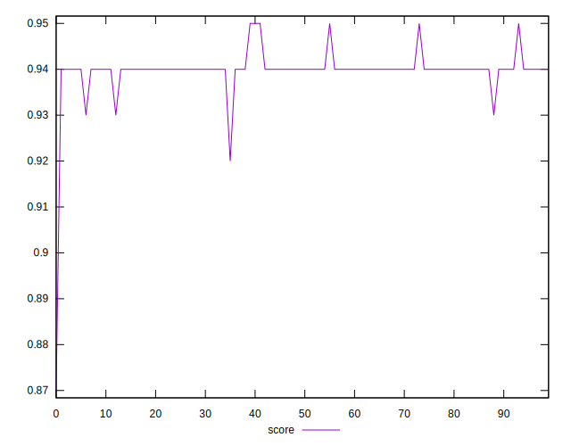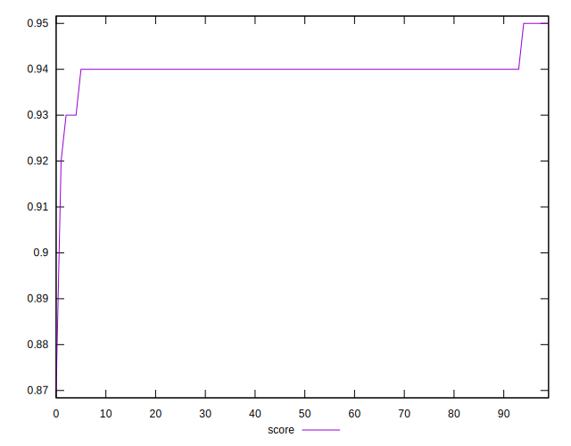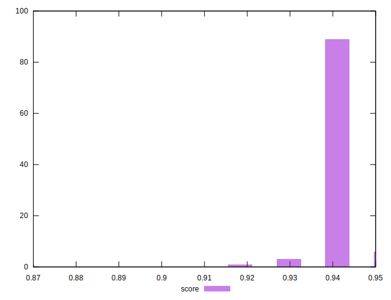
## Raw Estimate

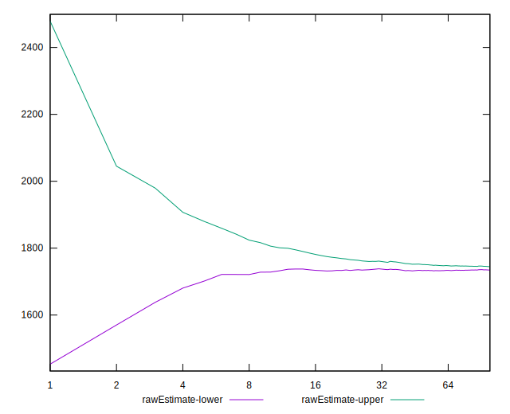
## Score Estimate

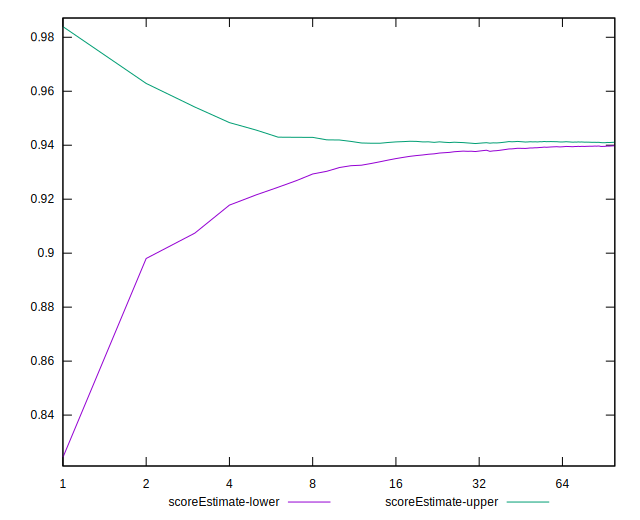
## P Score


```yaml
p90min: 0.9331068997263661
p90max: 0.9462089210530829
p90range: 0.013102021326716784
p90mean: 0.9407347340895331
median: 0.9408666744547773
p90stdev: 0.002572251602293743
mad: 0.0018497156143193472
stdevBySn: 0.0030289408913917416
lfitCenter: 0.9403641549071862
lfitStdev: 0.0027219135064435154
mfitCenter: 0.9403641549071862
mfitStdev: 0.0034114126816083713
mfitConfidence: 0.0003411412681608371
p90skewness: -0.3455025294462487
p90eccentricity: 1.0000000000000002
p90discretization: 1
outlandishness: 0.9981319696740362

```

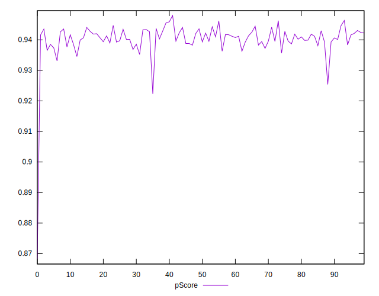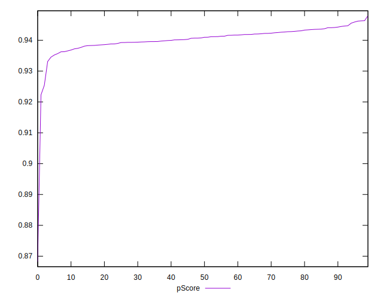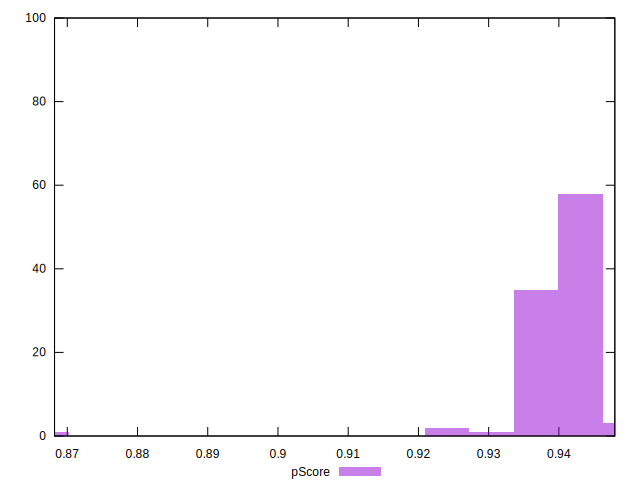
## Score Difference


```yaml
p90min: 0
p90max: 1.1102230246251565e-16
p90range: 1.1102230246251565e-16
p90mean: 1.0866012581437702e-16
median: 1.1102230246251565e-16
p90stdev: 1.6021061506108983e-17
mad: 0
stdevBySn: 0
lfitCenter: 1.0829672040123129e-16
lfitStdev: 6.664295900958606e-18
mfitCenter: 1.0829672040123129e-16
mfitStdev: 8.352456276329756e-18
mfitConfidence: 8.352456276329756e-19
p90skewness: -6.6348880269703825
p90eccentricity: 0.9999999999999988
p90discretization: 47
outlandishness: 0.9421656427221172

```

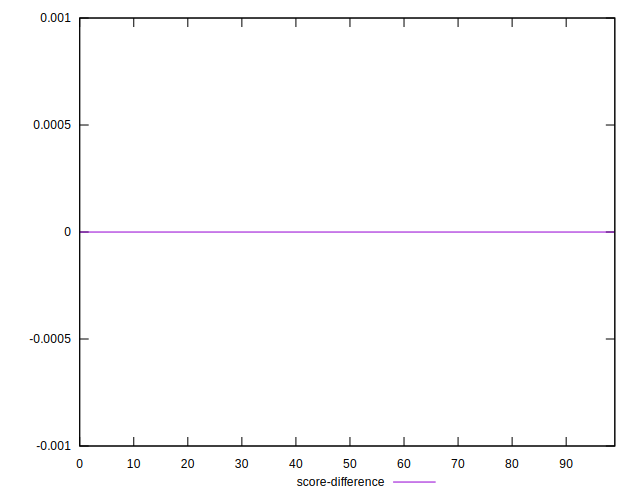
## P Score Difference


```yaml
p90min: -0.0043200956975375515
p90max: 0.004474707724904214
p90range: 0.008794803422441766
p90mean: 0.0004841712898389461
median: 0.0006621267671163
p90stdev: 0.002267216743142567
mad: 0.0018468399942730973
stdevBySn: 0.0027583648856844257
lfitCenter: 0.0005153137154993044
lfitStdev: 0.0019898731199156704
mfitCenter: 0.0005153137154993044
mfitStdev: 0.0024939361151639157
mfitConfidence: 0.00024939361151639155
p90skewness: -0.2491186377317365
p90eccentricity: 0.9999999999999997
p90discretization: 1
outlandishness: 0.885705199959313

```

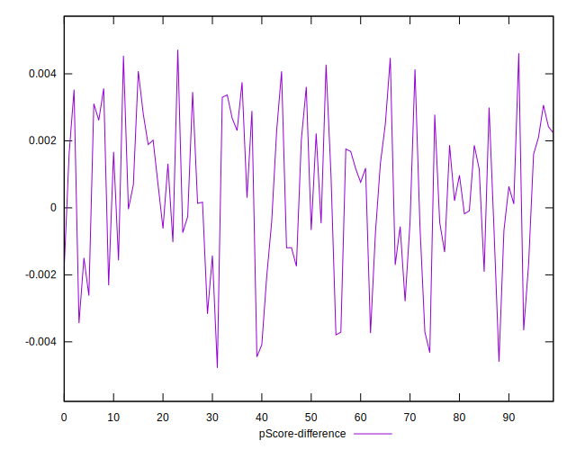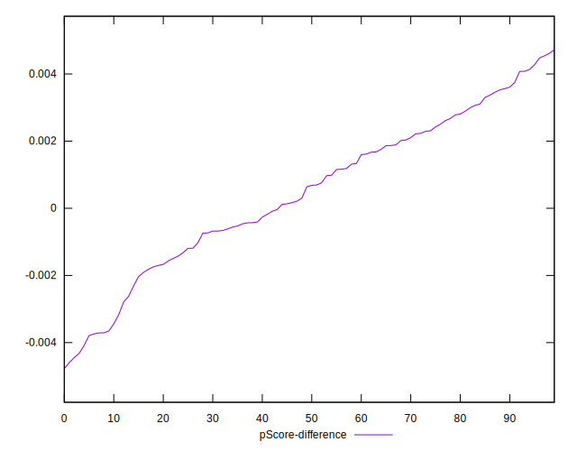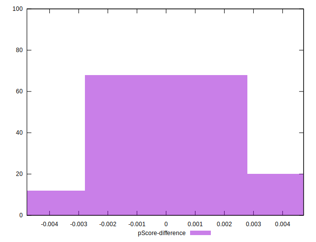