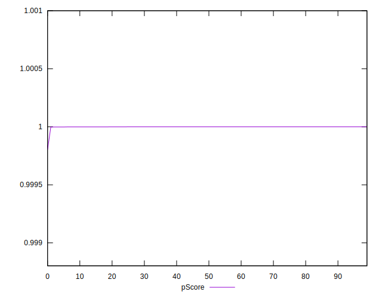

# //max-potential-fid/samples/agenda

[→ Parent](../..)


## Raw


```yaml
p90min: 16
p90max: 23
p90range: 7
p90mean: 17.372340425531913
median: 16
p90stdev: 2.5009957274636245
mad: 0
stdevBySn: 0
lfitCenter: 17.054320384951282
lfitStdev: 2.2060050167085894
mfitCenter: 17.054320384951282
mfitStdev: 2.764817277211868
mfitConfidence: 0.2764817277211868
p90skewness: 1.3079683207839379
p90eccentricity: 0.9999999999999997
p90discretization: 23.5
outlandishness: 1.0357331081352195

```


## Score


```yaml
p90min: 1
p90max: 1
p90range: 0
p90mean: 1
median: 1
p90stdev: 0
mad: 0
stdevBySn: 0
lfitCenter: 1
lfitStdev: 0
mfitCenter: 1
mfitStdev: 0
mfitConfidence: 0
p90skewness: .nan
p90eccentricity: .nan
p90discretization: 94
outlandishness: 1

```


## Raw Estimate


## Score Estimate


## P Score


```yaml
p90min: 0.999998535498587
p90max: 0.9999999641342965
p90range: 0.0000014286357095105728
p90mean: 0.9999997551691392
median: 0.9999999641342965
p90stdev: 3.985589050861029e-7
mad: 0
stdevBySn: 0
lfitCenter: 0.9999989012412158
lfitStdev: 0.0000023175484996646834
mfitCenter: 0.9999989012412158
mfitStdev: 0.000002904616301466823
mfitConfidence: 2.904616301466823e-7
p90skewness: -1.6319774357381982
p90eccentricity: 0.999999999999998
p90discretization: 23.5
outlandishness: 0.9999960127477203

```


## Score Difference


```yaml
p90min: 0
p90max: 0
p90range: 0
p90mean: 0
median: 0
p90stdev: 0
mad: 0
stdevBySn: 0
lfitCenter: 0
lfitStdev: 0
mfitCenter: 0
mfitStdev: 0
mfitConfidence: 0
p90skewness: .nan
p90eccentricity: .nan
p90discretization: 94
outlandishness: .nan

```


## P Score Difference


```yaml
p90min: -0.0000014645014130287848
p90max: -3.5865703518211944e-8
p90range: 0.0000014286357095105728
p90mean: -2.448308591253072e-7
median: -3.5865703518211944e-8
p90stdev: 3.9855890508610285e-7
mad: 0
stdevBySn: 0
lfitCenter: -0.000001098758784419094
lfitStdev: 0.000002317548499947257
mfitCenter: -0.000001098758784419094
mfitStdev: 0.0000029046163018209764
mfitConfidence: 2.9046163018209764e-7
p90skewness: -1.631977448397832
p90eccentricity: 0.9999999999999992
p90discretization: 23.5
outlandishness: 83.59220486559079

```

