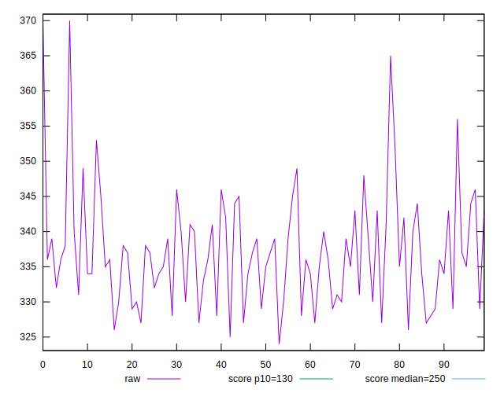
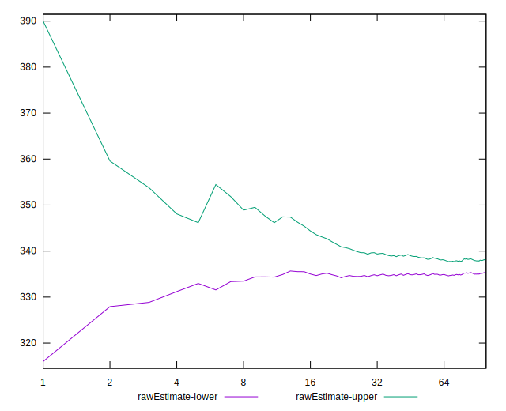

# //max-potential-fid/samples/astro

[→ Parent](../..)


## Raw


```yaml
p90min: 326
p90max: 356
p90range: 30
p90mean: 336.6170212765957
median: 336
p90stdev: 6.630211932973413
mad: 5.5
stdevBySn: 7.155600000000001
lfitCenter: 336.7116525172396
lfitStdev: 5.7089244582165
mfitCenter: 336.7116525172396
mfitStdev: 7.155075739548714
mfitConfidence: 0.7155075739548714
p90skewness: 0.49387555081921736
p90eccentricity: 0.9999999999999997
p90discretization: 3.6153846153846154
outlandishness: 1.0035857888351072

```


## Score


```yaml
p90min: 0.24
p90max: 0.3
p90range: 0.06
p90mean: 0.28085106382978725
median: 0.28
p90stdev: 0.01357873607285858
mad: 0.010000000000000009
stdevBySn: 0.011926000000000011
lfitCenter: 0.280566194039992
lfitStdev: 0.010861556519456883
mfitCenter: 0.280566194039992
mfitStdev: 0.013612942352784572
mfitConfidence: 0.0013612942352784572
p90skewness: -0.4092266187358949
p90eccentricity: 1.0000000000000009
p90discretization: 13.428571428571429
outlandishness: 0.9925291572543621

```


## Raw Estimate


## Score Estimate


## P Score


```yaml
p90min: 0.24424168649718153
p90max: 0.30146316384229
p90range: 0.05722147734510846
p90mean: 0.28021785446712577
median: 0.2811564989162073
p90stdev: 0.012868838216155004
mad: 0.010787390238813865
stdevBySn: 0.014123900025788939
lfitCenter: 0.2800294388484189
lfitStdev: 0.011047368584789698
mfitCenter: 0.2800294388484189
mfitStdev: 0.013845823241384315
mfitConfidence: 0.0013845823241384315
p90skewness: -0.3957434081185301
p90eccentricity: 0.9999999999999994
p90discretization: 3.6153846153846154
outlandishness: 0.9929357153249434

```


## Score Difference


```yaml
p90min: 0
p90max: 0
p90range: 0
p90mean: 0
median: 0
p90stdev: 0
mad: 0
stdevBySn: 0
lfitCenter: 0
lfitStdev: 0
mfitCenter: 0
mfitStdev: 0
mfitConfidence: 0
p90skewness: .nan
p90eccentricity: .nan
p90discretization: 94
outlandishness: .nan

```


## P Score Difference


```yaml
p90min: -0.004883752116671913
p90max: 0.003950710999721663
p90range: 0.008834463116393576
p90mean: -0.0005836038367392301
median: -0.0006251390576321181
p90stdev: 0.0029115356985735725
mad: 0.002724994914579726
stdevBySn: 0.003277438109513247
lfitCenter: -0.0005286139347566568
lfitStdev: 0.0025995825569031282
mfitCenter: -0.0005286139347566568
mfitStdev: 0.0032580935729638986
mfitConfidence: 0.0003258093572963899
p90skewness: -0.10828916063997067
p90eccentricity: 1.0000000000000007
p90discretization: 3.2413793103448274
outlandishness: 0.9662435684259247

```

