# //max-potential-fid/samples/card

[→ Parent](../..)


## Raw


```yaml
p90min: 16
p90max: 43
p90range: 27
p90mean: 20.23404255319149
median: 16
p90stdev: 7.6233481390562945
mad: 0
stdevBySn: 0
lfitCenter: 19.130826413151386
lfitStdev: 5.986892779250495
mfitCenter: 19.130826413151386
mfitStdev: 7.50345736637703
mfitConfidence: 0.750345736637703
p90skewness: 1.8807725010806582
p90eccentricity: 0.9999999999999989
p90discretization: 11.75
outlandishness: 1.0587566042054357

```

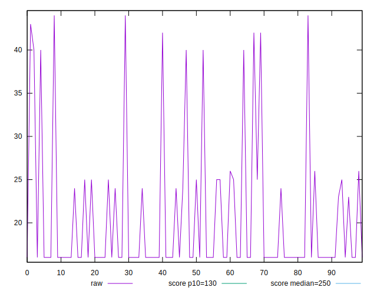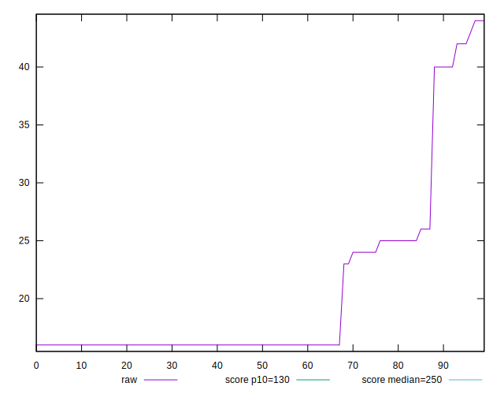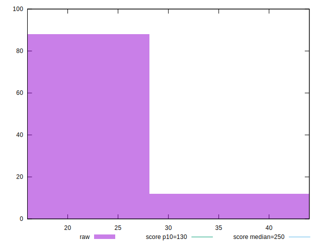
## Score


```yaml
p90min: 1
p90max: 1
p90range: 0
p90mean: 1
median: 1
p90stdev: 0
mad: 0
stdevBySn: 0
lfitCenter: 1
lfitStdev: 0
mfitCenter: 1
mfitStdev: 0
mfitConfidence: 0
p90skewness: .nan
p90eccentricity: .nan
p90discretization: 94
outlandishness: 1

```


## Raw Estimate

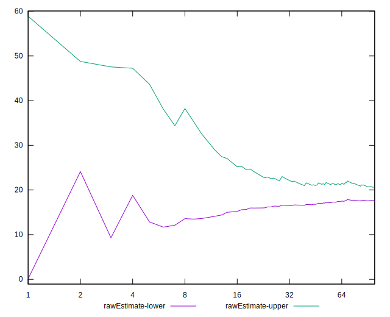
## Score Estimate

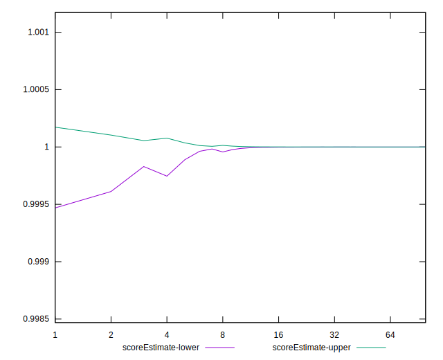
## P Score


```yaml
p90min: 0.9997193707068333
p90max: 0.9999999641342965
p90range: 0.00028059342746322713
p90mean: 0.9999800750515283
median: 0.9999999641342965
p90stdev: 0.000060530651961300374
mad: 0
stdevBySn: 0
lfitCenter: 0.9999846736905147
lfitStdev: 0.00003464449436447382
mfitCenter: 0.9999846736905147
mfitStdev: 0.0000434204346108337
mfitConfidence: 0.00000434204346108337
p90skewness: -3.0032089566896167
p90eccentricity: 0.999999999999997
p90discretization: 11.75
outlandishness: 0.9999825121580916

```

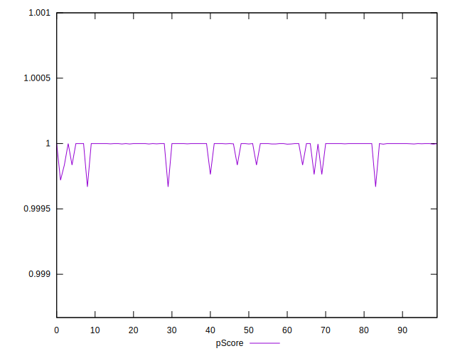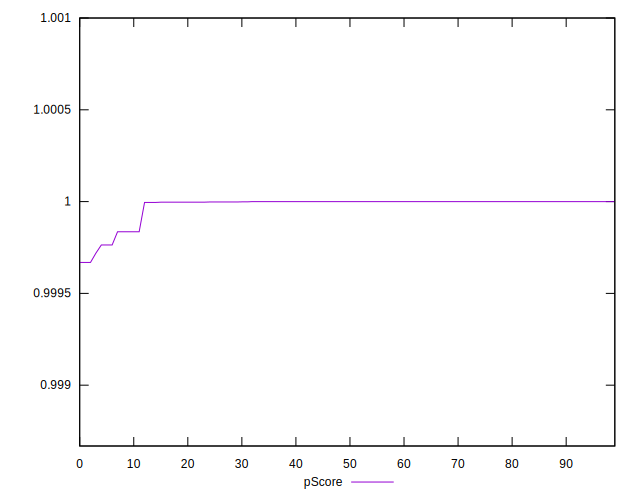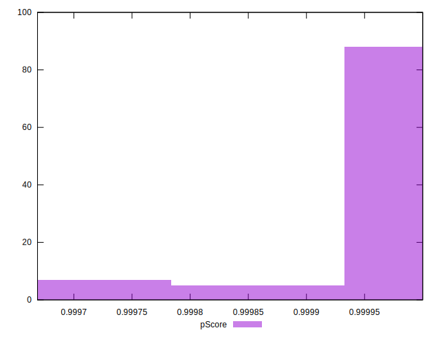
## Score Difference


```yaml
p90min: 0
p90max: 0
p90range: 0
p90mean: 0
median: 0
p90stdev: 0
mad: 0
stdevBySn: 0
lfitCenter: 0
lfitStdev: 0
mfitCenter: 0
mfitStdev: 0
mfitConfidence: 0
p90skewness: .nan
p90eccentricity: .nan
p90discretization: 94
outlandishness: .nan

```


## P Score Difference


```yaml
p90min: -0.00028062929316674534
p90max: -3.5865703518211944e-8
p90range: 0.00028059342746322713
p90mean: -0.00001992494847013081
median: -3.5865703518211944e-8
p90stdev: 0.00006053065196130032
mad: 0
stdevBySn: 0
lfitCenter: -0.000015326309485603037
lfitStdev: 0.000034644494364795014
mfitCenter: -0.000015326309485603037
mfitStdev: 0.000043420434611236256
mfitConfidence: 0.000004342043461123625
p90skewness: -3.0032089567506284
p90eccentricity: 1.0000000000000016
p90discretization: 11.75
outlandishness: 2.0702490742819113

```

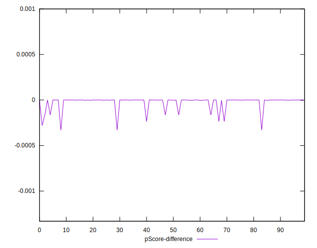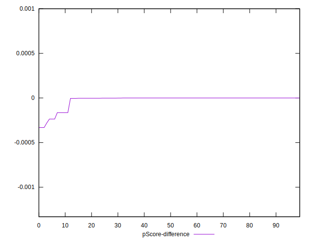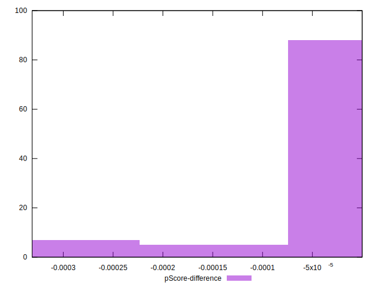