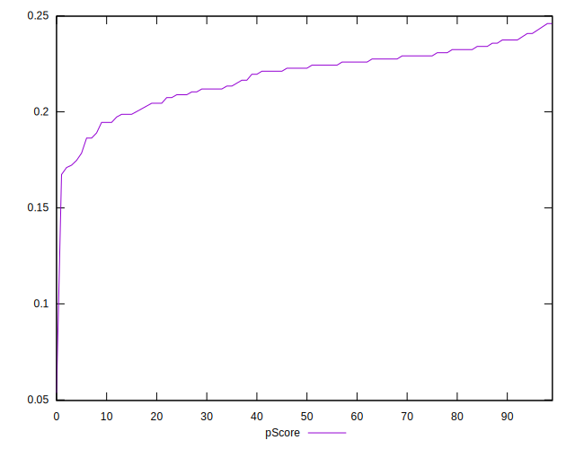

# //max-potential-fid/samples/music

[→ Parent](../..)


## Raw


```yaml
p90min: 357
p90max: 405
p90range: 48
p90mean: 371.97872340425533
median: 369
p90stdev: 10.321407956286318
mad: 6.5
stdevBySn: 9.5408
lfitCenter: 372.05479427963365
lfitStdev: 9.861913541925178
mfitCenter: 372.05479427963365
mfitStdev: 12.360075675515237
mfitConfidence: 1.2360075675515236
p90skewness: 1.0993733982314893
p90eccentricity: 1.0000000000000002
p90discretization: 2.6857142857142855
outlandishness: 1.011762350594889

```


## Score


```yaml
p90min: 0.17
p90max: 0.24
p90range: 0.06999999999999998
p90mean: 0.21819148936170218
median: 0.22
p90stdev: 0.016042680173322162
mad: 0.010000000000000009
stdevBySn: 0.017889000000000002
lfitCenter: 0.2185193466475051
lfitStdev: 0.014234224835458605
mfitCenter: 0.2185193466475051
mfitStdev: 0.01783995523795899
mfitConfidence: 0.001783995523795899
p90skewness: -0.8481709606208455
p90eccentricity: 0.9999999999999988
p90discretization: 11.75
outlandishness: 0.9836461565049794

```


## Raw Estimate


## Score Estimate


## P Score


```yaml
p90min: 0.17221489028066628
p90max: 0.2425197073059409
p90range: 0.07030481702527464
p90mean: 0.2186079457766542
median: 0.22272802234810485
p90stdev: 0.015457850580669556
mad: 0.010261825840643835
stdevBySn: 0.014860143602505739
lfitCenter: 0.2190244760930649
lfitStdev: 0.013880542408151609
mfitCenter: 0.2190244760930649
mfitStdev: 0.01739668005124903
mfitConfidence: 0.001739668005124903
p90skewness: -0.9287600741153864
p90eccentricity: 1.0000000000000002
p90discretization: 2.6857142857142855
outlandishness: 0.9832716085450676

```


## Score Difference


```yaml
p90min: 0
p90max: 0
p90range: 0
p90mean: 0
median: 0
p90stdev: 0
mad: 0
stdevBySn: 0
lfitCenter: 0
lfitStdev: 0
mfitCenter: 0
mfitStdev: 0
mfitConfidence: 0
p90skewness: .nan
p90eccentricity: .nan
p90discretization: 94
outlandishness: .nan

```


## P Score Difference


```yaml
p90min: -0.0040831018723639645
p90max: 0.004506073982486369
p90range: 0.008589175854850334
p90mean: 0.0003789181177606899
median: 0.000781526852782849
p90stdev: 0.002724209904907541
mad: 0.002263002806883907
stdevBySn: 0.0032823478462711596
lfitCenter: 0.00039098000922759067
lfitStdev: 0.002490822816863474
mfitCenter: 0.00039098000922759067
mfitStdev: 0.0031217834530642805
mfitConfidence: 0.00031217834530642807
p90skewness: -0.04814490855237794
p90eccentricity: 1.0000000000000007
p90discretization: 2.5405405405405403
outlandishness: 0.962547100631603

```

