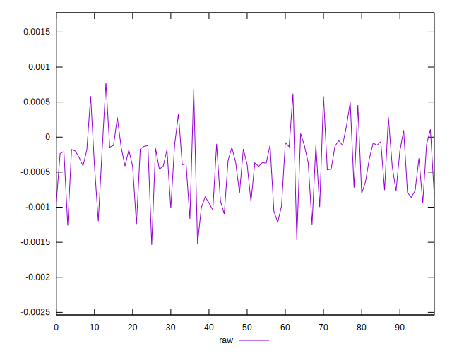
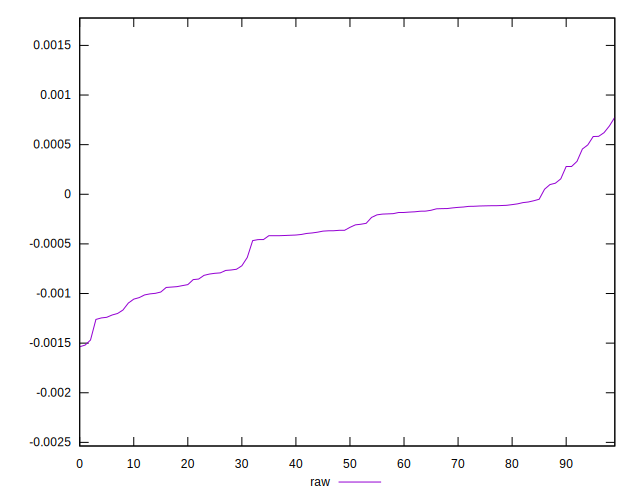
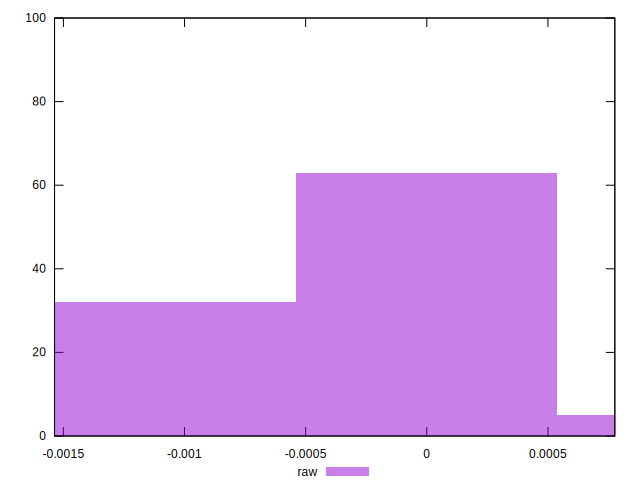

# //meta/pScore-difference/samples/agenda

[→ Parent](../..)


## Raw


```yaml
p90min: -0.0012611257871213478
p90max: 0.0005835120065522282
p90range: 0.001844637793673576
p90mean: -0.0003969830861268872
median: -0.00034820762772216625
p90stdev: 0.0004382002389013191
mad: 0.00025785770163999904
stdevBySn: 0.0004052474565521411
lfitCenter: -0.00037704343605791794
lfitStdev: 0.00035914392105395617
mfitCenter: -0.00037704343605791794
mfitStdev: 0.00045012015404077523
mfitConfidence: 0.000045012015404077525
p90skewness: -0.15632423940491272
p90eccentricity: 1.0000000000000002
p90discretization: 1.010752688172043
outlandishness: 1.0029269939282168

```

