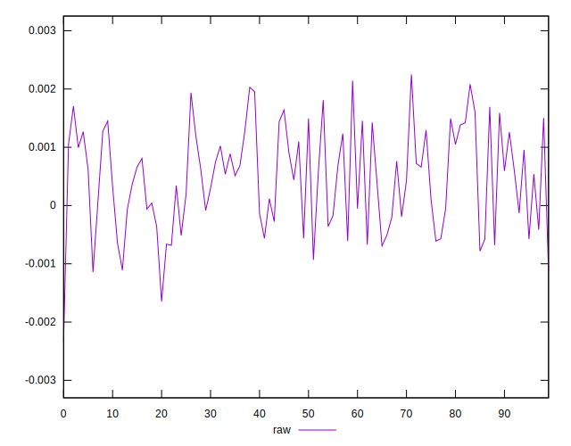
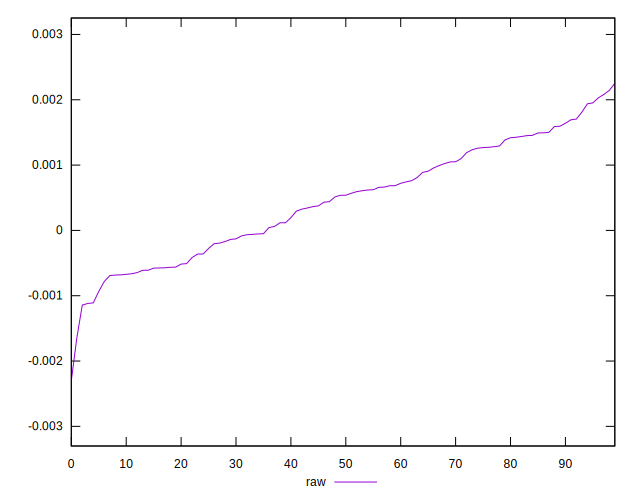
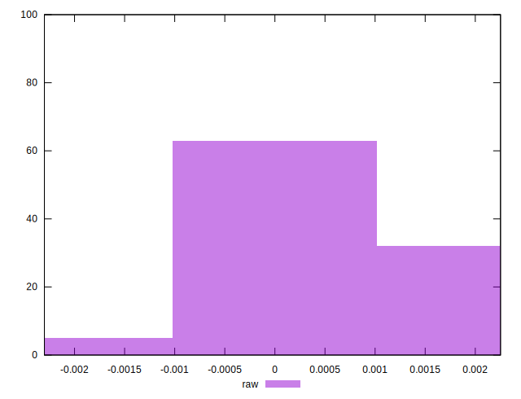

# //meta/pScore-difference/samples/astro

[→ Parent](../..)


## Raw


```yaml
p90min: -0.0011183217301808264
p90max: 0.0020293388811053747
p90range: 0.0031476606112862014
p90mean: 0.00046349792267092664
median: 0.0005383371786579755
p90stdev: 0.0008275873784657438
mad: 0.0007379244907409015
stdevBySn: 0.0009791899681917387
lfitCenter: 0.0004612632755056419
lfitStdev: 0.0007458781953072919
mfitCenter: 0.0004612632755056419
mfitStdev: 0.000934819687834656
mfitConfidence: 0.00009348196878346561
p90skewness: -0.01717875157932498
p90eccentricity: 1.0000000000000002
p90discretization: 1
outlandishness: 0.9406849311141151

```

