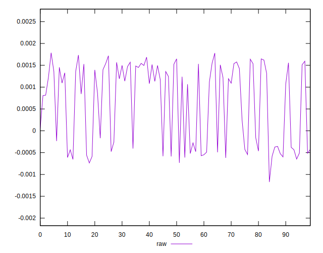
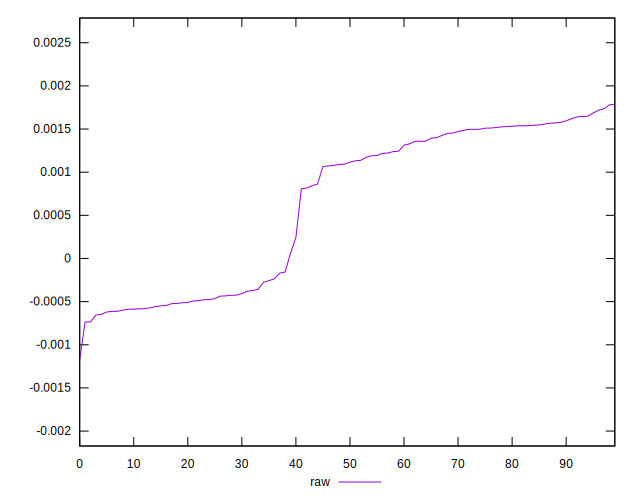
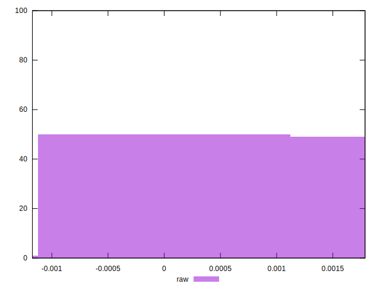

# //meta/pScore-difference/samples/card

[→ Parent](../..)


## Raw


```yaml
p90min: -0.0006551621973400034
p90max: 0.0017184442035736492
p90range: 0.0023736064009136524
p90mean: 0.0006353461807130489
median: 0.0011049966122768486
p90stdev: 0.0009137482625572303
mad: 0.000502187319704389
stdevBySn: 0.0006702216308862014
lfitCenter: 0.0006965199992173876
lfitStdev: 0.0009782404673705709
mfitCenter: 0.0006965199992173876
mfitStdev: 0.001226042608683355
mfitConfidence: 0.00012260426086833549
p90skewness: -0.3277322458138557
p90eccentricity: 1.0000000000000004
p90discretization: 1
outlandishness: 0.9639558912852411

```

