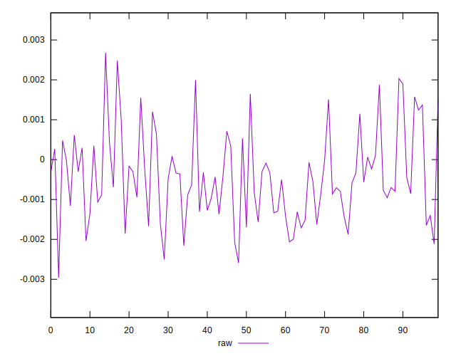
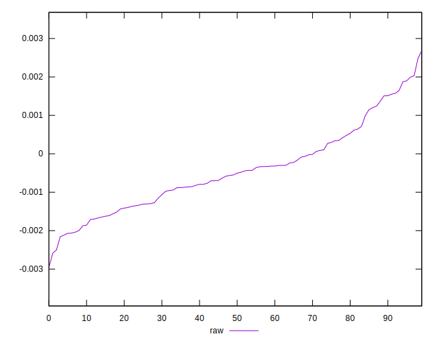
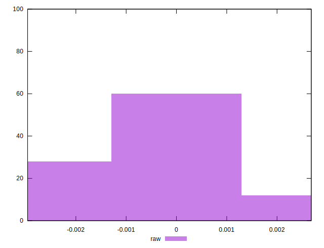

# //meta/pScore-difference/samples/music

[→ Parent](../..)


## Raw


```yaml
p90min: -0.002157772053159525
p90max: 0.001995239458250185
p90range: 0.00415301151140971
p90mean: -0.0004395613373081463
median: -0.0005264178575534629
p90stdev: 0.0010489361350890381
mad: 0.0008026108464325554
stdevBySn: 0.0011344781832699604
lfitCenter: -0.0004744510186122937
lfitStdev: 0.0008410017892162859
mfitCenter: -0.0004744510186122937
mfitStdev: 0.0010540394329930209
mfitConfidence: 0.0001054039432993021
p90skewness: 0.5114277640798823
p90eccentricity: 0.9999999999999997
p90discretization: 1
outlandishness: 0.9205149928370681

```

