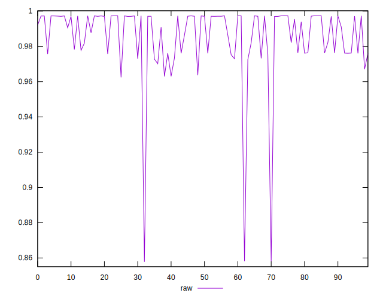
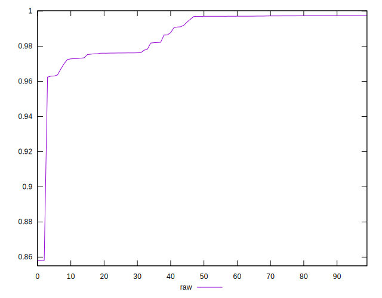
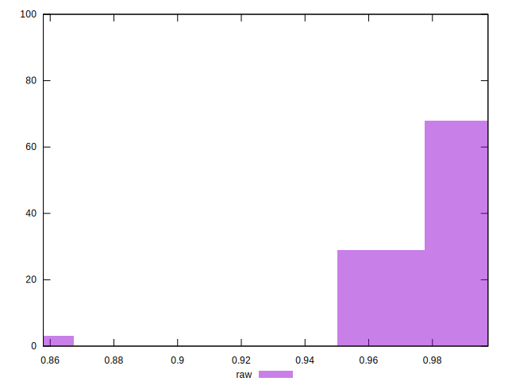

# //meta/pScore/samples/agenda

[→ Parent](../..)


## Raw


```yaml
p90min: 0.9624634793030395
p90max: 0.9974158680706335
p90range: 0.03495238876759399
p90mean: 0.9881053524728438
median: 0.9970632018253435
p90stdev: 0.011191996008932625
mad: 0.00035585653676600826
stdevBySn: 0.0004480026395455548
lfitCenter: 0.9879319769213587
lfitStdev: 0.013908813246813718
mfitCenter: 0.9879319769213587
mfitStdev: 0.017432112293053668
mfitConfidence: 0.0017432112293053667
p90skewness: -0.7015187237606493
p90eccentricity: 1.0000000000000002
p90discretization: 1.010752688172043
outlandishness: 0.9926803870722251

```

