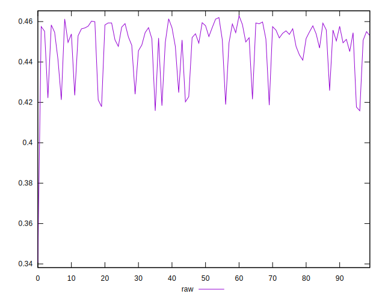
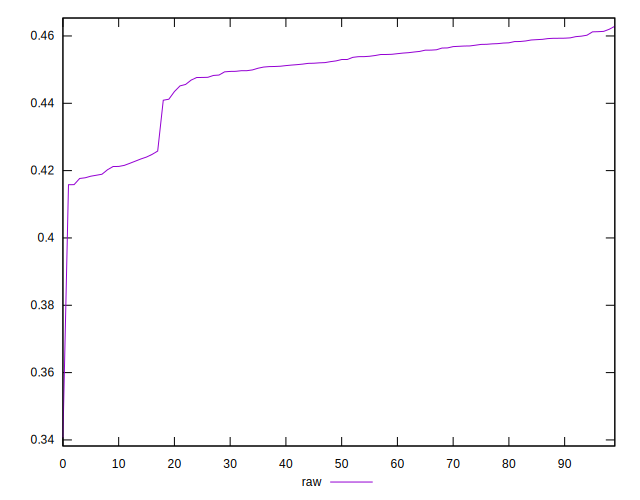
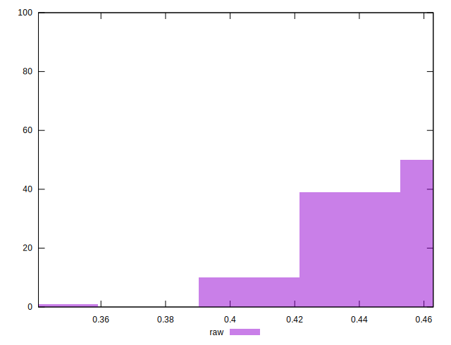

# //meta/pScore/samples/astro

[→ Parent](../..)


## Raw


```yaml
p90min: 0.4176604214018054
p90max: 0.46127265233987713
p90range: 0.043612230938071705
p90mean: 0.44860410863086203
median: 0.45279735137150307
p90stdev: 0.012687311268277709
mad: 0.0047898153062364834
stdevBySn: 0.0073433792182947205
lfitCenter: 0.44962045411317786
lfitStdev: 0.00950267452894235
mfitCenter: 0.44962045411317786
mfitStdev: 0.011909836341415542
mfitConfidence: 0.0011909836341415542
p90skewness: -1.4696422155728885
p90eccentricity: 0.9999999999999999
p90discretization: 1
outlandishness: 0.9940746731592753

```

