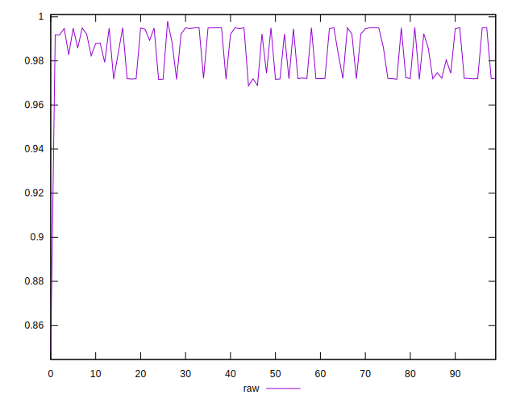
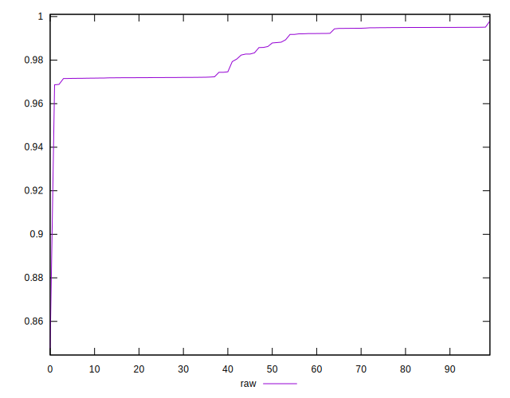
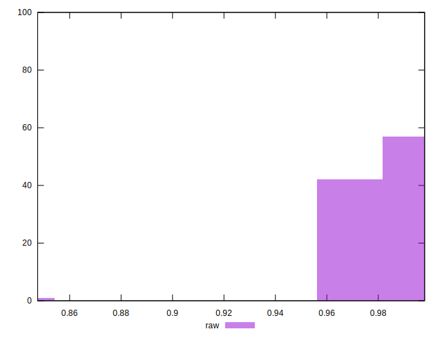

# //meta/pScore/samples/card

[→ Parent](../..)


## Raw


```yaml
p90min: 0.9715395438593635
p90max: 0.99507722161328
p90range: 0.023537677753916575
p90mean: 0.9839949560218608
median: 0.9870654450393471
p90stdev: 0.010361475529102162
mad: 0.007972253365656323
stdevBySn: 0.010565003249650344
lfitCenter: 0.9837427431311301
lfitStdev: 0.012125900459829132
mfitCenter: 0.9837427431311301
mfitStdev: 0.01519756248927681
mfitConfidence: 0.001519756248927681
p90skewness: -0.15291645282381594
p90eccentricity: 1
p90discretization: 1
outlandishness: 0.9973469411629562

```

