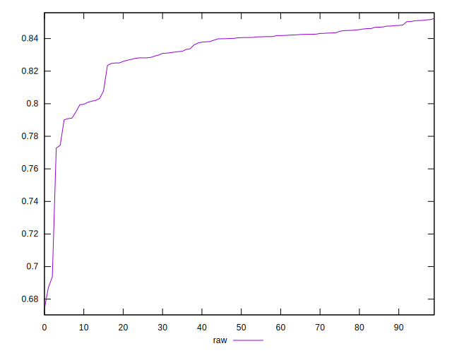

# //meta/pScore/samples/music

[→ Parent](../..)


## Raw


```yaml
p90min: 0.7727698835733513
p90max: 0.8511193803128984
p90range: 0.07834949673954705
p90mean: 0.83321435430936
median: 0.8404952655840504
p90stdev: 0.017360495296768266
mad: 0.006970590445567193
stdevBySn: 0.009010774967585705
lfitCenter: 0.83363431136965
lfitStdev: 0.01512749245197209
mfitCenter: 0.83363431136965
mfitStdev: 0.018959500171267997
mfitConfidence: 0.0018959500171267997
p90skewness: -1.715230153322685
p90eccentricity: 0.9999999999999999
p90discretization: 1
outlandishness: 0.990681871768094

```

