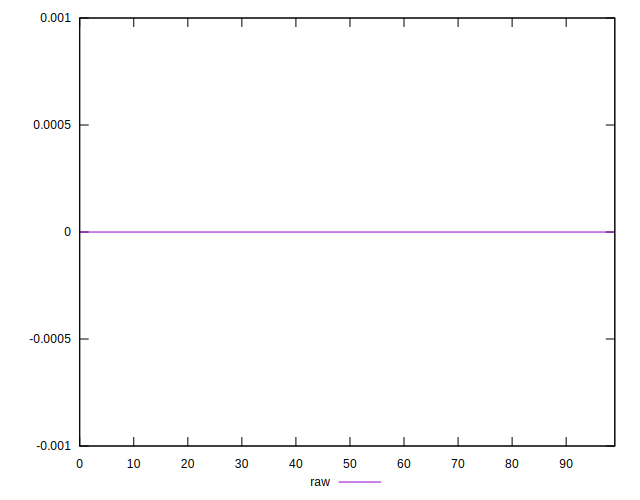

# //meta/score-difference/samples/agenda

[→ Parent](../..)


## Raw


```yaml
p90min: 0
p90max: 2.7755575615628914e-17
p90range: 2.7755575615628914e-17
p90mean: 7.086529944415892e-18
median: 0
p90stdev: 1.2102553906987999e-17
mad: 0
stdevBySn: 0
lfitCenter: 5.116371283216117e-18
lfitStdev: 1.0460752047705971e-17
mfitCenter: 5.116371283216117e-18
mfitStdev: 1.3110608441534414e-17
mfitConfidence: 1.3110608441534414e-18
p90skewness: 1.1222850838908165
p90eccentricity: 1.0000000000000009
p90discretization: 47
outlandishness: 1.1183062500000003

```

