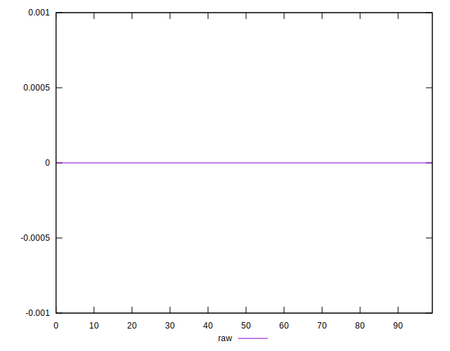
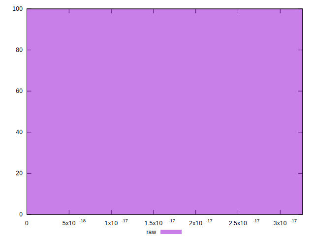

# //meta/score-difference/samples/astro

[→ Parent](../..)


## Raw


```yaml
p90min: 0
p90max: 3.2653618371328135e-17
p90range: 3.2653618371328135e-17
p90mean: 3.473789188439163e-19
median: 0
p90stdev: 3.3500009750620404e-18
mad: 0
stdevBySn: 0
lfitCenter: 6.32656030235609e-19
lfitStdev: 1.555108351190623e-18
mfitCenter: 6.32656030235609e-19
mfitStdev: 1.949039283565812e-18
mfitConfidence: 1.949039283565812e-19
p90skewness: 9.539955591519938
p90eccentricity: 1.0000000000000018
p90discretization: 47
outlandishness: 14.137599999999999

```

