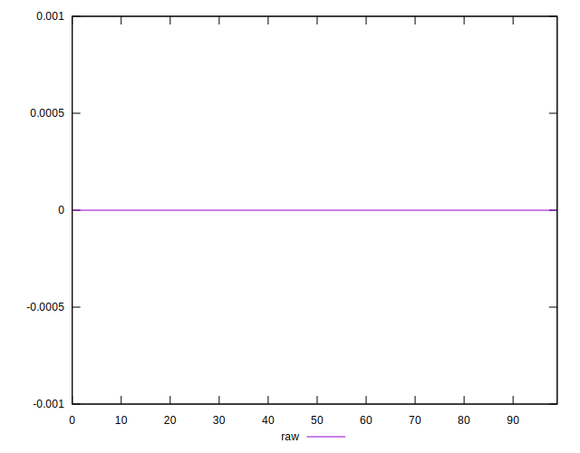

# //meta/score-difference/samples/card

[→ Parent](../..)


## Raw


```yaml
p90min: 0
p90max: 2.7755575615628914e-17
p90range: 2.7755575615628914e-17
p90mean: 2.9527208101732875e-18
median: 0
p90stdev: 4.5590621267830645e-18
mad: 0
stdevBySn: 0
lfitCenter: 2.9252503085639144e-18
lfitStdev: 4.29369996969061e-18
mfitCenter: 2.9252503085639144e-18
mfitStdev: 5.381354878819325e-18
mfitConfidence: 5.381354878819325e-19
p90skewness: 3.354442576036956
p90eccentricity: 0.9999999999999991
p90discretization: 31.333333333333332
outlandishness: 1.6343065599999989

```

