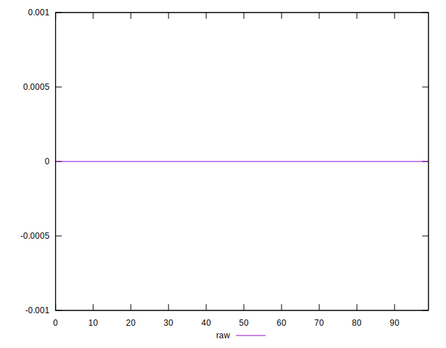
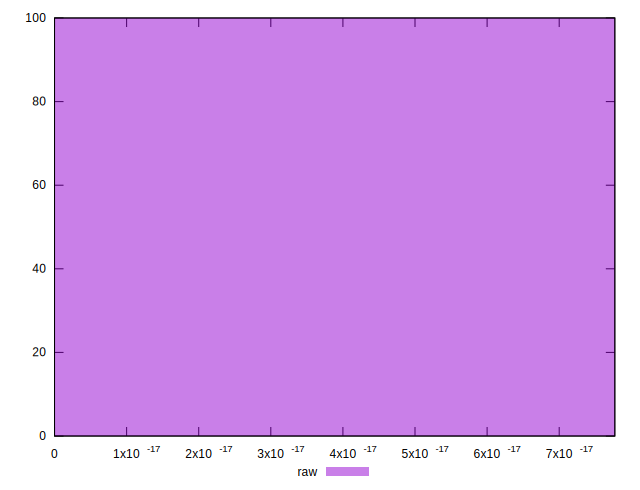

# //meta/score-difference/samples/music

[→ Parent](../..)


## Raw


```yaml
p90min: 0
p90max: 7.216449660063518e-17
p90range: 7.216449660063518e-17
p90mean: 3.312952749014429e-17
median: 3.3306690738754695e-17
p90stdev: 2.2107578943183862e-17
mad: 1.6653345369377347e-17
stdevBySn: 2.6481039583359238e-17
lfitCenter: 3.280748094888916e-17
lfitStdev: 1.8496388196795798e-17
mfitCenter: 3.280748094888916e-17
mfitStdev: 2.3181784839646223e-17
mfitConfidence: 2.3181784839646224e-18
p90skewness: 0.2195752333092557
p90eccentricity: 1.0000000000000007
p90discretization: 8.545454545454545
outlandishness: 1.0140956707687123

```

